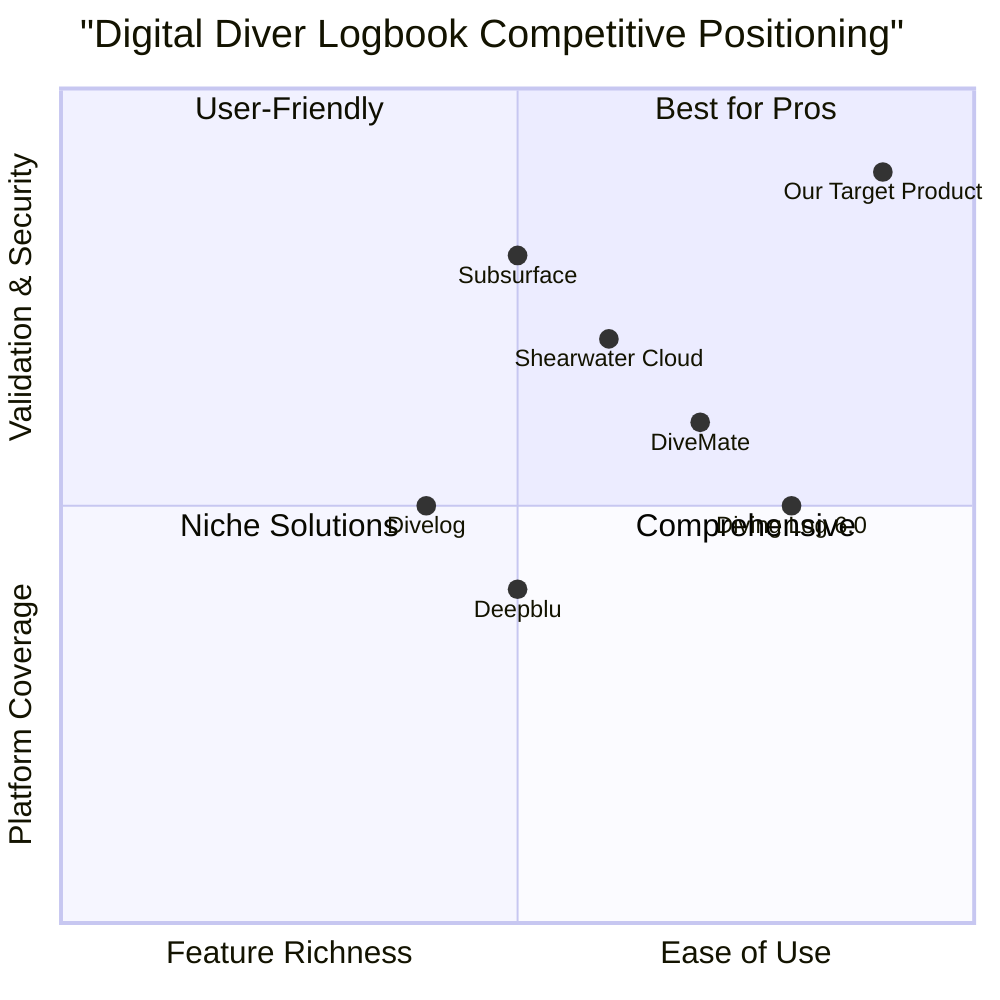

# Digital Diver’s Logbook App PRD

## 1. Language & Project Info
- **Language:** English
- **Programming Language:** Python
- **Project Name:** digital_divers_logbook
- **Restated Requirements:**
  - Develop a digital diver’s logbook app using Python, supporting Android, iOS, and Windows/Mac/Linux platforms. The app must include data digitization, photo uploads, digital signing, validation, OCR integration for journal entries, cloud storage support, dynamic export options, and secure login functionality.

## 2. Product Definition
### Product Goals
1. Enable divers to securely digitize and manage their dive logs across all major platforms.
2. Provide seamless integration of photos, digital signatures, and OCR for rich journal entries.
3. Ensure robust data validation, secure cloud storage, and flexible export options for user convenience.

### User Stories
- As a diver, I want to digitize my dive logs so that I can easily access and manage them from any device.
- As a diver, I want to upload photos and attach them to my dive entries so that I can visually document my experiences.
- As a dive instructor, I want to digitally sign and validate logbook entries so that I can authenticate dives for my students.
- As a diver, I want to use OCR to quickly convert handwritten journal entries into digital text so that I save time and reduce manual entry.
- As a user, I want secure login and cloud storage so that my data is protected and accessible anywhere.
### Competitive Analysis

| Product                | Pros                                                      | Cons                                                      |
|------------------------|-----------------------------------------------------------|-----------------------------------------------------------|
| DiveMate               | Multi-platform, cloud sync, photo support                 | Limited export options, no OCR                            |
| Subsurface             | Open source, cross-platform, supports many dive computers | UI less modern, limited mobile features                   |
| Divelog                | Simple interface, photo uploads, digital signing          | No OCR, limited validation, basic export                  |
| Shearwater Cloud       | Cloud sync, validation, secure login                      | Tied to Shearwater devices, limited export                |
| Deepblu                | Social features, photo uploads, cloud storage             | No digital signing, limited validation                    |
| Diving Log 6.0         | Advanced export, validation, photo support                | Windows-focused, mobile support limited                   |
| Our Target Product     | Full feature set, OCR, multi-platform, secure, flexible   | New to market, needs user adoption                        |

## 3. Technical Specifications

### Requirements Analysis
- Multi-platform support using Python frameworks (e.g., Kivy, BeeWare) for Android, iOS, Windows, Mac, and Linux.
- Data digitization: Structured input forms for dive logs, journal entries, and metadata.
- Photo uploads: Integration with device camera and gallery, image compression, and attachment to log entries.
- Digital signing: Support for electronic signatures, instructor validation, and audit trails.
- Validation: Field-level checks, instructor approval workflows, and error handling.
- OCR integration: Use of Tesseract or cloud-based OCR APIs for converting handwritten or printed journal entries to text.
- Cloud storage: Sync with providers (Google Drive, Dropbox, OneDrive, custom S3), offline access, and backup.
- Dynamic export: PDF, CSV, and image export options, customizable templates.
- Secure login: OAuth2, biometric authentication, and encrypted local storage.

### Requirements Pool
- **P0 (Must-have):**
  - Multi-platform support
  - Data digitization
  - Photo uploads
  - Digital signing
  - Validation
  - Secure login
- **P1 (Should-have):**
  - OCR integration
  - Cloud storage support
  - Dynamic export options
- **P2 (Nice-to-have):**
  - Biometric authentication
  - Customizable export templates
  - Offline access

### UI Design Draft
- **Main Dashboard:** Dive log summary, quick add button, recent activity.
- **Log Entry Screen:** Form fields for dive details, photo upload, signature capture, OCR journal entry, validation status.
- **Export/Share Screen:** Export format selection, cloud sync options, sharing controls.
- **Login/Settings:** Secure login, cloud provider selection, biometric toggle, backup/restore.

### Open Questions
- Which cloud storage providers are preferred by target users?
- What level of regulatory compliance is required for digital signatures?
- Should the app support integration with dive computer hardware?
- What languages/localization are needed for global users?
