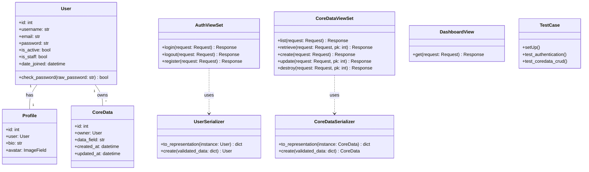
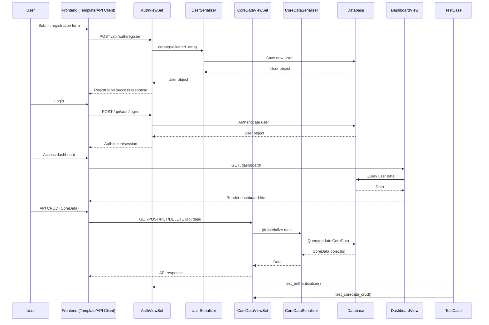

## Implementation approach

We will use Django as the core framework, leveraging Django REST Framework (DRF) for API endpoints. The project will follow Django's recommended modular structure, with separate apps for authentication, core data, and admin functionality. Security will be enforced via Django's middleware, settings, and best practices (CSRF, XSS, SQL injection prevention, HTTPS). Authentication will use Django's built-in system, with optional JWT and social auth. Automated tests will be implemented using pytest and Django's test framework. Deployment will be containerized with Docker, using Gunicorn/Uvicorn and Nginx for production.

## File list

- manage.py
- django_web_application/
    - __init__.py
    - settings.py
    - urls.py
    - wsgi.py
    - asgi.py
- apps/
    - users/
        - models.py
        - views.py
        - serializers.py
        - urls.py
        - tests.py
    - core/
        - models.py
        - views.py
        - serializers.py
        - urls.py
        - tests.py
    - dashboard/
        - views.py
        - urls.py
        - templates/
            - dashboard.html
        - tests.py
- templates/
    - base.html
    - home.html
    - login.html
    - register.html
- static/
    - css/
    - js/
- requirements.txt
- Dockerfile
- docker-compose.yml
- .env.example
- README.md
- docs/
    - deployment_guide.md

## Data structures and interfaces:

## Program call flow:

## Anything UNCLEAR

- The primary use case (CMS, e-commerce, SaaS) is not specified; the design is generic and modular.
- Authentication methods: Email/password is default; social auth and JWT are optional and can be added.
- Expected scale and compliance requirements are not defined; further clarification may be needed for production tuning.
- Preferred cloud provider/deployment environment is not specified; Docker-based deployment is recommended for portability.
