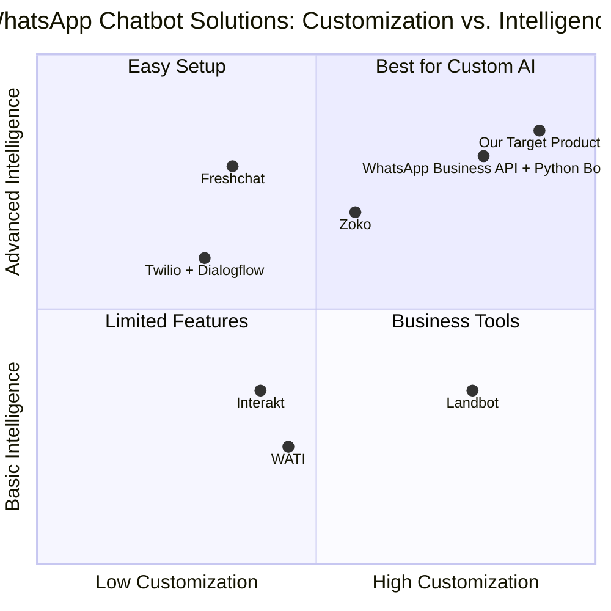

# Product Requirement Document (PRD): Python WhatsApp Chatbot with Meta Cloud API & OpenAI ChatGPT Integration

## 1. Language & Project Info
- **Language:** English
- **Programming Language:** Python
- **Project Name:** whatsapp_chatbot_meta_openai_hostinger
- **Restated Requirements:**
  - Develop a Python-based WhatsApp chatbot integrated with Meta Cloud API for messaging and OpenAI ChatGPT API for intelligent conversation.
  - The chatbot must include customer registration, service booking flows, an admin dashboard for managing bookings, notification features, be backed by a database, and deployed on HOSTINGER.

## 2. Product Definition
### Product Goals
1. Enable seamless customer interaction and service booking via WhatsApp.
2. Provide intelligent, context-aware conversation using OpenAI ChatGPT.
3. Empower administrators with a dashboard for managing bookings and notifications.

### User Stories
- As a customer, I want to register via WhatsApp so that I can access services easily.
- As a customer, I want to book services through the chatbot so that my requests are processed quickly.
- As an admin, I want to view and manage bookings in a dashboard so that I can efficiently handle customer requests.
- As a customer, I want to receive notifications about my bookings so that I stay informed.
- As an admin, I want to send notifications to customers so that they are updated about their service status.

### Competitive Analysis
| Product | Pros | Cons |
|--------|------|------|
| Twilio WhatsApp API + Dialogflow | Reliable, scalable, supports rich flows | Costly, less flexible for custom AI integration |
| WATI | Easy setup, business tools, dashboard | Limited AI, expensive for advanced features |
| Zoko | Multi-agent, CRM integration | Limited customization, pricing tiers |
| Landbot | Visual flow builder, WhatsApp integration | Limited AI, not Python-native |
| WhatsApp Business API + Custom Python Bot | Full control, flexible, open source | Requires more development, hosting complexity |
| Interakt | CRM features, notifications, booking flows | Limited AI, subscription cost |
| Freshchat | Omnichannel, dashboard, automation | Not focused on WhatsApp, less AI depth |

### Competitive Quadrant Chart

## 3. Technical Specifications
### Requirements Analysis
- Integration with Meta Cloud API for WhatsApp messaging
- Integration with OpenAI ChatGPT API for intelligent conversation
- Customer registration and authentication flow
- Service booking workflow with status tracking
- Admin dashboard (web-based) for managing bookings and notifications
- Notification system (WhatsApp, email, dashboard alerts)
- Database backend (e.g., PostgreSQL, MySQL)
- Deployment on HOSTINGER (supporting Python web apps)

### Requirements Pool
- **P0 (Must-have):**
  - WhatsApp messaging integration (Meta Cloud API)
  - ChatGPT-powered conversation
  - Customer registration
  - Service booking flow
  - Admin dashboard for bookings
  - Database backend
  - HOSTINGER deployment
- **P1 (Should-have):**
  - Notification features (WhatsApp, email)
  - Booking status updates
  - Admin notification management
- **P2 (Nice-to-have):**
  - Analytics dashboard
  - Multi-language support
  - Role-based access control

### UI Design Draft
- **Customer WhatsApp Chatbot:**
  - Registration prompt
  - Service selection menu
  - Booking confirmation
  - Notification messages
- **Admin Dashboard:**
  - Login/authentication
  - Booking list/table
  - Booking status update controls
  - Notification management panel

### Open Questions
- What specific services are to be booked?
- What data fields are required for customer registration?
- What notification channels are preferred (WhatsApp only, email, SMS)?
- What analytics are required for the admin dashboard?
- Is multi-language support required at launch?
