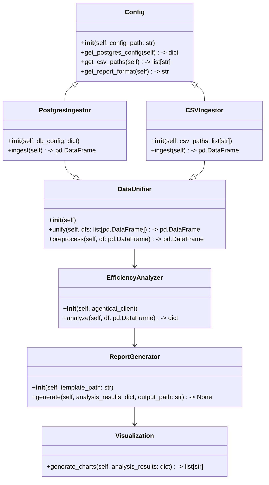
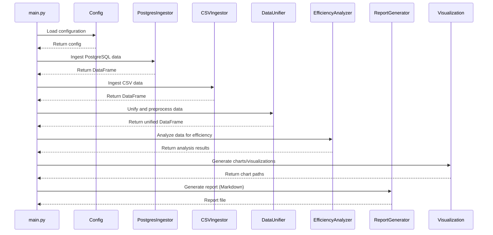

## Implementation approach

We will implement a modular Python program using the AgenticAi framework. The system will use SQLAlchemy and pandas for data ingestion from PostgreSQL and CSV files, respectively. Data will be unified and preprocessed before being sent to AgenticAi APIs for efficiency analysis. The report generation module will support Markdown by default, with extensibility for PDF/HTML. The architecture will be extensible for new data sources and analysis modules. Key open-source libraries: SQLAlchemy, pandas, AgenticAi SDK, Jinja2 (for templating reports), matplotlib/seaborn (for visualizations).

## File list

- main.py
- config.py
- data_ingestion/postgres_ingestor.py
- data_ingestion/csv_ingestor.py
- data_ingestion/data_unifier.py
- analysis/efficiency_analyzer.py
- report/report_generator.py
- report/templates/report_template.md
- utils/visualization.py
- requirements.txt
- README.md

## Data structures and interfaces:

## Program call flow:

## Anything UNCLEAR

- Expected data volume and update frequency (impacts scalability).
- Should report generation be on-demand or scheduled?
- Preferred report format (Markdown, PDF, HTML)?
- Specific efficiency metrics/KPIs to prioritize?
- Is authentication/access control required for UI/CLI?
