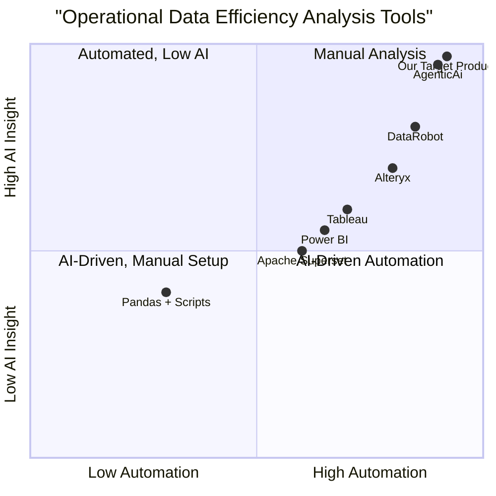

# Product Requirement Document: agenticai_data_efficiency

## 1. Language & Project Info
- **Language:** English
- **Programming Language:** Python
- **Project Name:** agenticai_data_efficiency
- **Original Requirement:** Implement a Python program using the AgenticAi framework to ingest operational data streams from PostgreSQL and CSV files, analyze the data for efficiency insights using the AgenticAi APIs, and generate a report highlighting key bottlenecks and efficiency gaps with recommendations and metrics.

## 2. Product Definition
### 2.1 Product Goals
1. Efficiently ingest and unify operational data from PostgreSQL and CSV sources.
2. Analyze operational data for efficiency insights using AgenticAi APIs.
3. Generate actionable reports highlighting bottlenecks, efficiency gaps, and recommendations with supporting metrics.

### 2.2 User Stories
- As a data analyst, I want to automatically ingest data from PostgreSQL and CSV files so that I can analyze operational performance without manual data preparation.
- As an operations manager, I want to receive reports identifying key bottlenecks and efficiency gaps so that I can prioritize process improvements.
- As a business executive, I want recommendations and metrics in the report so that I can make informed strategic decisions.
- As a developer, I want a modular Python program leveraging AgenticAi APIs so that I can extend or customize the analysis pipeline.

### 2.3 Competitive Analysis
| Product/Framework         | Pros                                         | Cons                                         |
|--------------------------|----------------------------------------------|----------------------------------------------|
| AgenticAi                | Advanced AI-driven analytics, modular APIs   | Newer framework, smaller community           |
| Pandas + Custom Scripts  | Flexible, widely used, strong CSV support    | Manual analysis, lacks built-in AI insights  |
| Apache Superset          | Rich visualization, SQL integration          | Less focus on AI-driven efficiency analysis  |
| Tableau                  | Powerful reporting, user-friendly            | Expensive, limited automation                |
| Power BI                 | Integrates with MS stack, strong reporting   | Less Python-native, limited AI integration   |
| DataRobot                | Automated ML, efficiency analytics           | Costly, less customizable                   |
| Alteryx                  | Drag-and-drop, strong data prep              | Expensive, less code-centric                 |

### 2.4 Competitive Quadrant Chart

## 3. Technical Specifications
### 3.1 Requirements Analysis
- Must support data ingestion from PostgreSQL databases and CSV files.
- Must unify and preprocess data for analysis.
- Must integrate with AgenticAi APIs for efficiency analysis.
- Must generate a structured report (PDF/HTML/Markdown) with:
  - Identified bottlenecks
  - Efficiency gaps
  - Actionable recommendations
  - Supporting metrics and visualizations
- Should be modular and extensible for additional data sources or analyses.

### 3.2 Requirements Pool
- **P0:** Ingest data from PostgreSQL and CSV
- **P0:** Analyze data using AgenticAi APIs
- **P0:** Generate report with bottlenecks, gaps, recommendations, metrics
- **P1:** Support for additional data sources (e.g., Excel, APIs)
- **P1:** Configurable report format (PDF/HTML/Markdown)
- **P2:** Real-time data stream support
- **P2:** Customizable analysis modules

### 3.3 UI Design Draft
- CLI or minimal web UI for:
  - Data source configuration (PostgreSQL credentials, CSV path)
  - Triggering analysis
  - Downloading/viewing reports
- Report layout:
  - Executive summary
  - Bottleneck analysis (tables/graphs)
  - Efficiency gap metrics
  - Recommendations section

### 3.4 Open Questions
- What is the expected data volume and update frequency?
- Should the report be generated on-demand or scheduled?
- What is the preferred report format (PDF, HTML, Markdown)?
- Are there specific efficiency metrics or KPIs to prioritize?
- Is authentication or access control required for the UI?
