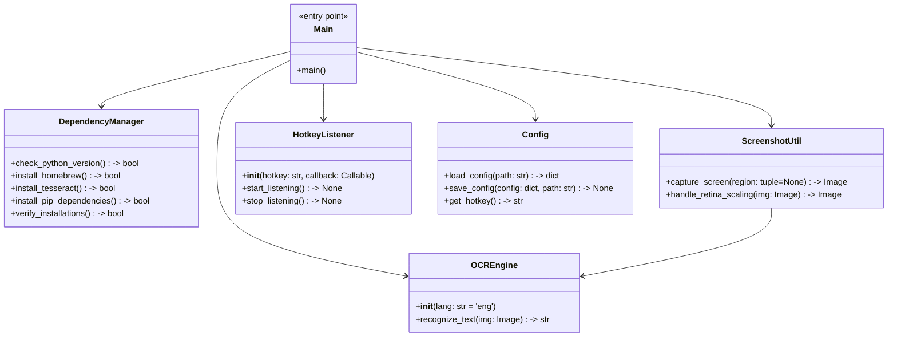
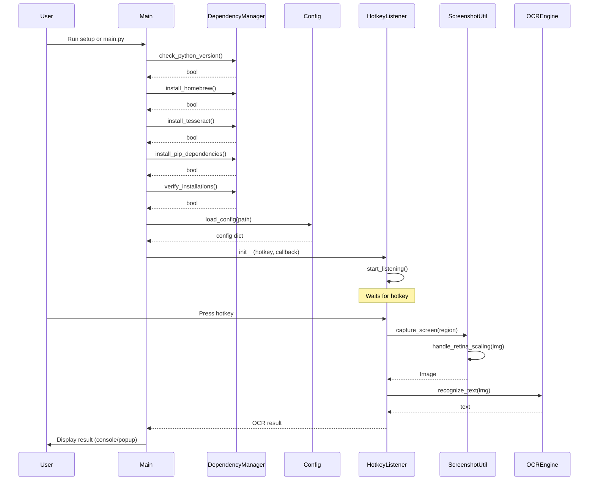

## Implementation approach

We will build a Python-based CLI tool for macOS that automates quiz answering by capturing screenshots, performing OCR, and triggering actions via a hotkey. The system will use Homebrew and pip for dependency management, pytesseract (with Tesseract-OCR) for OCR, and PyObjC or Pillow for Retina-aware screenshot capture. Hotkey triggers will be handled by the `keyboard` or `pynput` library. Documentation and a setup guide will be provided. All dependencies will be listed in requirements.txt and installation automated via a setup script.

## File list

- main.py
- ocr_engine.py
- hotkey_listener.py
- screenshot_util.py
- dependency_manager.py
- config.py
- requirements.txt
- setup.sh
- docs/setup_guide.md
- docs/system_design.md

## Data structures and interfaces:

## Program call flow:

## Anything UNCLEAR

- Preferred OCR library: Tesseract/pytesseract assumed, but EasyOCR could be considered.
- Should hotkey be customizable via config file? (Design allows for this.)
- Is CLI sufficient, or is a GUI required? (Assumed CLI is sufficient.)
- Any specific quiz platforms to support? (Assumed generic for now.)
