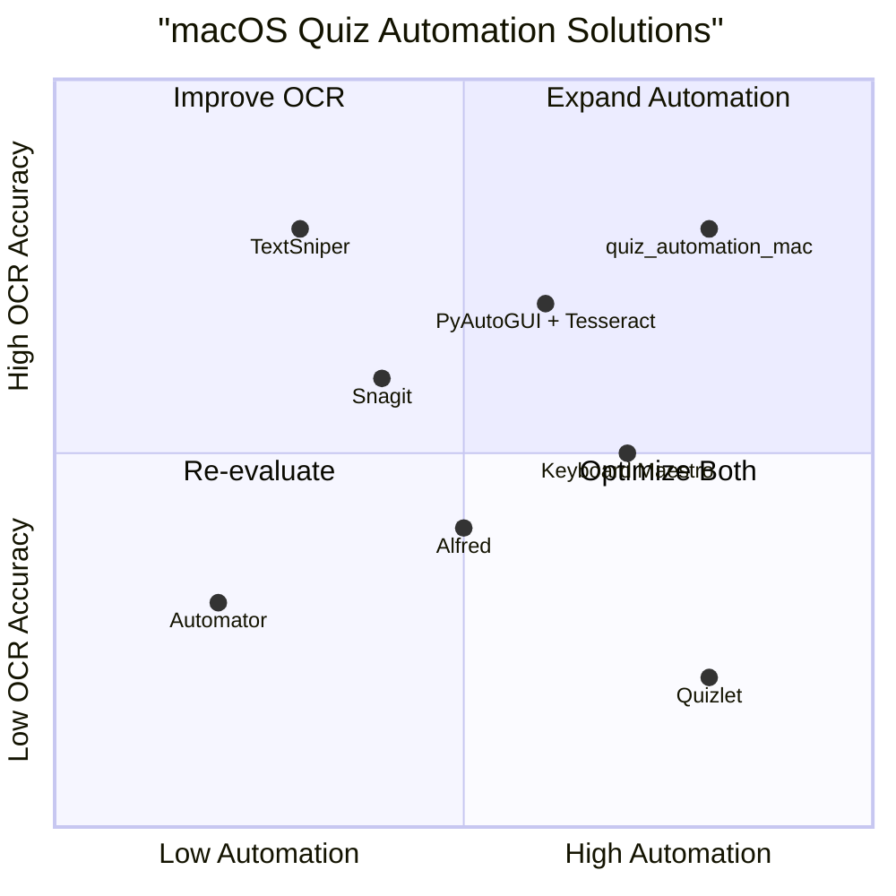

# Product Requirement Document (PRD): quiz_automation_mac

## 1. Language & Project Info
- **Language:** English
- **Programming Language:** Python
- **Project Name:** quiz_automation_mac
- **Restated Requirements:**
  - Ensure correct installation of dependencies
  - Achieve successful OCR text recognition
  - Implement hotkey trigger functionality
  - Support Retina scaling for macOS
  - Provide a setup guide with updated requirements

## 2. Product Definition
### Product Goals
1. Guarantee seamless installation and configuration of all required dependencies for macOS users.
2. Enable accurate and reliable OCR-based text recognition from quiz screenshots.
3. Deliver a responsive and user-friendly hotkey trigger mechanism for quiz automation.

### User Stories
- As a macOS user, I want a simple setup process so that I can start using the quiz automation script without technical hurdles.
- As a quiz participant, I want the script to recognize text accurately from my screen so that I can automate answer selection.
- As a power user, I want to trigger the script using a customizable hotkey so that I can operate it efficiently during quizzes.
- As a Retina display owner, I want the script to scale correctly so that OCR works regardless of screen resolution.
- As a new user, I want a clear setup guide and updated requirements so that I can install and run the script without issues.

### Competitive Analysis
| Product                | Pros                                      | Cons                                      |
|------------------------|-------------------------------------------|-------------------------------------------|
| Automator (macOS)      | Built-in, easy to use                     | Limited OCR, not quiz-specific            |
| Alfred                 | Powerful automation, hotkey support       | No native OCR, paid features              |
| Keyboard Maestro       | Advanced triggers, macOS support          | Complex setup, no built-in OCR            |
| TextSniper             | Fast OCR, Retina support                  | No automation, paid app                   |
| PyAutoGUI + Tesseract  | Open source, customizable                 | Manual setup, scaling issues              |
| Quizlet                | Popular quiz platform, automation options | Web-based, not for local scripts          |
| Snagit                 | OCR, screen capture, easy UI              | Expensive, not automation-focused         |

### Competitive Quadrant Chart

## 3. Technical Specifications
### Requirements Analysis
- Must support Python 3.9+ on macOS (Intel & Apple Silicon)
- Must automate dependency installation (pip, Homebrew, etc.)
- Must use reliable OCR library (e.g., Tesseract, pytesseract)
- Must capture screenshots with Retina scaling support
- Must implement hotkey trigger (e.g., using keyboard or pynput)
- Must provide a comprehensive setup guide
- Must update requirements.txt with all dependencies

### Requirements Pool
- **P0:**
  - Automated dependency installation
  - Accurate OCR text recognition
  - Hotkey trigger functionality
  - Retina scaling support
  - Setup guide and updated requirements
- **P1:**
  - Customizable hotkey mapping
  - Error handling and user feedback
- **P2:**
  - Multi-language OCR support
  - Optional GUI for setup

### UI Design Draft
- Minimal CLI interface for setup and configuration
- Hotkey status indicator (console output)
- OCR result preview (console or popup)
- Step-by-step setup instructions

### Open Questions
- Which OCR library is preferred (Tesseract, EasyOCR, etc.)?
- Should hotkey be customizable via config file?
- Is GUI setup required or is CLI sufficient?
- Any specific quiz platforms to support?
