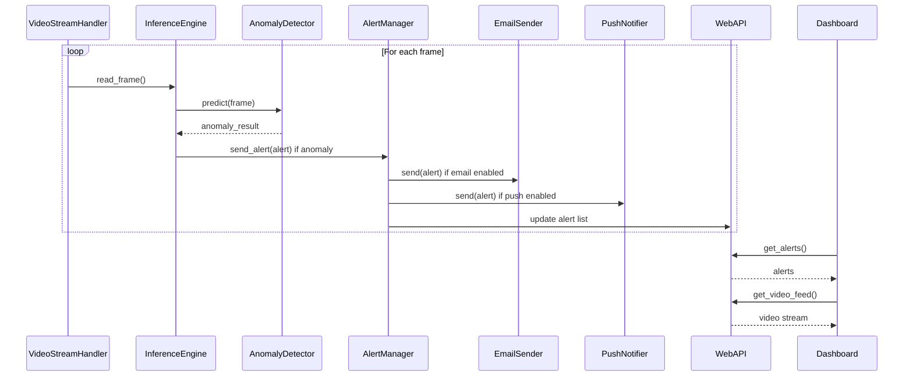

## Implementation approach

We will build an AI surveillance system using Python and PyTorch (or TensorFlow) for behavior analysis and anomaly detection on RTSP video feeds. The system will process live or recorded RTSP streams, perform real-time inference using the trained model, and identify anomalies such as loitering or erratic movement. Alerts will be sent via a web dashboard (using FastAPI + React), email (via SMTP), and push notifications (using a service like Firebase Cloud Messaging). The entire solution will be containerized with Docker for easy deployment. Integration points include the AI inference engine, video stream handler, alerting subsystem, and web dashboard backend/frontend.

## File list

- Dockerfile
- requirements.txt
- src/
    - main.py
    - video_stream_handler.py
    - inference_engine.py
    - alert_manager.py
    - config.py
    - utils.py
    - models/
        - anomaly_detector.py
        - __init__.py
    - notifications/
        - email_sender.py
        - push_notifier.py
        - __init__.py
    - web/
        - api.py
        - dashboard/
            - App.jsx
            - components/
                - AlertList.jsx
                - VideoFeed.jsx
            - index.js
            - styles.css
- model/
    - trained_model.pt (or .pb)
- docs/
    - system_design.md
    - system_design-sequence-diagram.mermaid
    - system_design-sequence-diagram.mermaid-class-diagram

## Data structures and interfaces:

```mermaid
classDiagram
    class VideoStreamHandler {
        +__init__(rtsp_url: str)
        +read_frame() -> np.ndarray
        +is_open() -> bool
        +release()
    }
    class InferenceEngine {
        +__init__(model_path: str)
        +predict(frame: np.ndarray) -> dict
    }
    class AnomalyDetector(ABC) {
        +detect_behavior(frame: np.ndarray) -> dict
    }
    class AlertManager {
        +__init__(...)
        +send_alert(alert: Alert)
        +register_channel(channel: AlertChannel)
    }
    class Alert {
        +timestamp: datetime
        +type: str
        +details: dict
    }
    class AlertChannel(ABC) {
        +send(alert: Alert)
    }
    class EmailSender~AlertChannel~ {
        +send(alert: Alert)
    }
    class PushNotifier~AlertChannel~ {
        +send(alert: Alert)
    }
    class WebAPI {
        +get_alerts() -> list[Alert]
        +get_video_feed() -> StreamingResponse
    }
    class Dashboard {
        +display_alerts(alerts: list[Alert])
        +display_video_feed(url: str)
    }
    VideoStreamHandler --> InferenceEngine : feeds frames
    InferenceEngine --> AnomalyDetector : uses
    InferenceEngine --> AlertManager : triggers alert
    AlertManager --> AlertChannel : uses
    AlertChannel <|-- EmailSender
    AlertChannel <|-- PushNotifier
    WebAPI --> Dashboard : serves data
```

## Program call flow:



## Anything UNCLEAR

- The specific anomaly types and their thresholds may need further clarification.
- The choice between TensorFlow and PyTorch depends on the provided model; both are supported in the design.
- Email and push notification service credentials/configuration must be provided at deployment.
