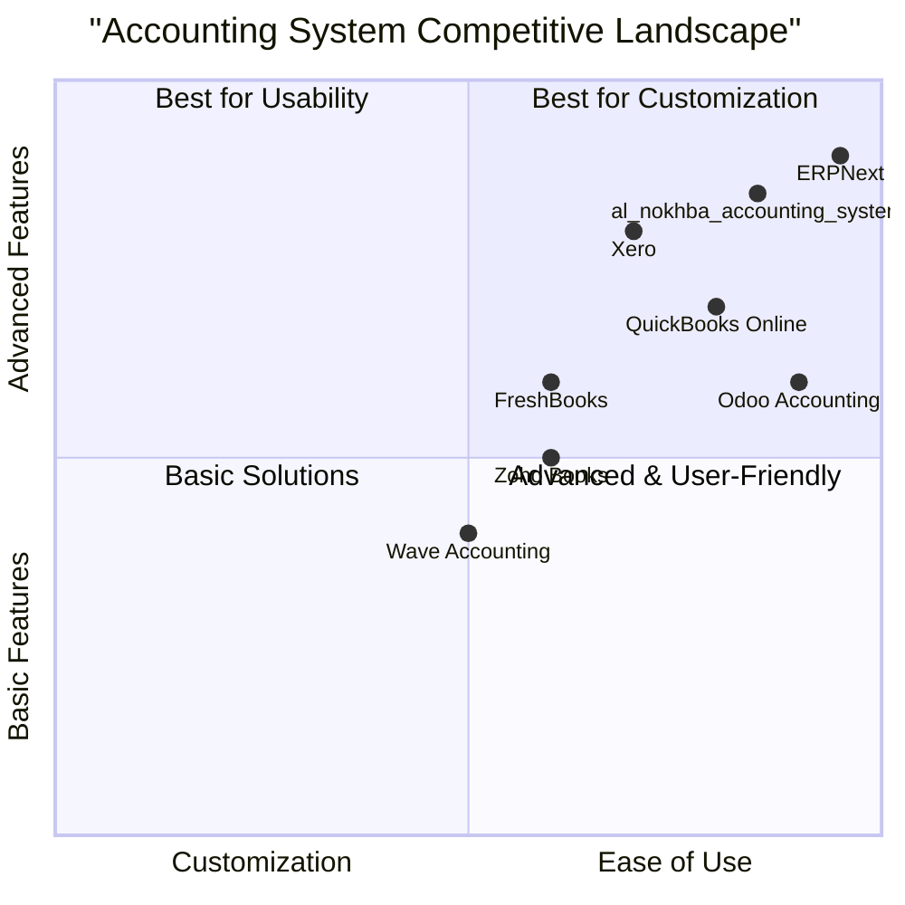

# Product Requirement Document (PRD): al_nokhba_accounting_system

## 1. Language & Project Info
- **Language:** English
- **Programming Language:** Python (Django or Flask)
- **Front-end:** HTML5, CSS3, JavaScript (Bootstrap), preferably React.js or Vue.js
- **Database:** MySQL
- **Deployment Environment:** Ubuntu Server
- **Project Name:** al_nokhba_accounting_system

### Restated Requirements
Develop a comprehensive accounting system for Al-Nokhba for Electronics as a Python web application (using Django or Flask). The system must include features for managing general ledger, invoices, purchases, inventory, financial reports, and user roles. The front-end should utilize HTML5, CSS3, JavaScript (Bootstrap), and preferably React.js or Vue.js. The database must be MySQL, and the system will be deployed on an Ubuntu server.
## 2. Product Definition

### Product Goals
1. Enable efficient and accurate management of all accounting operations for Al-Nokhba for Electronics.
2. Provide secure, role-based access to financial data and operations.
3. Deliver comprehensive financial insights through customizable reports and dashboards.

### User Stories
- As an accountant, I want to record and manage general ledger entries so that I can maintain accurate financial records.
- As a sales manager, I want to generate and track invoices so that I can monitor receivables and sales performance.
- As a procurement officer, I want to manage purchases and inventory so that I can optimize stock levels and supplier relationships.
- As a financial controller, I want to generate financial reports so that I can analyze company performance and ensure compliance.
- As an admin, I want to assign user roles and permissions so that I can control access to sensitive financial data.

### Competitive Analysis
| Product                | Pros                                         | Cons                                      |
|------------------------|----------------------------------------------|-------------------------------------------|
| QuickBooks Online      | User-friendly, cloud-based, strong reporting | Limited customization, subscription cost  |
| Odoo Accounting        | Modular, open-source, integrated ERP         | Complex setup, requires technical skills  |
| Xero                   | Intuitive UI, multi-currency, integrations   | Pricey, limited inventory features        |
| Zoho Books             | Affordable, automation, good support         | Limited advanced features, user limits    |
| Wave Accounting        | Free, simple, good for small businesses      | Limited scalability, fewer integrations   |
| ERPNext                | Open-source, comprehensive, customizable     | Steep learning curve, setup complexity    |
| FreshBooks             | Easy invoicing, time tracking                | Limited inventory, higher cost for teams  |

### Competitive Quadrant Chart

## 3. Technical Specifications

### Requirements Analysis
The system must support multi-user access with secure authentication and role-based authorization. Core modules include:
- General Ledger: Chart of accounts, journal entries, closing periods.
- Invoices: Creation, tracking, payment status, PDF export.
- Purchases: Supplier management, purchase orders, receipts.
- Inventory: Stock tracking, adjustments, valuation, alerts.
- Financial Reports: Balance sheet, income statement, cash flow, custom reports.
- User Roles: Admin, Accountant, Sales Manager, Procurement Officer, Financial Controller.
- Audit Trail: Track all changes and user actions.
- Responsive UI: Accessible on desktop and mobile.

### Requirements Pool
- **P0 (Must-have):**
  - User authentication and role-based access control
  - General ledger management
  - Invoice management (create, track, export)
  - Purchase and supplier management
  - Inventory tracking and alerts
  - Standard financial reports (balance sheet, income statement, cash flow)
  - Audit trail for all transactions
  - Responsive front-end (React.js or Vue.js)
  - MySQL database integration
- **P1 (Should-have):**
  - Customizable reports and dashboards
  - Multi-currency support
  - Email notifications for key events
  - Data import/export (CSV, Excel)
- **P2 (Nice-to-have):**
  - Integration with external ERP/CRM systems
  - Mobile app version
  - Advanced analytics and forecasting

### UI Design Draft
- **Sidebar Navigation:** Dashboard, General Ledger, Invoices, Purchases, Inventory, Reports, Users, Settings
- **Dashboard:** Key metrics, recent activity, alerts
- **General Ledger:** Chart of accounts, journal entry form, ledger view
- **Invoices:** List, create/edit form, status filter, PDF export
- **Purchases:** Purchase order list, supplier directory, order form
- **Inventory:** Stock list, adjustment form, low stock alerts
- **Reports:** Select report type, date range picker, export options
- **User Management:** List users, assign roles, permissions matrix

### Open Questions
1. What localization or language support is required?
2. Are there specific regulatory or tax compliance needs?
3. What is the expected number of concurrent users?
4. Should the system support multi-company or branch accounting?
5. Are there preferred third-party integrations (e.g., payment gateways, ERP)?
