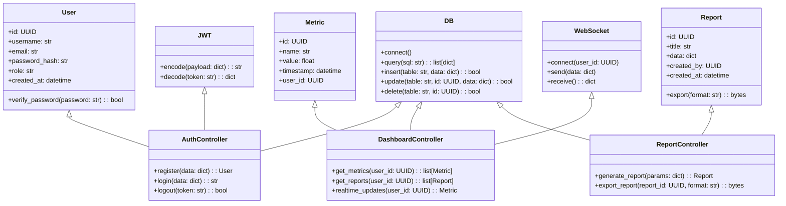
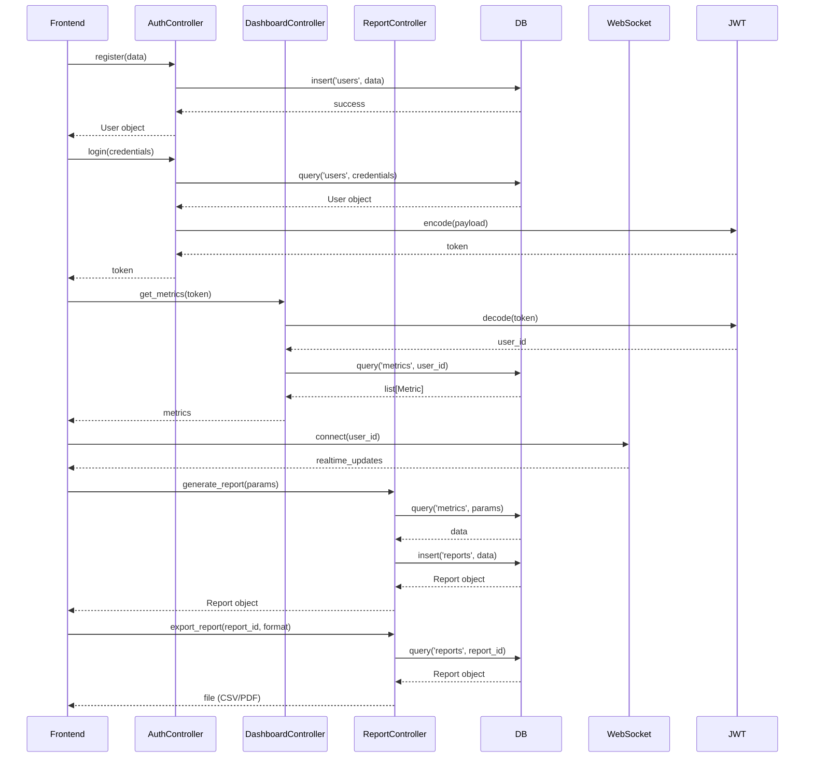

## Implementation approach

We will implement the MVP using React/Next.js for the frontend to provide a responsive, modern dashboard UI. The backend will be built with Node.js (Express) for RESTful APIs, but can be swapped for Python (FastAPI) if required. PostgreSQL is recommended for relational data, but MongoDB can be used for flexibility. Real-time updates will be handled via WebSocket (Socket.IO for Node.js or FastAPI WebSockets). AWS will be used for deployment (EC2 for backend, RDS for database, S3 for static assets, IAM for security). Authentication will use JWT, with role-based access control. The dashboard will feature charts (using Chart.js or Recharts), data tables, and export options (CSV/PDF).

## File list

- frontend/
  - package.json
  - next.config.js
  - public/
  - src/
    - pages/
      - index.tsx
      - dashboard.tsx
      - login.tsx
      - register.tsx
    - components/
      - Header.tsx
      - Sidebar.tsx
      - MetricsPanel.tsx
      - ChartPanel.tsx
      - DataTable.tsx
      - ExportButton.tsx
    - utils/
      - api.ts
      - auth.ts
    - styles/
      - globals.css
- backend/
  - package.json (Node.js) or requirements.txt (Python)
  - src/
    - app.js (Express) or main.py (FastAPI)
    - controllers/
      - authController.js/py
      - dashboardController.js/py
      - reportController.js/py
    - models/
      - User.js/py
      - Metric.js/py
      - Report.js/py
    - routes/
      - authRoutes.js/py
      - dashboardRoutes.js/py
      - reportRoutes.js/py
    - utils/
      - db.js/py
      - jwt.js/py
      - websocket.js/py
    - middleware/
      - authMiddleware.js/py
      - roleMiddleware.js/py
- infrastructure/
  - aws/
    - ec2_setup.md
    - rds_setup.md
    - s3_setup.md
    - iam_policies.md
    - cicd_pipeline.md
- docs/
  - system_design.md
  - system_design-sequence-diagram.mermaid
  - system_design-sequence-diagram.mermaid-class-diagram

## Data structures and interfaces:

## Program call flow:

## Anything UNCLEAR

- Backend language preference (Node.js or Python) is not specified.
- Initial user base size for AWS scaling is unclear.
- Specific compliance/security requirements are not detailed.
- Most critical analytics features for the dashboard need clarification.
