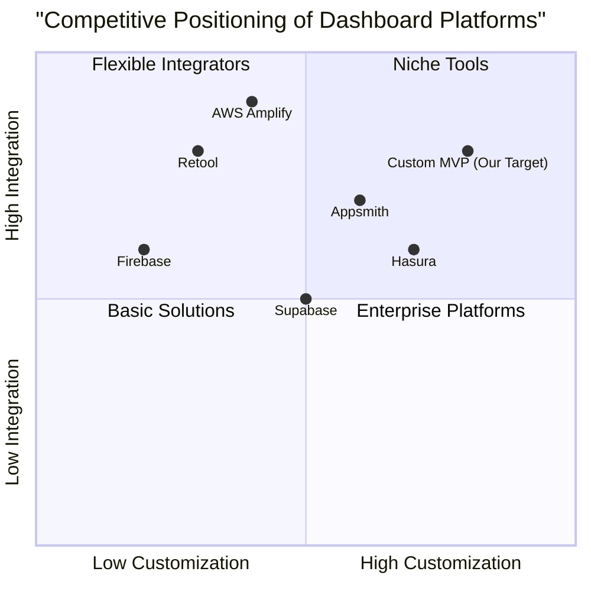

# Full-Stack MVP Web Application PRD

## 1. Language & Project Info
- **Language:** English
- **Programming Language:** React/Next.js (Frontend), Node.js/Python (Backend)
- **Project Name:** full_stack_mvp_web_app
- **Restated Requirements:**
  - Implement a full-stack MVP web application.
  - Use React/Next.js for the frontend.
  - Use Node.js or Python for the backend.
  - Integrate a database.
  - Deploy on AWS cloud.
  - Include a functional dashboard design.

## 2. Product Definition
### Product Goals
1. Deliver a robust MVP web application with seamless frontend-backend integration.
2. Ensure scalable and secure deployment on AWS cloud infrastructure.
3. Provide an intuitive, data-driven dashboard for user insights and management.
### User Stories
1. As an admin, I want to log in and view key metrics on the dashboard so that I can monitor application performance.
2. As a user, I want to register and access personalized data so that I can manage my account efficiently.
3. As a manager, I want to generate and export reports from the dashboard so that I can share insights with my team.
4. As a developer, I want to access API endpoints securely so that I can integrate external services.
5. As a stakeholder, I want to view real-time updates on the dashboard so that I can make informed decisions.
### Competitive Analysis
| Product                | Pros                                              | Cons                                         |
|------------------------|---------------------------------------------------|----------------------------------------------|
| Retool                 | Rapid dashboard building, many integrations       | Expensive, limited customization             |
| Appsmith               | Open-source, flexible, good community             | UI less polished, fewer enterprise features  |
| Supabase               | Backend-as-a-service, real-time, easy setup       | Less control over infra, limited analytics   |
| Firebase               | Scalable, managed backend, fast deployment        | Vendor lock-in, pricing complexity           |
| Hasura                 | Instant GraphQL APIs, real-time, open-source      | Requires GraphQL knowledge, setup complexity |
| AWS Amplify            | Deep AWS integration, scalable, full-stack tools  | AWS ecosystem lock-in, learning curve        |
| Custom Solution        | Fully tailored, no vendor lock-in                 | Higher dev cost, longer time-to-market       |

## 3. Technical Specifications
### Requirements Analysis
- The application must support user authentication and role-based access.
- The backend should be implemented in Node.js or Python, exposing RESTful APIs.
- The frontend must be built with React/Next.js, providing a responsive dashboard UI.
- Database integration is required (PostgreSQL or MongoDB recommended).
- AWS cloud deployment must include CI/CD, scalability, and security best practices.
- The dashboard should display real-time data, charts, and exportable reports.

### Requirements Pool
- **P0 (Must-have):**
  - User authentication and authorization
  - Dashboard with key metrics and charts
  - RESTful API endpoints
  - Database integration
  - AWS deployment (EC2, RDS, S3, IAM)
- **P1 (Should-have):**
  - Role-based access control
  - Data export (CSV, PDF)
  - Real-time updates (WebSocket)
  - Basic error handling and logging
- **P2 (Nice-to-have):**
  - Customizable dashboard widgets
  - Multi-language support
  - Advanced analytics

### UI Design Draft
- **Header:** Navigation, user profile, notifications
- **Sidebar:** Menu for dashboard, reports, settings
- **Main Panel:** Key metrics, charts, data tables
- **Footer:** Copyright, support links

### Open Questions
- Which backend language is preferred: Node.js or Python?
- What is the target user base size for initial deployment?
- Are there specific compliance or security requirements?
- What analytics features are most critical for the dashboard?
