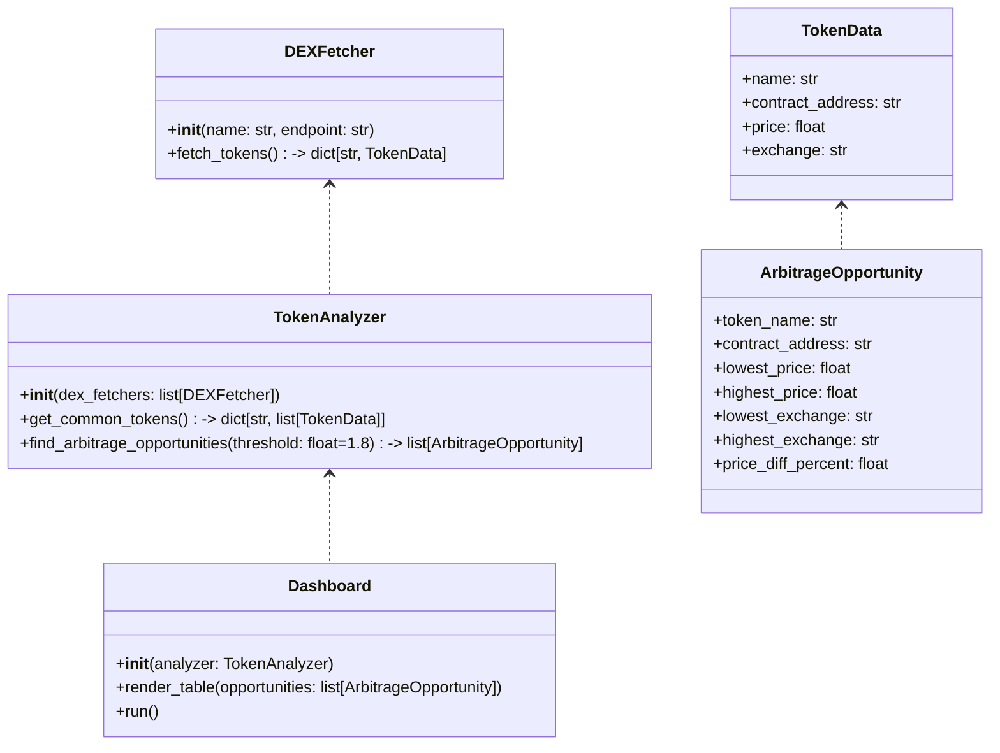
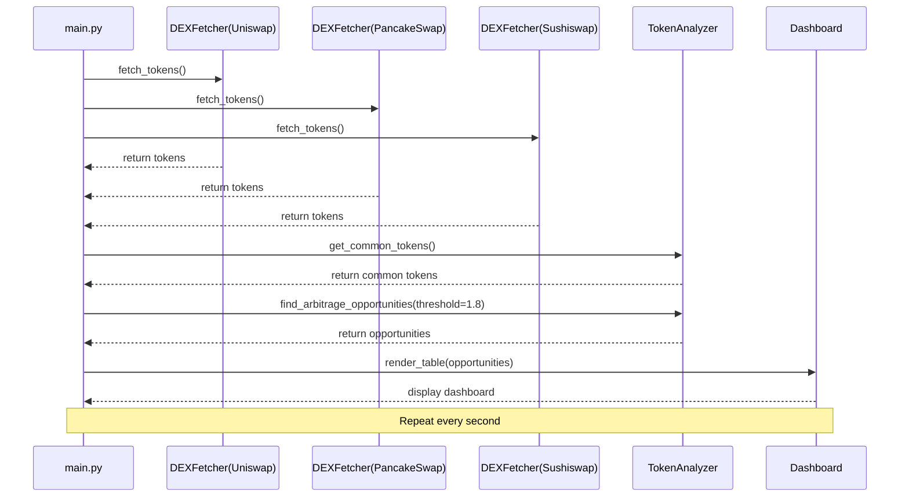

## Implementation approach

We will use Python for both backend and dashboard UI. For the dashboard, Streamlit is chosen for its simplicity and real-time update capabilities. Data fetching will use the official subgraph APIs (GraphQL) for Uniswap, PancakeSwap, and Sushiswap. The system will consist of modular fetchers for each DEX, a token analyzer to compare prices and filter opportunities, and a dashboard component for display. Async programming (asyncio, aiohttp) will be used for efficient real-time updates. Error handling and rate limiting will be built in.

## File list

- main.py
- dex_fetcher.py
- token_analyzer.py
- dashboard.py
- config.py
- requirements.txt
- docs/system_design.md

## Data structures and interfaces:

## Program call flow:

## Anything UNCLEAR

- Preferred dashboard framework: Streamlit is chosen for now, but Dash or Flask could be considered.
- Should the dashboard support mobile devices? (Streamlit is responsive but not optimized for mobile)
- Is user authentication required, or is public access sufficient?
- Should historical data be stored for later analysis?
