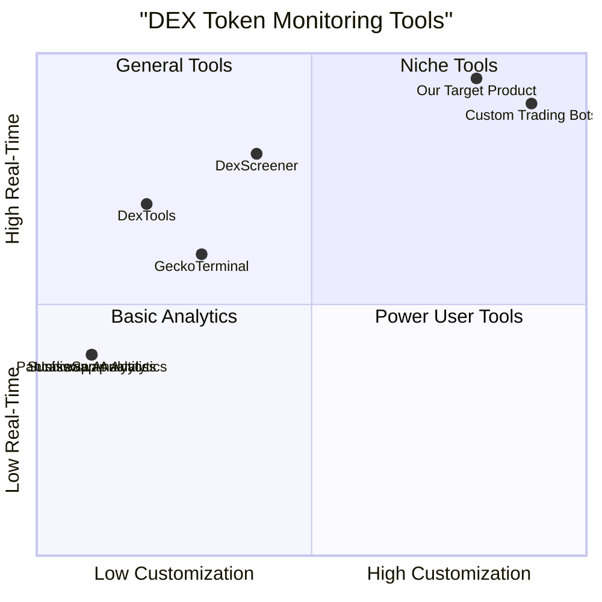

# Real-Time Token Monitoring Dashboard PRD

## 1. Language & Project Info
- **Language:** English
- **Programming Language:** Python (for backend and data fetching), with possible use of Dash/Streamlit for dashboard UI
- **Project Name:** real_time_token_monitoring_dashboard
- **Original Requirement:**
  Implement a Python program to create a real-time monitoring system that fetches token data from Uniswap, PancakeSwap, and Sushiswap, analyzes tokens available on at least two exchanges, displays their names, contract addresses, lowest and highest price exchanges, and price differences greater than 1.8% on a dashboard, updating every second.

## 2. Product Definition
### 2.1 Product Goals
1. Provide real-time monitoring of token prices across Uniswap, PancakeSwap, and Sushiswap.
2. Identify and display arbitrage opportunities where price differences exceed 1.8% for tokens listed on at least two exchanges.
3. Deliver a user-friendly dashboard that updates every second with actionable token data.

### 2.2 User Stories
- As a crypto trader, I want to see tokens listed on multiple DEXs so that I can identify arbitrage opportunities.
- As a DeFi analyst, I want to monitor real-time price differences across exchanges so that I can make informed trading decisions.
- As a developer, I want a dashboard that updates every second so that I always have the latest data.
- As a user, I want to see token names, contract addresses, and which exchanges have the lowest and highest prices so that I can act quickly.

### 2.3 Competitive Analysis
| Product                | Pros                                              | Cons                                      |
|------------------------|--------------------------------------------------|-------------------------------------------|
| DexTools               | Real-time data, multi-DEX support                 | Limited customization, may lag on updates |
| GeckoTerminal          | Clean UI, supports many DEXs                      | Not open-source, update interval unclear  |
| DexScreener            | Fast updates, good filtering                      | Limited to listed DEXs, not programmable  |
| Uniswap Analytics      | Deep Uniswap data                                 | Single DEX only                           |
| PancakeSwap Analytics  | Deep PancakeSwap data                             | Single DEX only                           |
| Sushiswap Analytics    | Deep Sushiswap data                               | Single DEX only                           |
| Custom Trading Bots    | Fully customizable, real-time                     | Requires development, no UI by default    |

### 2.4 Competitive Quadrant Chart

## 3. Technical Specifications
### 3.1 Requirements Analysis
- Must fetch token price and metadata from Uniswap, PancakeSwap, and Sushiswap APIs or subgraphs.
- Must identify tokens available on at least two exchanges.
- Must calculate price differences and filter for those >1.8%.
- Must display token name, contract address, lowest/highest price exchanges, and price difference.
- Must update dashboard every second.
- Should handle API rate limits and errors gracefully.
- May allow user to filter or sort results.

### 3.2 Requirements Pool
- **P0:** Real-time data fetching from all three DEXs
- **P0:** Identify tokens on at least two exchanges
- **P0:** Calculate and display price differences >1.8%
- **P0:** Dashboard UI with 1-second refresh
- **P1:** Error handling and fallback for API issues
- **P1:** User filtering/sorting options
- **P2:** Historical price charting

### 3.3 UI Design Draft
- Table view with columns: Token Name | Contract Address | Lowest Price Exchange | Highest Price Exchange | Price Difference (%)
- Real-time update indicator
- Optional: Filter/search bar

### 3.4 Open Questions
- What is the preferred dashboard framework (Dash, Streamlit, custom Flask app)?
- Should the dashboard support mobile devices?
- Is there a need for user authentication or public access?
- Should historical data be stored for later analysis?
