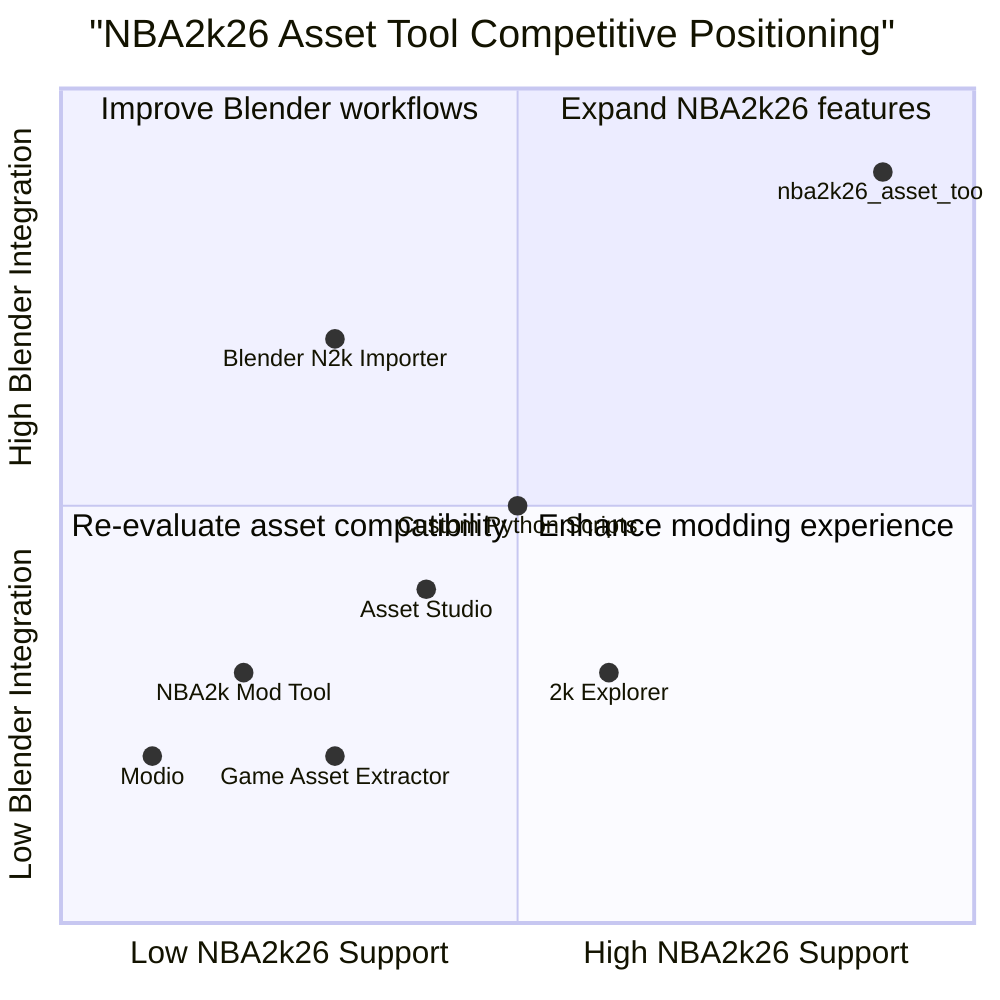

# NBA2k26 Asset Tool & Blender Add-on PRD

## 1. Language & Project Info
- Language: English
- Programming Language: Python (Windows standalone tool), Python (Blender 3.x add-on)
- Project Name: nba2k26_asset_tool
- Original Requirement: Implement a Python program for a Windows standalone tool that reads NBA 2k26 assets to export JSON and DDS files, along with a Blender 3.x add-on that imports, edits, and exports player models in the same JSON/DDS format, ensuring preservation of textures and rigging.

## 2. Product Definition
### Product Goals
1. Enable reliable extraction of NBA 2k26 player assets to JSON and DDS formats.
2. Provide seamless import, editing, and export of player models in Blender 3.x, preserving textures and rigging.
3. Ensure compatibility and ease-of-use for modders and asset creators.

### User Stories
- As a modder, I want to export NBA 2k26 player assets to JSON/DDS so that I can edit them outside the game.
- As a 3D artist, I want to import player models into Blender with textures and rigging intact so that I can make visual modifications.
- As a developer, I want to re-export edited models from Blender in the same format so that they can be re-integrated into NBA 2k26.
- As a user, I want a simple UI for asset selection and export so that I can quickly process multiple files.
- As a technical artist, I want to verify texture and rigging preservation after import/export so that my edits do not break game compatibility.

### Competitive Analysis
| Product                | Pros                                         | Cons                                         |
|------------------------|----------------------------------------------|----------------------------------------------|
| NBA2k Mod Tool         | Supports older NBA2k versions, easy to use   | No support for 2k26, limited Blender support |
| Blender N2k Importer   | Direct Blender integration                   | May not preserve rigging/textures fully      |
| Asset Studio           | Multi-format export, batch processing        | No NBA2k26 support, UI complexity            |
| Modio                  | Community-driven, plugin ecosystem           | Not focused on NBA2k assets                  |
| Custom Python Scripts  | Highly customizable                         | Requires technical expertise                 |
| 2k Explorer            | Asset browsing, partial export               | No Blender integration, format limitations   |
| Game Asset Extractor   | Broad format support                        | Generic, lacks NBA2k-specific features       |

### Competitive Quadrant Chart

## 3. Technical Specifications
### Requirements Analysis
- Must support reading NBA 2k26 proprietary asset formats (player models, textures, rigging data).
- Must export player models to JSON (geometry, rigging, metadata) and DDS (texture maps).
- Must provide a Windows GUI for asset selection, preview, and export.
- Blender 3.x add-on must import JSON/DDS, allow editing, and export back to the same format.
- Texture and rigging data must be preserved during import/export cycles.
- Should support batch processing of multiple assets.
- Should provide error handling and validation for asset integrity.

### Requirements Pool
- P0: NBA 2k26 asset reading and parsing (Must-have)
- P0: JSON/DDS export from Windows tool (Must-have)
- P0: Blender add-on import/export with texture/rigging preservation (Must-have)
- P1: Batch processing support (Should-have)
- P1: Asset preview in Windows tool (Should-have)
- P2: Advanced error reporting and logging (Nice-to-have)
- P2: Customizable export settings (Nice-to-have)

### UI Design Draft
- Windows Tool:
  - File browser for NBA 2k26 asset selection
  - Preview pane for model and texture
  - Export options (JSON, DDS)
  - Batch export toggle
  - Status bar for progress/errors
- Blender Add-on:
  - Import menu for NBA 2k26 JSON/DDS
  - Edit mode (geometry, rigging, textures)
  - Export menu (preserve format)
  - Validation dialog for asset integrity

### Open Questions
- What is the exact NBA 2k26 asset file format specification?
- Are there existing libraries for NBA 2k26 asset parsing?
- What Blender rigging features must be supported for full compatibility?
- Is there a need for cross-platform support (Mac/Linux)?
- What are the performance requirements for batch processing?
