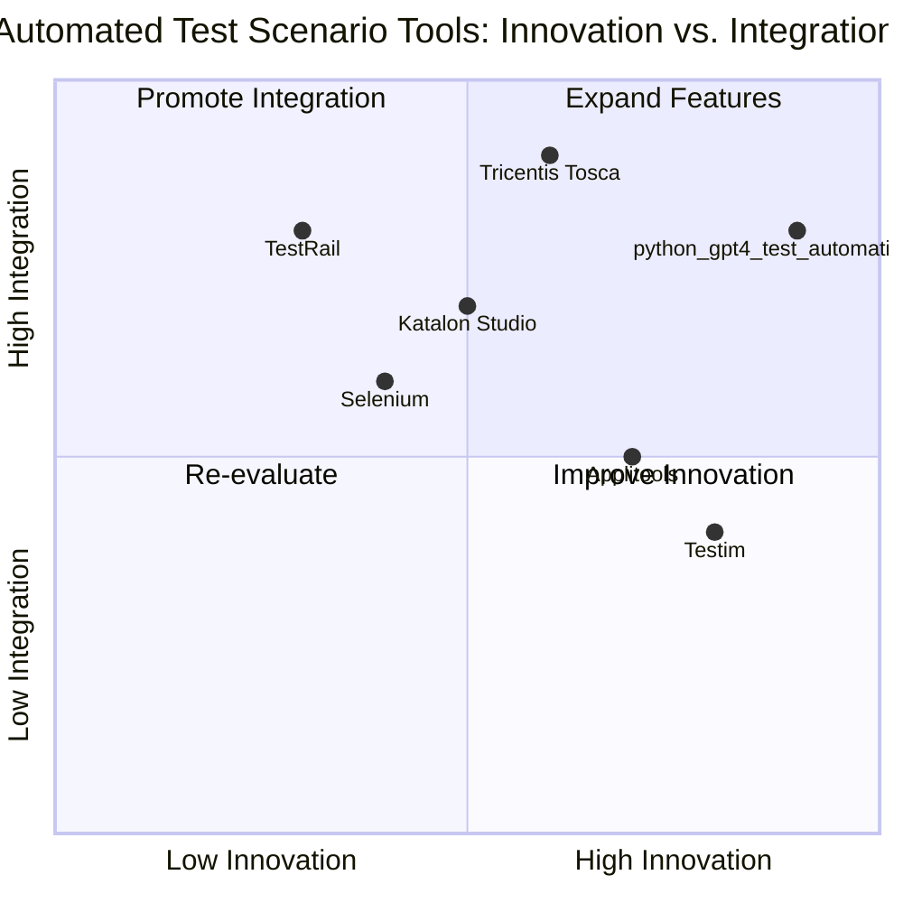

# Product Requirement Document (PRD): python_gpt4_test_automation_app

## 1. Language & Project Info
- **Language:** English
- **Programming Language:** Python
- **Project Name:** python_gpt4_test_automation_app
- **Restated Requirements:**
  - Develop a Python standalone .exe application that utilizes the GPT-4 API to:
    - Generate input Excel files for automated test scenarios
    - Analyze output files and categorize errors
    - Log all data into a RAG (Retrieval-Augmented Generation) knowledge base
    - Improve future input generation based on historical data
    - Support multi-client environments
    - Use a local storage solution (SQLite or JSON)

## 2. Product Definition
### Product Goals
1. Automate the generation and analysis of test scenario files using GPT-4.
2. Enable error categorization and continuous improvement of test inputs via a RAG knowledge base.
3. Support multi-client operations with secure, efficient local data storage.

### User Stories
- As a QA engineer, I want to automatically generate test input Excel files so that I can save time and reduce manual errors.
- As a test manager, I want the application to analyze output files and categorize errors so that I can quickly identify and address issues.
- As a developer, I want all test data and error logs stored in a RAG knowledge base so that the system can improve future input generation.
- As an IT administrator, I want the application to support multiple clients so that different teams can use it independently.
- As a product owner, I want local storage using SQLite or JSON so that data is secure and easily accessible.
### Competitive Analysis

| Product/Tool                | Pros                                              | Cons                                              |
|-----------------------------|---------------------------------------------------|---------------------------------------------------|
| TestRail                    | Robust test management, multi-client support      | No GPT-4 integration, limited automation          |
| Selenium                    | Widely used, open-source, flexible                | Manual test case creation, no built-in RAG        |
| Applitools                  | Visual testing, AI-powered error detection        | Focused on UI, not Excel or GPT-4                 |
| Katalon Studio              | All-in-one automation, supports data-driven tests | No GPT-4, limited error categorization            |
| Tricentis Tosca             | Model-based, strong analytics                     | Expensive, complex setup                          |
| Testim                      | AI-powered, easy integration                      | Limited local storage, no RAG knowledge base      |
| Custom Python Frameworks    | Highly customizable, open-source                  | Requires manual setup, lacks advanced analytics   |

### Competitive Quadrant Chart

## 3. Technical Specifications

### Requirements Analysis
- The application must be a standalone .exe built with Python (e.g., using PyInstaller).
- It must integrate with the GPT-4 API for generating test input Excel files.
- The system should analyze output files, categorize errors, and log all data into a RAG knowledge base.
- The application must continuously improve input generation based on historical data and error analysis.
- Multi-client support is required, with data isolation and secure access for each client.
- Local storage must be implemented using either SQLite or JSON, configurable per deployment.
- The UI should be simple, allowing users to upload/download files, view error reports, and manage clients.

### Requirements Pool
- **P0 (Must-have):**
  - Standalone .exe application
  - GPT-4 API integration for input generation
  - Output file analysis and error categorization
  - RAG knowledge base for logging and retrieval
  - Multi-client support with data isolation
  - Local storage (SQLite/JSON)
- **P1 (Should-have):**
  - Configurable error categories
  - User management and access control
  - Dashboard for error trends and input improvements
- **P2 (Nice-to-have):**
  - Customizable test scenario templates
  - Integration with external test management tools
  - Advanced analytics and reporting

### UI Design Draft
- **Main Dashboard:**
  - Client selector (dropdown)
  - Upload input/output Excel files
  - Generate new test input (button)
  - View error reports (table/list)
  - Knowledge base access (search/view)
- **Settings:**
  - Storage type selection (SQLite/JSON)
  - API key management
  - User management (if enabled)

### Open Questions
- What is the expected volume of test scenarios and clients?
- Are there specific security or compliance requirements for local storage?
- Should the RAG knowledge base support external integrations?
- What level of customization is needed for error categories and reporting?
- Is there a preferred framework for the UI (Tkinter, PyQt, etc.)?
