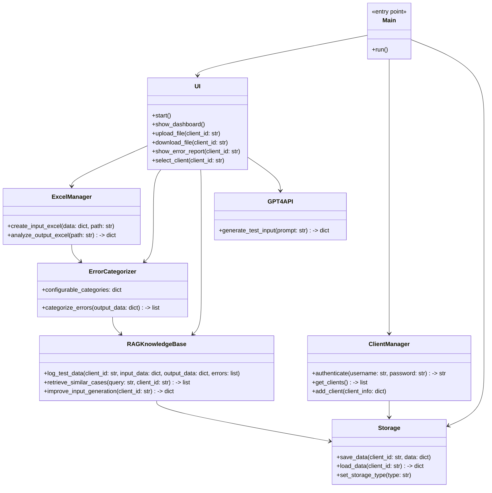

## Implementation approach

We will build a Python desktop application packaged as a standalone .exe using PyInstaller. The app will use Tkinter for the UI (simple, cross-platform, and compatible with .exe builds). For GPT-4 API integration, we'll use the requests library. Excel file generation and analysis will be handled by openpyxl and pandas. Error categorization logic will be modular and configurable. The RAG knowledge base will use SQLite (default) or JSON for local storage, with per-client data isolation. Multi-client support will be managed via user authentication and client-specific data partitions. The system will continuously improve input generation by leveraging historical data and error logs stored in the knowledge base.

## File list

- main.py
- ui.py
- gpt4_api.py
- excel_manager.py
- error_categorizer.py
- rag_knowledge_base.py
- client_manager.py
- storage.py
- config.py
- requirements.txt
- README.md
- /docs/system_design.md
- /docs/system_design-sequence-diagram.mermaid
- /docs/system_design-sequence-diagram.mermaid-class-diagram

## Data structures and interfaces:



## Program call flow:

```mermaid
sequenceDiagram
    participant M as Main
    participant U as UI
    participant CM as ClientManager
    participant S as Storage
    participant G as GPT4API
    participant EM as ExcelManager
    participant EC as ErrorCategorizer
    participant KB as RAGKnowledgeBase

    M->>U: start()
    U->>CM: authenticate(username, password)
    CM->>S: load_data(client_id)
    U->>G: generate_test_input(prompt)
    G-->>U: return test input data
    U->>EM: create_input_excel(data, path)
    U->>EM: analyze_output_excel(path)
    EM-->>U: return output data
    U->>EC: categorize_errors(output_data)
    EC-->>U: return error list
    U->>KB: log_test_data(client_id, input_data, output_data, errors)
    U->>KB: improve_input_generation(client_id)
    KB-->>U: return improved input suggestions
    U->>S: save_data(client_id, all_data)
    U->>U: show_error_report(client_id)

## Anything UNCLEAR

- Expected volume of test scenarios and clients is not specified; may affect performance and storage design.
- Security/compliance requirements for local storage are unclear; default to basic encryption and access control.
- Whether RAG knowledge base should support external integrations is not specified.
- Level of customization for error categories and reporting needs clarification.
- Preferred UI framework is not specified; Tkinter is chosen for simplicity, but PyQt or others could be considered if required.
