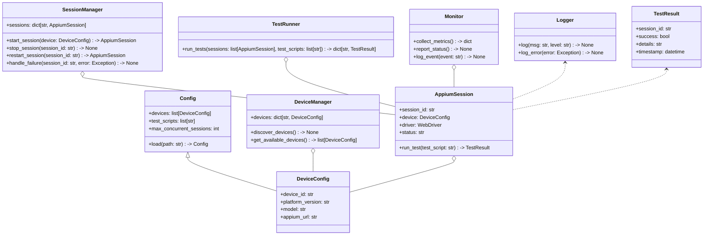
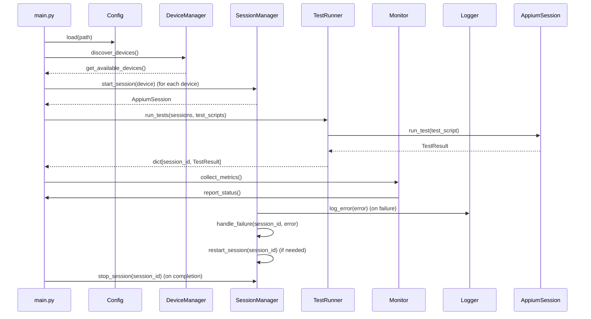

## Implementation approach

We will use Python's threading and concurrent.futures for multithreaded management of Appium sessions. The system will leverage the Appium-Python-Client for device interaction, and psutil for resource monitoring. Logging and error handling will be implemented using Python's logging module. The architecture will be modular, separating device/session management, test execution, monitoring, and configuration. Code will be optimized for thread safety, resource usage, and maintainability. Real-time status reporting will be provided via a CLI or optional web dashboard (Flask-based, if needed). Scalability is achieved by abstracting device pools and session managers, allowing easy extension to more devices or integration with CI/CD.

## File list

- main.py
- config.py
- device_manager.py
- session_manager.py
- test_runner.py
- monitor.py
- logger.py
- utils.py
- requirements.txt
- docs/system_design.md

## Data structures and interfaces:

## Program call flow:

## Anything UNCLEAR

- Maximum number of concurrent devices required?
- Specific Android versions or device models to support?
- Details of the most critical bugs in the existing codebase?
- Is integration with external test management or CI/CD tools needed?
- What level of reporting and analytics is expected by stakeholders?
