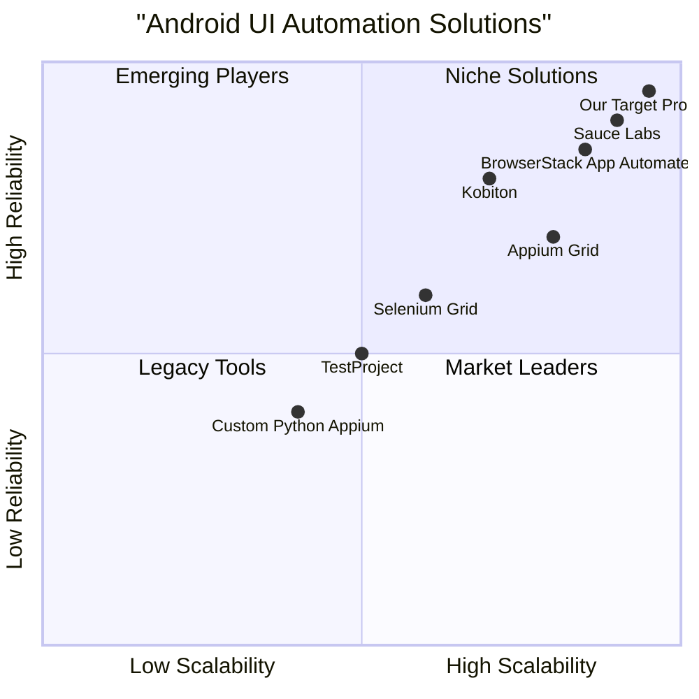

# Product Requirement Document: Multithreaded Appium Automation for Android

## 1. Language & Project Info
- **Language:** English
- **Programming Language:** Python
- **Project Name:** multithreaded_appium_android
- **Restated Requirements:**
  - Develop a Python program that runs multiple multithreaded Appium instances to perform UI interactions on Android devices.
  - The program must optimize the existing codebase and address significant bugs.
  - Requirements must include scalability, reliability, and performance improvements.

## 2. Product Definition
### Product Goals
1. Enable concurrent UI automation on multiple Android devices using multithreaded Appium instances.
2. Optimize code for maximum performance and resource efficiency.
3. Ensure high reliability and scalability for large-scale automated testing.
### User Stories
1. As a QA engineer, I want to run automated UI tests on multiple Android devices in parallel so that I can reduce testing time and increase coverage.
2. As a developer, I want the program to automatically recover from Appium or device failures so that test runs are reliable and require minimal manual intervention.
3. As a test manager, I want to scale the number of concurrent Appium sessions based on available hardware so that I can optimize resource usage and test throughput.
4. As a DevOps engineer, I want to monitor the performance and status of all running Appium instances so that I can quickly identify and resolve bottlenecks or failures.

### Competitive Analysis
| Product                        | Pros                                              | Cons                                             |
|-------------------------------|---------------------------------------------------|--------------------------------------------------|
| Appium Grid                   | Scalable, supports multiple devices, open-source   | Complex setup, resource intensive                |
| Selenium Grid                 | Mature, parallel execution, good reporting         | Limited mobile support, less Android focus       |
| Kobiton                       | Cloud-based, easy device management                | Paid, limited customization                      |
| Sauce Labs                    | Scalable, cloud-based, strong analytics            | Expensive, less control over infrastructure      |
| TestProject                   | Free, easy setup, supports parallel execution      | Limited advanced features, sunset announced      |
| BrowserStack App Automate     | Large device cloud, easy integration               | Costly, limited local device support             |
| Custom Python Appium Scripts  | Flexible, full control, open-source                | Requires manual scaling, error-prone             |

### Competitive Quadrant Chart

## 3. Technical Specifications
### Requirements Analysis
- The program must support launching and managing multiple Appium server instances in parallel using Python multithreading.
- Each Appium instance should be able to connect to a unique Android device or emulator and execute UI interaction scripts independently.
- The system must handle device/Appium failures gracefully, with automatic retries and error logging.
- Resource usage (CPU, memory, network) must be optimized to maximize throughput and minimize bottlenecks.
- The codebase must be refactored to eliminate major bugs, improve maintainability, and support future enhancements.
- The solution should be easily configurable for different device pools, test scripts, and concurrency levels.
- Real-time monitoring and reporting of test execution status, device health, and performance metrics are required.

### Requirements Pool
- **P0 (Must-have):**
  - Multithreaded management of Appium instances
  - Robust error handling and recovery
  - Optimized resource usage
  - Support for multiple Android devices/emulators
  - Real-time status and performance reporting
  - Major bug fixes in existing codebase
- **P1 (Should-have):**
  - Configurable device pools and test scripts
  - Scalable architecture for large device farms
  - Integration with CI/CD pipelines
- **P2 (Nice-to-have):**
  - Web-based dashboard for monitoring
  - Historical test result analytics
  - Support for iOS devices

### UI Design Draft
- **Main Interface:**
  - Dashboard showing active Appium sessions, device status, and test progress
  - Controls to start/stop sessions, configure device pools, and select test scripts
  - Real-time logs and error notifications
- **Reporting:**
  - Summary view of test results, device health, and performance metrics

### Open Questions
- What is the maximum number of concurrent devices required?
- Are there specific Android versions or device models to support?
- What are the most critical bugs in the existing codebase?
- Is integration with external test management or CI/CD tools needed?
- What level of reporting and analytics is expected by stakeholders?
