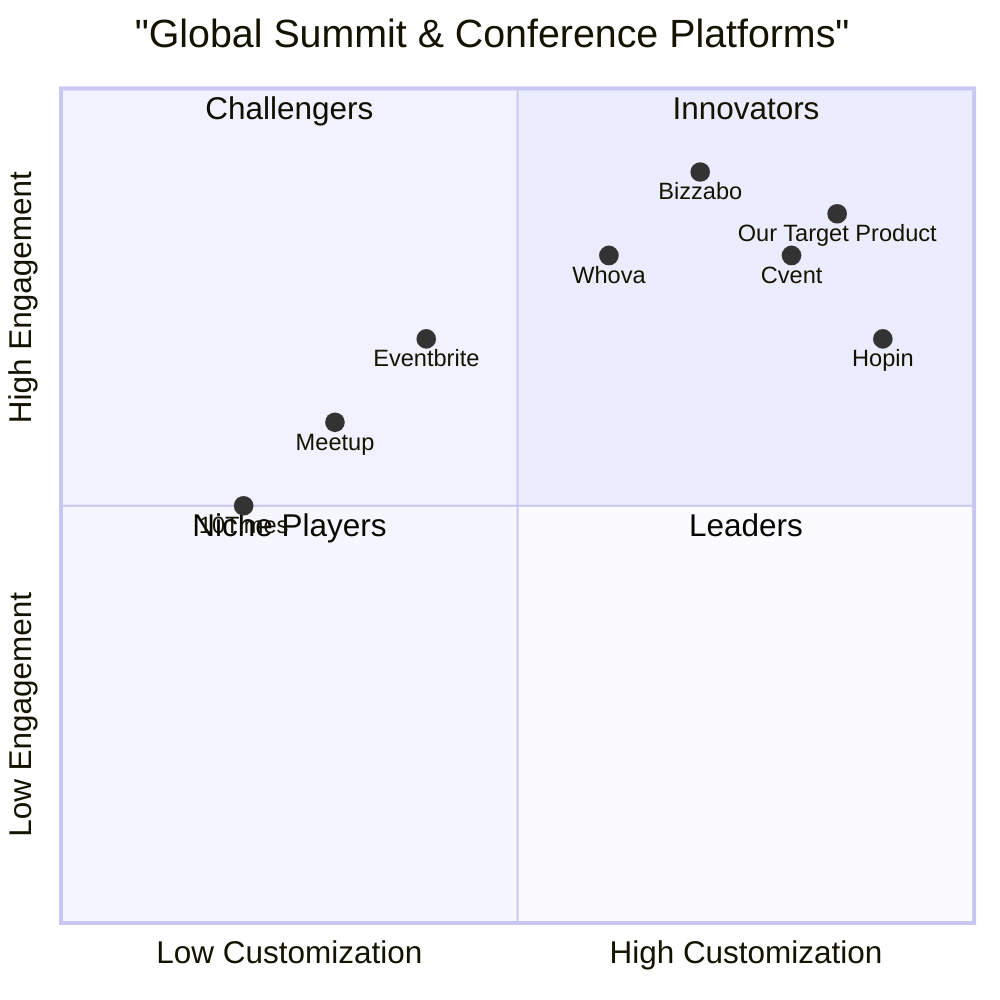

# Product Requirement Document (PRD): Global Summits & Conferences Aggregator

## 1. Language & Project Info
- **Language:** English
- **Programming Language:** Python (Django framework)
- **Project Name:** global_summits_conferences_aggregator
- **Restated Requirements:**
  - Build a Django web application that aggregates global summits and conferences.
  - Must include user profiles for delegates, organizers, and speakers.
  - Integrate ticketing and payment systems.
  - Provide AI chatbot functionality for user support and event interaction.
  - Include administrative controls for event management and monetization.

## 2. Product Definition
### Product Goals
1. Enable seamless discovery and aggregation of global summits and conferences.
2. Facilitate secure ticketing, payment, and user management for all stakeholders.
3. Enhance user engagement and support through integrated AI chatbot features.

### User Stories
- As a **delegate**, I want to browse and register for events so that I can participate in relevant summits and conferences.
- As an **organizer**, I want to list and manage my events so that I can reach a global audience and monetize my offerings.
- As a **speaker**, I want to showcase my profile and sessions so that I can attract invitations and engage with attendees.
- As an **admin**, I want to control platform operations and monetization so that I can ensure quality and profitability.
- As a **user**, I want to interact with an AI chatbot so that I can get instant support and event recommendations.

### Competitive Analysis
### Competitive Analysis
| Platform   | Pros | Cons |
|------------|------|------|
| Eventbrite | Widely used, robust ticketing, integrations | Limited customization, fees can be high |
| Meetup     | Strong community features, easy event creation | Less focus on large conferences, limited monetization |
| 10Times    | Global reach, comprehensive event listings | UI can be cluttered, less focus on user engagement |
| Cvent      | Enterprise-grade, advanced analytics | Expensive, complex setup |
| Bizzabo    | Hybrid/virtual event support, networking tools | Higher learning curve, premium pricing |
| Whova      | Interactive agenda, attendee engagement | Limited free features, UI complexity |
| Hopin      | Virtual event focus, scalable | Can be costly, less suited for in-person only events |

### Competitive Quadrant Chart

## 3. Technical Specifications
### Requirements Analysis
The application will be built using Python and Django, leveraging Django REST Framework for API endpoints and React for the frontend (if SPA is required). Key technical requirements include:

- **User Profiles & Roles:**
  - Delegates: Register, manage profiles, browse events, purchase tickets, interact with chatbot.
  - Organizers: Create/manage events, view sales, manage attendees, monetize events.
  - Speakers: Manage speaker profiles, link to sessions, interact with attendees.
  - Admin: Full access to manage users, events, monetization, and platform settings.

- **Event Aggregation:**
  - Centralized listing of global summits and conferences.
  - Advanced search, filtering, and categorization.
  - Event detail pages with schedules, speakers, and ticketing options.

- **Ticketing & Payment Integration:**
  - Secure ticket purchase flow (Stripe/PayPal integration).
  - E-ticket generation and QR code support.
  - Order history and refund management.

- **AI Chatbot Functionality:**
  - NLP-powered chatbot for event discovery, FAQs, and support.
  - Integration with OpenAI or similar service.
  - Contextual recommendations and escalation to human support.

- **Administrative Controls:**
  - Dashboard for event and user management.
  - Monetization controls (fees, commissions, featured listings).
  - Analytics and reporting tools.

- **Security & Compliance:**
  - GDPR compliance, secure authentication (OAuth2/Social login), and role-based access control.
  - Audit logs and data privacy controls.

### Requirements Pool
**P0 (Must-have):**
- User registration and authentication (delegates, organizers, speakers, admin)
- Event listing, search, and filtering
- Ticketing system with payment integration (Stripe/PayPal)
- AI chatbot for event discovery and support
- Admin dashboard for event/user management and monetization controls
- GDPR compliance and secure data handling

**P1 (Should-have):**
- Speaker profile management and session linking
- E-ticket generation and QR code support
- Order history and refund management
- Analytics and reporting tools for organizers and admin
- Social login (Google, LinkedIn, Facebook)

**P2 (Nice-to-have):**
- Advanced event recommendation engine
- In-app messaging between delegates, organizers, and speakers
- Featured/Promoted event listings
- Multi-language support
- Mobile-responsive design

### UI Design Draft
### UI Design Draft
- **Landing Page:** Event search, featured summits, login/register buttons.
- **Event Listing:** Filter/search sidebar, event cards with details and ticket options.
- **Event Detail Page:** Full event info, speaker profiles, schedule, ticket purchase, chatbot widget.
- **User Dashboard:** Tabs for profile, tickets, events (for delegates, organizers, speakers).
- **Admin Dashboard:** User/event management, analytics, monetization controls.
- **Chatbot Widget:** Persistent on all pages for instant support.

### Open Questions
- What specific AI chatbot features are required (e.g., event recommendations, live support, FAQ)?
- Which payment providers are preferred (Stripe, PayPal, others)?
- Are there geographic or language requirements for event listings?
- What monetization models should be supported (commissions, featured listings, ads)?
- Is mobile app support required, or is responsive web sufficient?
