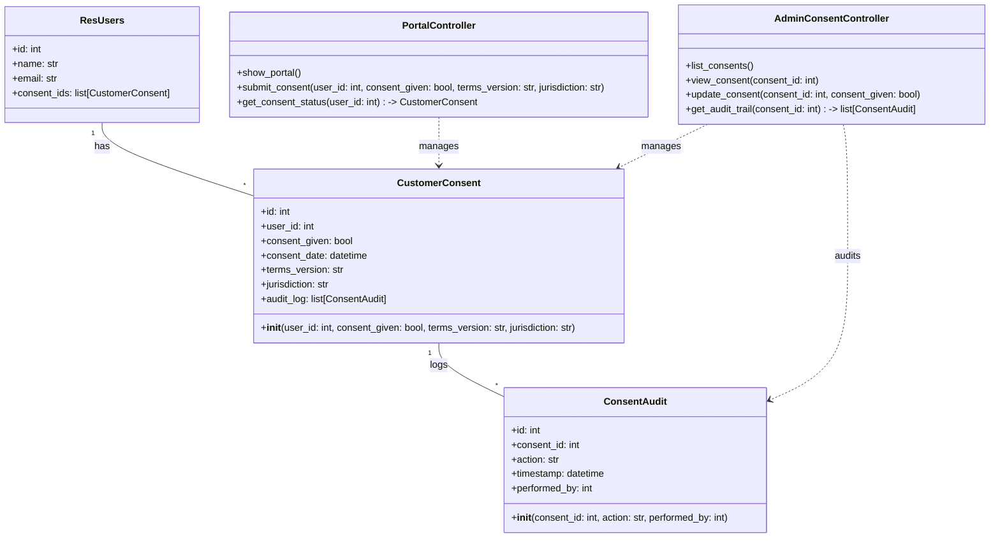
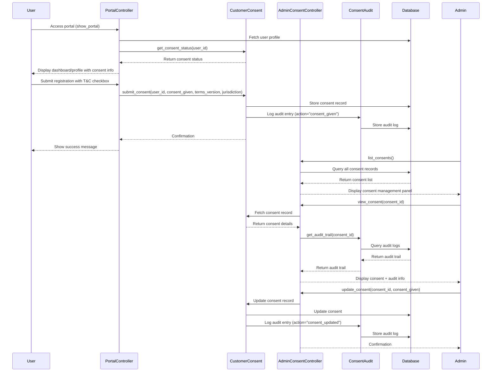

## Implementation approach

We will redesign the Odoo Online customer portal UI using Odoo's QWeb templating system for frontend structure, SCSS for modern styling, and JavaScript for interactive elements. For legal compliance, we will add a Terms & Conditions checkbox to relevant forms, store customer consent in the backend (PostgreSQL via Odoo ORM), and provide admin tools for consent management and audit trails. The architecture will leverage Odoo's modularity, using custom modules and extending existing models/views. Open-source libraries such as Bootstrap (for SCSS), vanilla JS, and Odoo's built-in ORM will be used for simplicity and maintainability.

## File list

- odoo_online_customer_portal/
  - __init__.py
  - __manifest__.py
  - models/
    - customer_consent.py
  - views/
    - portal_templates.xml (QWeb)
    - admin_consent_templates.xml (QWeb)
  - static/
    - src/
      - scss/
        - portal.scss
      - js/
        - portal.js
  - controllers/
    - main.py
  - security/
    - ir.model.access.csv
  - docs/
    - system_design.md
    - system_design-sequence-diagram.mermaid
    - system_design-sequence-diagram.mermaid-class-diagram

## Data structures and interfaces:

## Program call flow:

## Anything UNCLEAR

- Legal jurisdictions to support (GDPR, CCPA, etc.) need clarification.
- Should consent be versioned if Terms & Conditions change?
- What reporting features are required for compliance audits?
- Is multi-language support required for Terms & Conditions?
