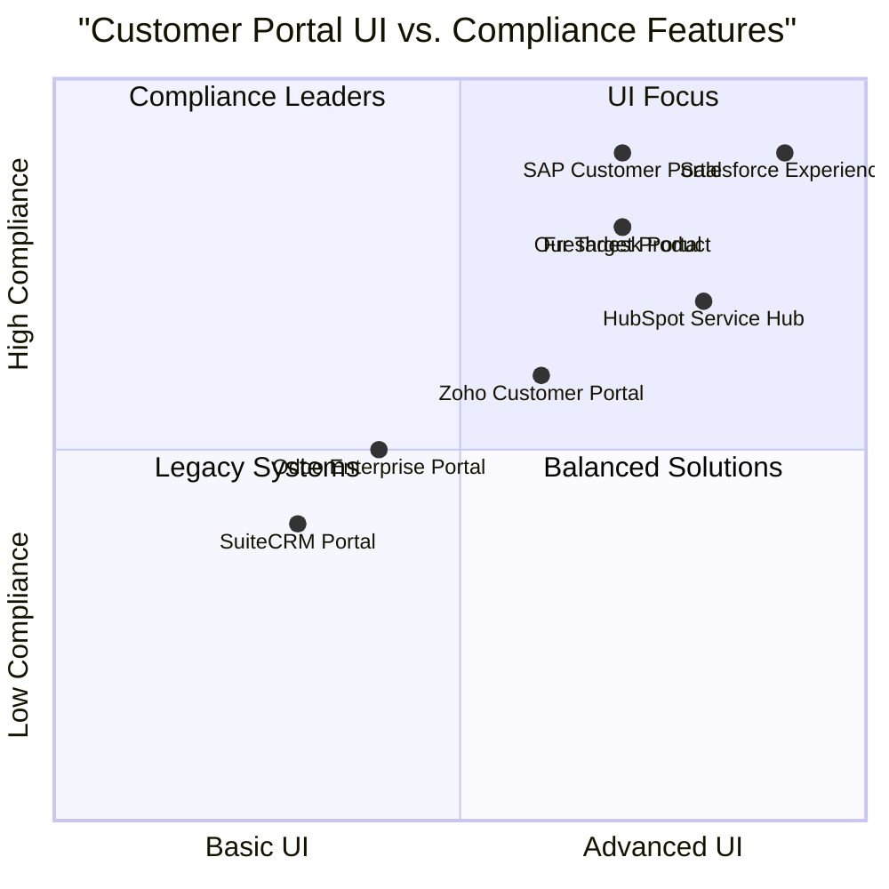

# Odoo Online Customer Portal Redesign PRD

## 1. Language & Project Info
- **Language:** English
- **Programming Language:** Python (Odoo framework), QWeb, SCSS, JS
- **Project Name:** odoo_online_customer_portal
- **Restated Requirements:**
  - Redesign the Odoo Online customer portal UI using QWeb, SCSS, and JS.
  - Integrate legal compliance features: Terms & Conditions checkbox, customer consent storage, and necessary frontend/backend modifications.

## 2. Product Definition
### Product Goals
1. Modernize the customer portal UI for improved usability and aesthetics.
2. Ensure legal compliance by capturing and storing customer consent for Terms & Conditions.
3. Seamlessly integrate new features into both frontend and backend with minimal disruption.

### User Stories
- As a customer, I want to easily navigate the portal so that I can access my account and services efficiently.
- As a customer, I want to see and accept Terms & Conditions before proceeding so that my consent is recorded for legal compliance.
- As an admin, I want to view and manage customer consent records so that I can ensure regulatory requirements are met.
- As a developer, I want the UI components to be modular and maintainable so that future updates are easier.
- As a compliance officer, I want to verify that consent storage meets legal standards so that the business avoids penalties.

### Competitive Analysis
| Product                | Pros                                      | Cons                                      |
|------------------------|-------------------------------------------|-------------------------------------------|
| Odoo Enterprise Portal | Native integration, robust features        | UI less modern, limited compliance tools  |
| Zoho Customer Portal   | Customizable, compliance modules           | Less flexible backend, higher cost        |
| Salesforce Experience  | Advanced UI, strong compliance features    | Complex setup, expensive                  |
| Freshdesk Portal       | User-friendly, GDPR tools                  | Limited backend customization             |
| SuiteCRM Portal        | Open source, customizable                  | UI outdated, compliance features limited  |
| HubSpot Service Hub    | Modern UI, consent management              | Expensive, less backend flexibility       |
| SAP Customer Portal    | Enterprise-grade, compliance ready         | High cost, complex integration            |

### Competitive Quadrant Chart

## 3. Technical Specifications
### Requirements Analysis
- **Frontend:**
  - Redesign UI using QWeb templates, SCSS for styling, and JS for interactivity.
  - Add Terms & Conditions checkbox to registration and relevant forms.
  - Display consent status to users and admins.
- **Backend:**
  - Store customer consent in the database (linked to user profile).
  - Provide admin interface for consent management and reporting.
  - Ensure audit trail for consent changes.
- **Legal Compliance:**
  - Ensure consent capture meets GDPR and other relevant standards.
  - Allow users to review and update consent.

### Requirements Pool
- **P0 (Must-have):**
  - Modern UI redesign (QWeb, SCSS, JS)
  - Terms & Conditions checkbox
  - Consent storage in backend
  - Admin consent management
- **P1 (Should-have):**
  - Audit trail for consent changes
  - User ability to review/update consent
- **P2 (Nice-to-have):**
  - Customizable Terms & Conditions per region
  - Consent analytics dashboard

### UI Design Draft
- **Layout:**
  - Dashboard with navigation sidebar
  - Profile page with consent status
  - Registration/login forms with T&C checkbox
  - Admin panel for consent management

### Open Questions
- What legal jurisdictions must be supported (GDPR, CCPA, etc.)?
- Should consent be versioned if Terms & Conditions change?
- What reporting features are required for compliance audits?
- Is multi-language support required for T&C?
