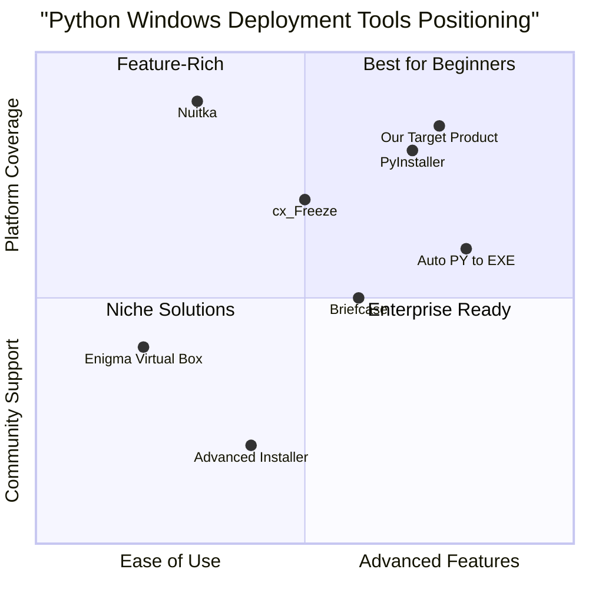

# Python Windows Deployment Tool PRD

## 1. Language & Project Info
- **Language:** English
- **Programming Language:** Python (with Windows-specific scripting)
- **Project Name:** python_windows_deployment_tool
- **Restated Requirements:**
  - Implement a Python program to automate the installation of the correct Python build on Windows machines.
  - Configure environment variables for Python and dependencies.
  - Verify and install required dependencies.
  - Compile Python source scripts into standalone .exe files using tools such as PyInstaller or cx_Freeze.
  - Test the generated executables for functionality across multiple user accounts.

## 2. Product Definition
### Product Goals
1. Automate Python environment setup and configuration on Windows systems.
2. Streamline the process of compiling Python scripts into reliable standalone executables.
3. Ensure cross-user functionality and robust testing of generated executables.

### User Stories
- As an IT administrator, I want to deploy Python applications as .exe files so that end users can run them without installing Python.
- As a developer, I want to automate dependency verification and installation so that my scripts work reliably on any Windows machine.
- As a QA engineer, I want to test executables across multiple user accounts so that I can ensure consistent functionality.
- As a support technician, I want to configure environment variables automatically so that manual setup errors are minimized.
- As a project manager, I want a repeatable deployment process so that releases are faster and less error-prone.
### Competitive Analysis

| Product/Tool         | Pros                                              | Cons                                              |
|---------------------|---------------------------------------------------|---------------------------------------------------|
| PyInstaller         | Easy to use, widely adopted, good documentation   | Limited advanced customization, occasional issues |
| cx_Freeze           | Cross-platform, supports complex dependencies     | Less intuitive, smaller community                 |
| Nuitka              | Compiles to C, performance boost                  | More complex setup, less beginner-friendly        |
| Briefcase           | Multi-platform, GUI support                       | Limited Windows features, less mature             |
| Auto PY to EXE      | GUI for PyInstaller, user-friendly                | Relies on PyInstaller, limited advanced options   |
| Enigma Virtual Box  | Bundles files, supports virtualization            | Not open source, limited Python support           |
| Advanced Installer  | Professional installer creation                   | Commercial, not Python-specific                   |

#### Competitive Quadrant Chart

## 3. Technical Specifications

### Requirements Analysis
- The tool must detect the current Windows environment and install the appropriate Python build (32/64-bit, version).
- It should configure system and user environment variables for Python and dependencies.
- Must verify and install all required Python packages (from requirements.txt or similar).
- Should support compiling scripts into .exe files using PyInstaller and cx_Freeze, with options for both.
- Must automate testing of generated executables across multiple user accounts, reporting any issues.
- Should provide clear logs and error messages for troubleshooting.

### Requirements Pool
- **P0 (Must-have):**
  - Automated Python installation and environment variable configuration
  - Dependency verification and installation
  - Compilation to .exe using PyInstaller/cx_Freeze
  - Automated multi-user testing of executables
- **P1 (Should-have):**
  - Support for both 32-bit and 64-bit Python builds
  - Customizable installation paths
  - Detailed logging and error reporting
- **P2 (Nice-to-have):**
  - GUI for configuration and status monitoring
  - Integration with Active Directory for user management
  - Support for additional packaging tools

### UI Design Draft
- Main window with tabs for:
  - Environment Setup
  - Dependency Management
  - Compilation
  - Testing & Reports
- Status indicators for each step
- Log output panel
- Configuration options (paths, Python version, packaging tool)

### Open Questions
- Which minimum Python versions must be supported?
- Are there specific dependencies or frameworks required?
- Should the tool support remote deployment or only local?
- What level of logging/detail is required for troubleshooting?
- Is GUI mandatory or is CLI sufficient for initial release?
