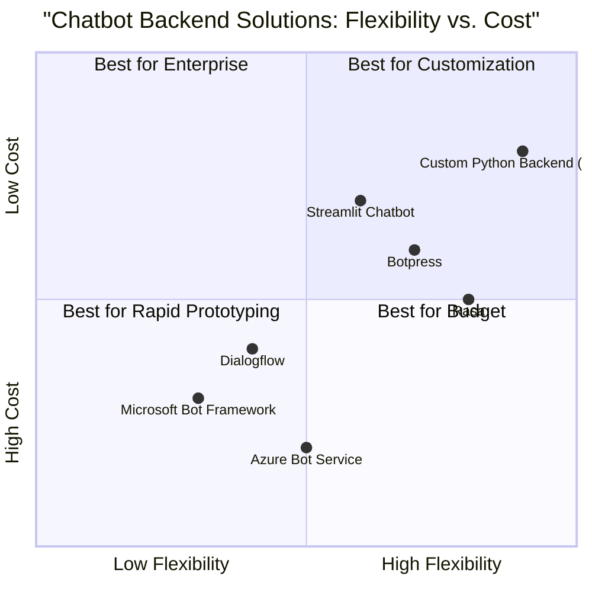

# Product Requirement Document: Python Chatbot Backend on Azure VM

## 1. Language & Project Info
- **Language:** English
- **Programming Language:** Python (Backend), HTML & JavaScript (Frontend)
- **Project Name:** python_chatbot_azure_vm

### Restated Requirements
A Python backend program will be deployed on a cost-effective Azure VM, serving as the backend for a web-based chatbot. The backend must interface with the OpenAI API to process and generate responses. The chatbot frontend will be hosted on an Azure free web app, featuring a clean UI/UX designed using HTML and JavaScript. The frontend will communicate with the backend via HTTP API. The deployment environment is Azure, with the backend on a VM and the frontend on a free web app.

## 2. Product Definition
### Product Goals
1. Provide a reliable, scalable Python backend for chatbot interactions, deployed cost-effectively on Azure VM.
2. Ensure seamless integration with the OpenAI API for high-quality conversational AI responses.
3. Deliver a clean, user-friendly web interface accessible via Azure free web app, with robust communication between frontend and backend.

### User Stories
- As a user, I want to interact with a chatbot through a web interface so that I can get instant responses to my queries.
- As an admin, I want to deploy the backend on a low-cost Azure VM so that operational expenses are minimized.
- As a developer, I want the frontend to communicate with the backend via HTTP API so that integration is straightforward and maintainable.
- As a product owner, I want the chatbot to leverage the OpenAI API so that responses are intelligent and context-aware.
- As a user, I want the web app to have a clean and intuitive UI/UX so that my experience is enjoyable and efficient.
### Competitive Analysis
1. **Microsoft Bot Framework**
   - Pros: Deep Azure integration, scalable, supports multiple channels.
   - Cons: Complex setup, may require paid Azure services, less flexible for custom Python backends.
2. **Dialogflow (Google Cloud)**
   - Pros: Powerful NLP, easy integration, rich UI tools.
   - Cons: Not native to Azure, pricing can escalate, less control over backend.
3. **Rasa**
   - Pros: Open-source, customizable, supports Python, on-premise or cloud deployment.
   - Cons: Requires manual setup, not optimized for Azure, UI/UX not included.
4. **Botpress**
   - Pros: Open-source, modular, supports custom backend logic.
   - Cons: Node.js based, not Python, Azure deployment requires extra configuration.
5. **Azure Bot Service**
   - Pros: Native Azure support, easy deployment, scalable.
   - Cons: Limited free tier, less control over backend stack, may incur costs.
6. **Custom Flask/FastAPI Python Backend**
   - Pros: Full control, cost-effective on cheap VM, easy OpenAI API integration.
   - Cons: Requires manual deployment, security and scaling handled by developer.
7. **Streamlit Chatbot**
   - Pros: Rapid prototyping, Python-based, simple UI.
   - Cons: Not production-grade, limited UI/UX customization, not optimized for Azure web app.

### Competitive Quadrant Chart

(Sections to be completed: Product Goals, User Stories, Competitive Analysis, Competitive Quadrant Chart)

## 3. Technical Specifications
### Requirements Analysis
- The backend must be implemented in Python and deployed on a cost-effective Azure VM (e.g., B1s/B1ls tier).
- The backend must expose an HTTP API endpoint for chatbot interactions.
- The backend must securely interface with the OpenAI API for generating responses.
- The frontend must be hosted on Azure free web app, built with HTML and JavaScript, and communicate with the backend via HTTP API.
- The UI/UX must be clean, responsive, and intuitive, supporting real-time chat interactions.
- Security, scalability, and cost-efficiency are critical for both backend and frontend.

### Requirements Pool
- **P0 (Must-have):**
  - Python backend on Azure VM
  - HTTP API for chatbot communication
  - OpenAI API integration
  - HTML/JavaScript frontend on Azure free web app
  - Clean, responsive UI/UX
- **P1 (Should-have):**
  - Basic authentication for backend API
  - Error handling and logging
  - Mobile-friendly design
- **P2 (Nice-to-have):**
  - Conversation history
  - Customizable chatbot avatar
  - Analytics dashboard

### UI Design Draft
- **Layout:**
  - Header with chatbot title
  - Main chat window with message bubbles
  - Input box for user queries
  - Send button
- **Functionality:**
  - Real-time message display
  - Loading indicator for responses
  - Responsive design for desktop and mobile

### Open Questions
- What is the expected user load (concurrent users)?
- Are there specific security or compliance requirements?
- Should the chatbot support multiple languages?
- Is persistent conversation history required?
- What branding elements (logo, colors) should be included in the UI?
(Sections to be completed: Requirements Analysis, Requirements Pool, UI Design Draft, Open Questions)
