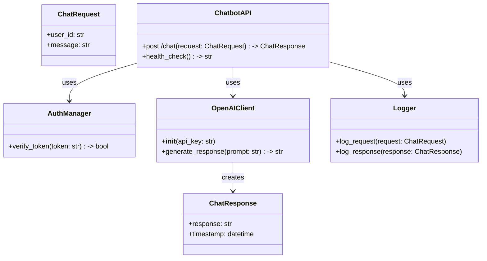
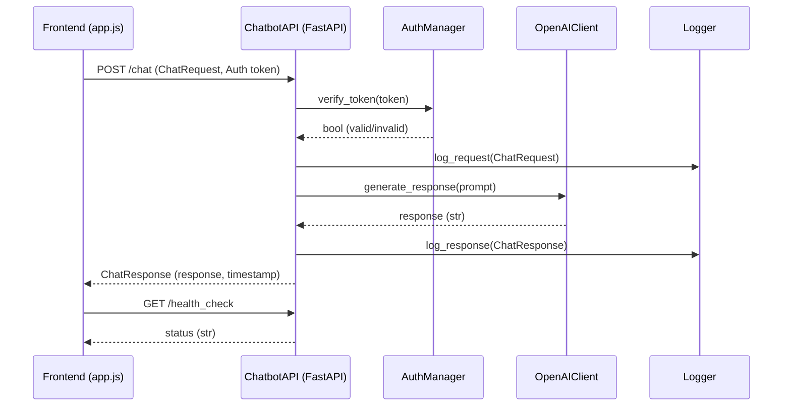

## Implementation approach

We will use FastAPI for the Python backend due to its speed, async support, and automatic OpenAPI documentation. The backend will be deployed on a cost-effective Azure VM (e.g., B1s/B1ls tier). The backend will expose secure HTTP endpoints for the chatbot frontend, which will be a static HTML/JavaScript web app hosted on Azure free web app. Communication between frontend and backend will use HTTPS, with CORS enabled and basic authentication for the backend API. The backend will securely interface with the OpenAI API using an API key stored in environment variables. Logging and error handling will be implemented for reliability. The frontend will feature a clean, responsive UI/UX with real-time chat updates.

## File list

- backend/
    - main.py
    - requirements.txt
    - .env (for OpenAI API key)
    - utils.py
    - auth.py
    - logging_config.py
- frontend/
    - index.html
    - style.css
    - app.js
- docs/
    - system_design.md
    - system_design-sequence-diagram.mermaid
    - system_design-sequence-diagram.mermaid-class-diagram

## Data structures and interfaces:

## Program call flow:

## Anything UNCLEAR

- Expected user load and scaling requirements are not specified.
- Security/compliance requirements (e.g., GDPR, HIPAA) are unclear.
- Persistent conversation history is not required per PRD, but may be added later.
- Branding elements (logo, colors) for frontend UI are not specified.
- Multi-language support is not required per PRD, but may be considered in future.
