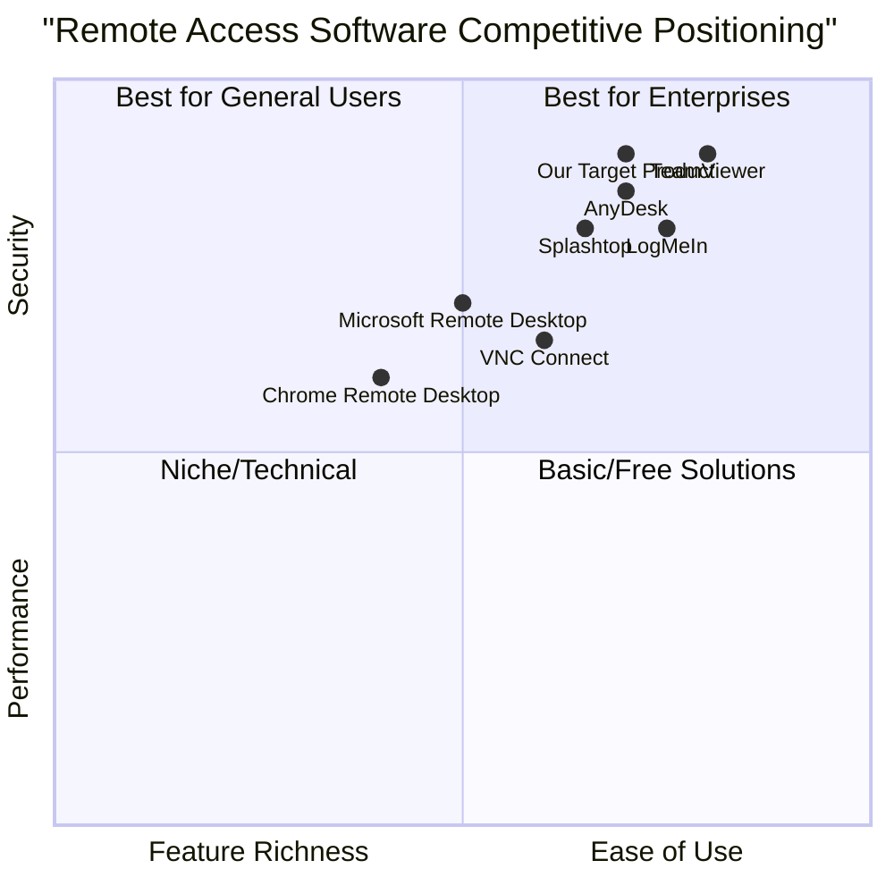

# 1. Language & Project Info

**Language:** English
**Programming Language:** Python (with cross-platform support)
**Project Name:** remote_access_software

**Restated Requirements:**
Develop a remote access software application in Python that supports Windows, MacOS, iOS, Android, and Chromebook. The application must ensure secure and reliable access, provide a user-friendly interface, deliver high performance, and include robust security features such as encryption and authentication.

# 2. Product Definition

## 2.1 Product Goals
1. Ensure secure and reliable remote access across all major platforms (Windows, MacOS, iOS, Android, Chromebook).
2. Deliver a user-friendly interface that simplifies connection management and device navigation.
3. Provide high performance with minimal latency and robust security features, including end-to-end encryption and multi-factor authentication.

## 2.2 User Stories
- As a remote worker, I want to securely access my office computer from any device so that I can work efficiently from anywhere.
- As an IT administrator, I want to manage and troubleshoot multiple devices remotely so that I can resolve issues quickly and securely.
- As a student, I want to access school resources from my Chromebook or mobile device so that I can complete assignments remotely.
- As a business owner, I want to ensure that only authorized users can access sensitive systems so that company data remains protected.
- As a support agent, I want to guide users through technical issues via remote sessions so that I can provide effective assistance.

## 2.3 Competitive Analysis

| Product           | Platforms Supported                | Pros                                                      | Cons                                                      |
|-------------------|------------------------------------|-----------------------------------------------------------|-----------------------------------------------------------|
| TeamViewer        | Windows, MacOS, Linux, iOS, Android, Chromebook | Easy setup, strong security, file transfer, multi-platform | Expensive for business, may be blocked by firewalls       |
| AnyDesk           | Windows, MacOS, Linux, iOS, Android, Chromebook | High performance, low latency, lightweight, affordable     | Limited free version, occasional compatibility issues      |
| Chrome Remote Desktop | Windows, MacOS, Linux, Chromebook, Android, iOS | Free, easy integration with Google accounts, simple UI     | Limited features, no file transfer, basic security         |
| Splashtop         | Windows, MacOS, Linux, iOS, Android, Chromebook | High performance, affordable, good for business/education  | Some features require premium, setup can be complex        |
| Microsoft Remote Desktop | Windows, MacOS, iOS, Android, Chromebook | Free, integrated with Windows, secure                      | Limited to Windows hosts, less intuitive for non-Windows   |
| LogMeIn           | Windows, MacOS, iOS, Android       | Reliable, business features, file transfer                 | Expensive, resource intensive                             |
| VNC Connect       | Windows, MacOS, Linux, iOS, Android, Raspberry Pi | Open standard, customizable, secure                        | Setup can be technical, UI less modern                    |

### Competitive Quadrant Chart

# 3. Technical Specifications

## 3.1 Requirements Analysis
- Cross-platform compatibility: Must support Windows, MacOS, iOS, Android, and Chromebook.
- Secure communication: End-to-end encryption (AES-256 or higher), secure authentication (OAuth2, MFA).
- Reliable connectivity: Automatic reconnection, adaptive bitrate, low-latency streaming.
- User-friendly interface: Intuitive dashboard, device list, quick connect, session controls.
- Performance: Optimized for minimal latency, efficient resource usage, scalable architecture.
- Session management: Multiple concurrent sessions, session logging, remote file transfer.
- Access controls: Role-based permissions, device authorization, audit trails.

## 3.2 Requirements Pool
- **P0 (Must-have):**
  - Secure remote access (encryption, authentication)
  - Support for all target platforms
  - Intuitive UI for connection management
  - Reliable session connectivity
- **P1 (Should-have):**
  - Multi-factor authentication
  - File transfer between devices
  - Session logging and audit trails
  - Role-based access controls
- **P2 (Nice-to-have):**
  - Remote printing
  - Clipboard sharing
  - Customizable UI themes

## 3.3 UI Design Draft
- **Main Dashboard:**
  - Device list (online/offline status)
  - Quick connect button
  - Recent sessions
- **Session Window:**
  - Remote desktop view
  - File transfer panel
  - Chat/support panel
  - Security status indicator
- **Settings:**
  - Account management
  - Security preferences (MFA, password)
  - Device authorization

## 3.4 Open Questions
- What is the preferred authentication provider (e.g., Google, Microsoft, custom)?
- Are there specific compliance requirements (e.g., GDPR, HIPAA)?
- What is the expected maximum number of concurrent sessions per user?
- Should the product support remote printing and clipboard sharing at launch?
- Is offline access or local caching required for any platform?
