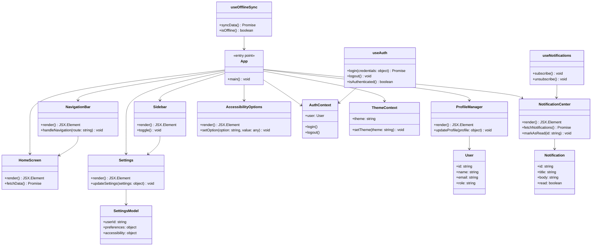
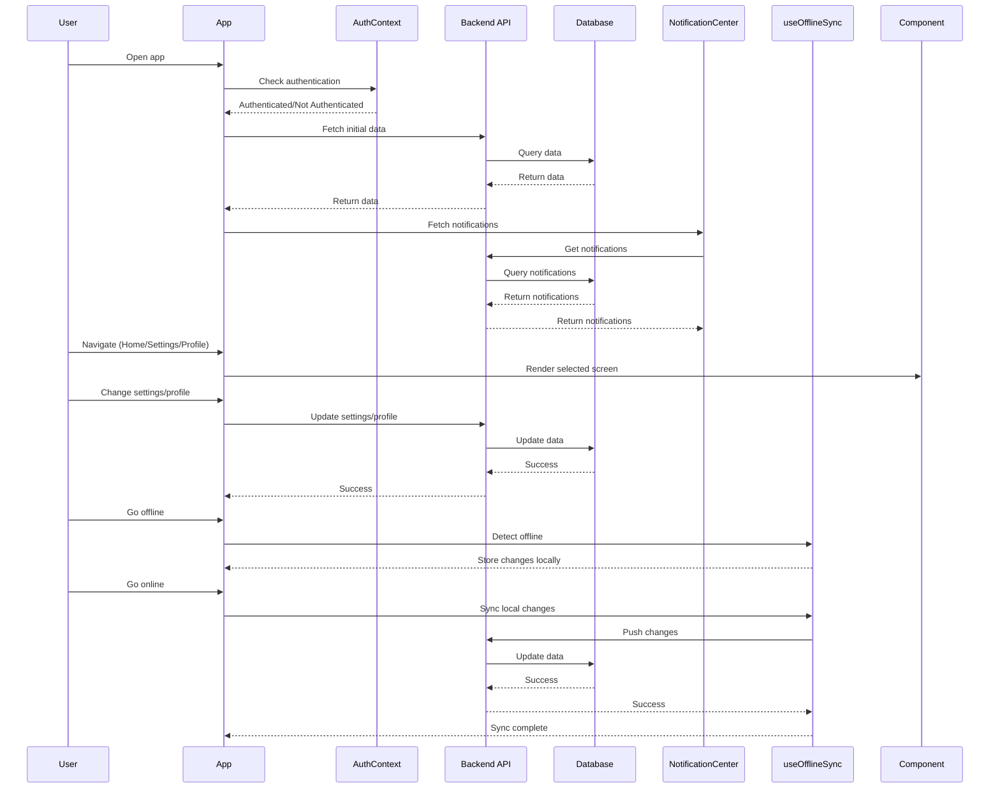

## Implementation approach

We will use Vite + React for the frontend, leveraging MUI and Tailwind CSS for responsive, accessible, and customizable UI components. This ensures fast development and consistent UI/UX across desktop and mobile. For backend, Node.js with Express will provide RESTful APIs, authentication, and data sync. We will use IndexedDB/localStorage for offline mode and data synchronization. Platform-specific features (notifications, camera, file system) will be accessed via browser APIs or wrappers (e.g., Capacitor for mobile, Electron for desktop if packaging is needed). Accessibility will be ensured via MUI and ARIA standards. Modular architecture will be achieved using React context, hooks, and reusable components.

Recommended frameworks/libraries:
- Frontend: Vite, React, MUI, Tailwind CSS, React Router, i18next (multi-language), React Query (data sync), Capacitor (mobile APIs), Electron (desktop packaging, optional)
- Backend: Node.js, Express, Passport.js (auth), MongoDB (data), Socket.io (real-time sync)

## File list

- index.html
- src/
    - App.jsx
    - main.jsx
    - components/
        - NavigationBar.jsx
        - Sidebar.jsx
        - HomeScreen.jsx
        - Settings.jsx
        - NotificationCenter.jsx
        - ProfileManager.jsx
        - AccessibilityOptions.jsx
    - hooks/
        - useOfflineSync.js
        - useAuth.js
        - useNotifications.js
    - context/
        - AuthContext.jsx
        - ThemeContext.jsx
    - assets/
        - icons/
        - styles/
            - theme.js
            - tailwind.css
    - i18n/
        - en.json
        - es.json
    - routes/
        - index.jsx
    - utils/
        - device.js
        - api.js
- backend/
    - server.js
    - models/
        - User.js
        - Notification.js
        - Settings.js
    - routes/
        - auth.js
        - user.js
        - notification.js
        - settings.js
    - middleware/
        - auth.js
    - config/
        - db.js
- package.json
- README.md

## Data structures and interfaces:

## Program call flow:

## Anything UNCLEAR

- Core features for initial release need clarification (beyond navigation, settings, notifications, profile management).
- Preferred authentication method (OAuth, SSO, etc.) is not specified.
- Platform-specific compliance/security requirements are not detailed.
- Analytics/reporting requirements are unclear.
- Expected user base size/growth is not provided.
