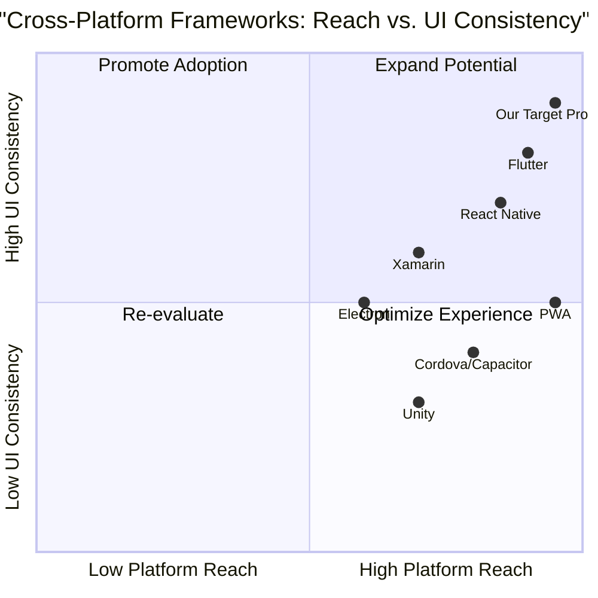

# Cross Platform App PRD

## 1. Language & Project Info
- **Language:** English
- **Programming Language:** Vite, React, MUI, Tailwind CSS (default selection)
- **Project Name:** cross_platform_app
- **Restated Requirements:**
  - Develop a cross-platform application ensuring seamless functionality across desktop (Windows, macOS, ChromeOS) and mobile (Android, iOS, ChromeOS, Windows) platforms.
  - Focus on robust UI/UX design principles for consistent and intuitive user experience.

## 2. Product Definition
(Sections to be completed: Product Goals, User Stories, Competitive Analysis, Quadrant Chart)

## 3. Technical Specifications
(Sections to be completed: Requirements Analysis, Requirements Pool, UI Design Draft, Open Questions)
### Product Goals
1. Ensure seamless cross-platform functionality and performance across all specified desktop and mobile platforms.
2. Deliver a unified, intuitive, and accessible UI/UX experience tailored for both desktop and mobile users.
3. Enable rapid development and easy maintenance through modular architecture and reusable components.

### User Stories
- As a user, I want the application to look and behave consistently on all my devices so that I can switch between platforms without confusion.
- As a mobile user, I want touch-friendly controls and responsive layouts so that I can easily interact with the app on my phone or tablet.
- As a desktop user, I want keyboard shortcuts and mouse support so that I can efficiently use the app on my computer.
- As an admin, I want to update content and features centrally so that changes are reflected instantly across all platforms.
- As a developer, I want a modular codebase so that I can quickly add new features and fix bugs without breaking existing functionality.

### Competitive Analysis
- **Flutter**: Pros – Excellent cross-platform support, strong UI toolkit, fast development. Cons – Larger app size, some platform-specific limitations.
- **React Native**: Pros – Large community, reusable code, good performance. Cons – Native module dependency, UI consistency challenges.
- **Electron**: Pros – Desktop focus, web technologies, easy packaging. Cons – High memory usage, limited mobile support.
- **Xamarin**: Pros – Native performance, C# integration, Microsoft support. Cons – Smaller community, UI customization complexity.
- **Cordova/Capacitor**: Pros – Simple web-to-app conversion, broad device support. Cons – Performance issues, limited native features.
- **Progressive Web Apps (PWA)**: Pros – No install required, works on any device, easy updates. Cons – Limited access to device features, browser dependency.
- **Unity**: Pros – Powerful for graphics-heavy apps/games, multi-platform export. Cons – Overkill for standard apps, larger footprint.

### Competitive Quadrant Chart

### Requirements Analysis
- The application must run natively or as a high-performance hybrid on Windows, macOS, ChromeOS (desktop), and Android, iOS, ChromeOS, Windows (mobile).
- UI/UX must adapt responsively to different screen sizes and input methods (touch, mouse, keyboard).
- Consistent navigation, theming, and branding across all platforms.
- Support for offline mode and synchronization when reconnected.
- Modular codebase to facilitate feature expansion and maintenance.
- Accessibility compliance (WCAG 2.1 AA or higher).
- Integration with platform-specific features (notifications, file system, camera, etc.) where possible.

### Requirements Pool
- **P0 (Must-have):**
  - Seamless cross-platform compatibility (Windows, macOS, ChromeOS, Android, iOS)
  - Responsive UI/UX for all device types
  - Centralized authentication and user management
  - Offline mode with data sync
  - Accessibility compliance
- **P1 (Should-have):**
  - Theming and customization options
  - Integration with device features (camera, notifications)
  - Multi-language support
- **P2 (Nice-to-have):**
  - Advanced analytics dashboard
  - Plugin/extension support
  - In-app guided tours

### UI Design Draft
- **Navigation:**
  - Bottom navigation bar for mobile, sidebar for desktop
  - Consistent iconography and color palette
- **Home Screen:**
  - Quick access to main features
  - Adaptive layout for screen size
- **Settings:**
  - Profile management, preferences, accessibility options
- **Notifications:**
  - Unified notification center, platform-specific integration

### Open Questions
1. What are the core features and use cases for the initial release?
2. Are there any platform-specific compliance or security requirements?
3. What is the preferred authentication method (OAuth, SSO, etc.)?
4. What analytics and reporting capabilities are required?
5. What is the expected user base size and growth projection?
