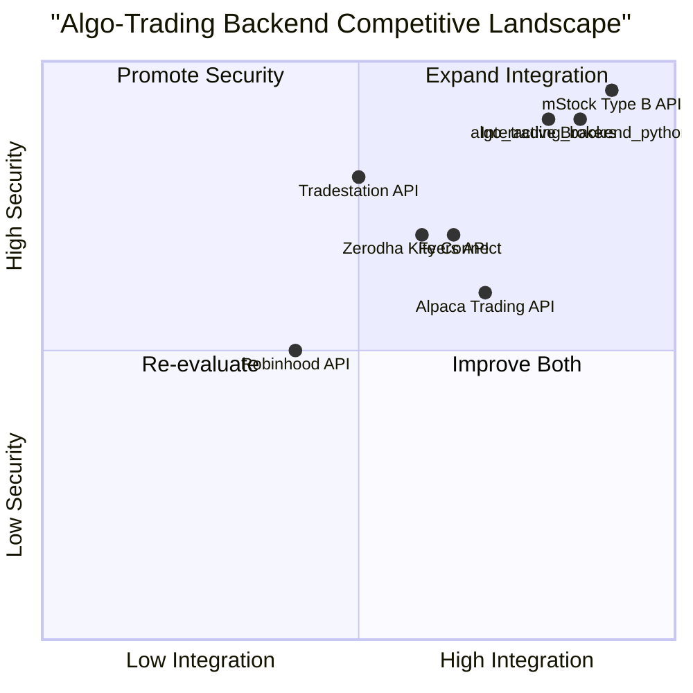

# Product Requirement Document (PRD): algo_trading_backend_python

## 1. Language & Project Info
- **Language:** English
- **Programming Language:** Python
- **Project Name:** algo_trading_backend_python
- **Restated Requirements:**
  - Develop a Python backend program to manage user authentication, session management, and fund details using mStock Type A User APIs. The system must include API key generation, login flow, session token generation, logout functionality, and robust error handling.

## 2. Product Definition
### Product Goals
1. Ensure secure and reliable user authentication and session management for algo-trading users.
2. Provide seamless integration with mStock Type A User APIs for fund management and trading operations.
3. Deliver a robust backend with comprehensive error handling and audit logging.

### User Stories
- As a trader, I want to securely log in and manage my session so that my trading activities are protected.
- As a developer, I want to generate API keys for users so that third-party integrations are possible.
- As a user, I want to view and manage my fund details so that I can make informed trading decisions.
- As an admin, I want to monitor authentication and session events so that I can audit system activity.
- As a user, I want to log out and terminate my session securely so that my account remains safe.

### Competitive Analysis
| Product                | Pros                                      | Cons                                      |
|------------------------|-------------------------------------------|-------------------------------------------|
| Alpaca Trading API     | Easy integration, good docs               | Limited to US stocks                      |
| Interactive Brokers    | Comprehensive, global access              | Complex API, steep learning curve         |
| Zerodha Kite Connect  | Popular in India, good community support  | Limited international access              |
| Tradestation API       | Advanced analytics, robust infrastructure | US-centric, costly for small traders      |
| Robinhood API (unofficial) | Simple, beginner-friendly              | Unofficial, limited features              |
| mStock Type B API      | Advanced features, high reliability       | More expensive, complex onboarding        |
| Fyers API              | Good for Indian market, easy onboarding   | Limited global reach                      |

### Competitive Quadrant Chart

## 3. Technical Specifications
### Requirements Analysis
- Must support secure API key generation and management.
- Must implement login flow with mStock Type A User APIs.
- Must generate and validate session tokens for authenticated users.
- Must provide logout functionality to terminate sessions.
- Must handle errors gracefully and log all critical events.
- Should support fund details retrieval and update via mStock APIs.
- Should be extensible for future trading features.

### Requirements Pool
- **P0:** Secure API key generation
- **P0:** User login and session management
- **P0:** Session token generation and validation
- **P0:** Logout functionality
- **P0:** Error handling and logging
- **P1:** Fund details management
- **P1:** Admin audit and monitoring
- **P2:** Extensibility for trading features

### UI Design Draft
- No direct UI; RESTful API endpoints for all core functions
- API documentation for integration
- Example endpoint structure:
  - `/api/auth/login` (POST)
  - `/api/auth/logout` (POST)
  - `/api/auth/session` (GET)
  - `/api/funds/details` (GET)
  - `/api/auth/apikey` (POST)

### Open Questions
- What is the expected user volume and concurrency?
- Are there specific compliance or regulatory requirements?
- Should multi-factor authentication be supported?
- What is the preferred error reporting format?
- Is there a need for role-based access control?
