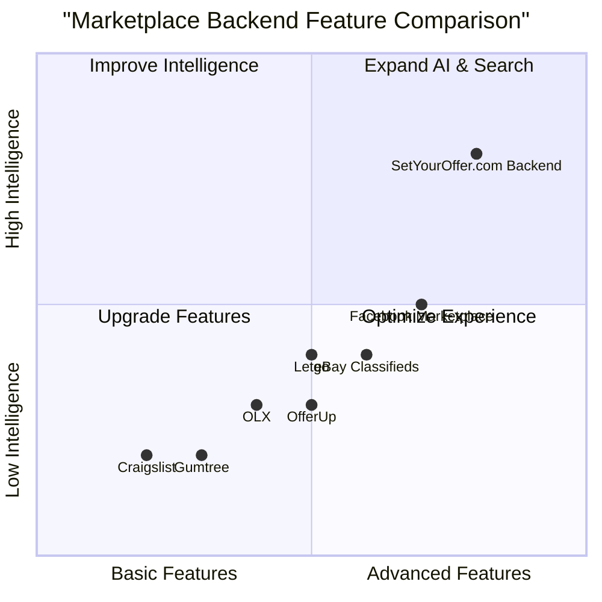

# Product Requirement Document (PRD): SetYourOffer.com Backend

## 1. Language & Project Info
- **Language:** English
- **Programming Language:** Python (Django)
- **Database:** PostgreSQL
- **Project Name:** set_your_offer_backend

### Restated Requirements
The backend for SetYourOffer.com must provide:
1. A smart authentication and registration system
2. An ad submission workflow
3. An advanced search engine
4. AI features for data analysis and recommendations

All user flows, data models, and feature requirements must be covered in detail.

---
## 2. Product Definition

### 2.1 Product Goals
- **Goal 1:** Ensure secure, seamless, and intelligent user authentication and registration.
- **Goal 2:** Enable efficient, user-friendly ad submission and management workflows.
- **Goal 3:** Provide advanced search capabilities for users to discover relevant ads quickly.
- **Goal 4:** Deliver AI-powered data analysis and personalized recommendations to enhance user engagement and platform value.

### 2.2 User Stories
1. As a new user, I want to register quickly and securely so that I can start posting ads immediately.
2. As a returning user, I want to log in with smart authentication so that my account remains protected.
3. As an advertiser, I want to submit and manage my ads easily so that I can reach my target audience.
4. As a buyer, I want to search for ads using advanced filters so that I can find relevant offers efficiently.
5. As a user, I want to receive AI-driven recommendations so that I discover offers tailored to my interests.

### 2.3 Competitive Analysis
| Product                | Pros                                         | Cons                                      |
|------------------------|----------------------------------------------|-------------------------------------------|
| Craigslist             | Large user base, simple UI                   | Limited search, no AI recommendations     |
| Facebook Marketplace   | Social integration, advanced search          | Privacy concerns, ad quality varies       |
| eBay Classifieds       | Trusted brand, secure transactions           | Complex workflows, limited recommendations|
| OfferUp                | Mobile-first, user ratings                   | Search limitations, less data analytics   |
| Gumtree                | Local focus, easy ad posting                 | Basic search, no AI features              |
| OLX                    | Global reach, free listings                  | Limited personalization, basic analytics  |
| Letgo                  | Visual ad browsing, chat integration         | Limited AI, search not highly advanced    |

### 2.4 Competitive Quadrant Chart

---
## 3. Technical Specifications

### 3.1 Requirements Analysis
The backend must support secure user authentication and registration, robust ad submission and management, advanced search capabilities, and AI-driven data analysis and recommendations. All features must be scalable, maintainable, and optimized for performance.

#### Key Technical Needs:
- User authentication (email, social login, multi-factor)
- User registration (validation, onboarding)
- Ad submission (CRUD operations, media uploads, moderation)
- Search engine (full-text, filters, relevance ranking)
- AI features (recommendation engine, analytics dashboard)
- Data models for users, ads, sessions, recommendations
- API endpoints for all major workflows
- Admin controls and moderation tools

### 3.2 Requirements Pool
- **P0 (Must-have):**
  - Secure authentication and registration
  - Ad submission and management
  - Advanced search engine with filters
  - AI-powered recommendations
  - Scalable API endpoints
- **P1 (Should-have):**
  - Social login integration
  - Ad moderation workflow
  - Analytics dashboard for users and admins
- **P2 (Nice-to-have):**
  - Multi-language support
  - Real-time notifications
  - Advanced reporting tools

### 3.3 Data Models
- **User:** id, name, email, password_hash, social_auth, registration_date, last_login, preferences
- **Ad:** id, user_id, title, description, category, price, location, images, status, created_at, updated_at
- **Session:** id, user_id, token, created_at, expires_at
- **Recommendation:** id, user_id, ad_id, score, generated_at
- **SearchLog:** id, user_id, query, filters, timestamp

### 3.4 User Flows
- **Registration:** User submits registration info → System validates → Account created → Welcome email sent
- **Authentication:** User enters credentials → System verifies → Access granted → Session started
- **Ad Submission:** User creates ad → System validates → Ad saved → Moderation (if needed) → Ad published
- **Search:** User enters query/filters → System processes → Relevant ads returned → User interacts with results
- **Recommendations:** User activity tracked → AI engine analyzes data → Personalized ads recommended

### 3.5 UI Design Draft (Backend API)
- **/api/register**: POST (user info)
- **/api/login**: POST (credentials)
- **/api/ads**: GET/POST/PUT/DELETE (ad management)
- **/api/search**: GET (query, filters)
- **/api/recommendations**: GET (user_id)
- **/api/admin/moderate**: POST/GET (ad moderation)
- **/api/analytics**: GET (dashboard data)

### 3.6 Open Questions
- What third-party authentication providers are required?
- What moderation rules should be enforced for ads?
- What AI models/algorithms are preferred for recommendations?
- Are there specific analytics metrics required by stakeholders?
- Is GDPR or other compliance needed for user data?

---
