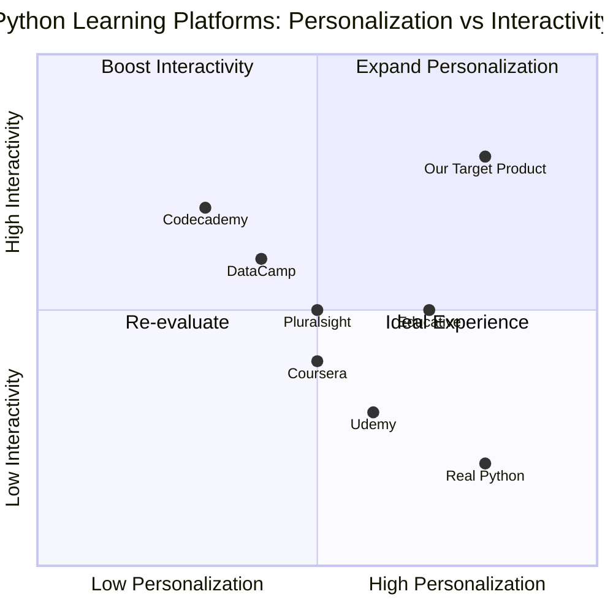

# Personalized Python Roadmap PRD

## 1. Language & Project Info
- Language: English
- Programming Language: Python
- Project Name: personalized_python_roadmap
- Restated Requirement: Create a personalized lesson roadmap for advancing Python skills from intermediate to advanced, incorporating live interactive sessions, practical exercises with feedback, and support for follow-up questions. Detail session formats, feedback mechanisms, and support channels in the PRD.

## 2. Product Definition
### Product Goals
1. Deliver a structured, personalized learning path for intermediate to advanced Python learners.
2. Facilitate live, interactive sessions to maximize engagement and real-time learning.
3. Provide actionable feedback and ongoing support for practical exercises and follow-up questions.

### User Stories
- As an intermediate Python learner, I want tailored lessons so that I can efficiently progress to advanced skills.
- As a student, I want live interactive sessions so that I can ask questions and get instant clarification.
- As a learner, I want practical exercises with feedback so that I can validate my understanding and improve.
- As a user, I want a support channel for follow-up questions so that I can resolve doubts after sessions.
- As an instructor, I want to track learner progress so that I can personalize future lessons.

### Competitive Analysis
| Product                | Pros                                         | Cons                                      |
|------------------------|----------------------------------------------|-------------------------------------------|
| DataCamp               | Structured courses, interactive exercises    | Limited live sessions, generic feedback   |
| Codecademy             | Hands-on practice, community support         | Less personalized, limited advanced depth |
| Coursera               | University-backed, peer forums               | Less interactivity, slow feedback         |
| Udemy                  | Wide variety, self-paced                     | No live support, variable quality         |
| Educative              | Text-based, interactive coding               | No live sessions, limited support         |
| Real Python            | In-depth articles, community Q&A             | No structured roadmap, no live sessions   |
| Pluralsight            | Skill assessments, expert instructors        | Limited interactivity, feedback delays    |

### Competitive Quadrant Chart

## 3. Technical Specifications
### Requirements Analysis
- Must support personalized lesson sequencing based on learner profile and progress.
- Must enable live interactive sessions (video, chat, code collaboration).
- Must provide practical exercises with automated and instructor feedback.
- Must offer support channels for follow-up questions (chat, forum, email).
- Should track learner progress and adapt future lessons.
- Should integrate scheduling and notifications for sessions.

### Requirements Pool
- P0: Personalized lesson roadmap generation
- P0: Live interactive session platform
- P0: Practical exercises with feedback
- P0: Support channel for follow-up questions
- P1: Progress tracking and adaptive learning
- P1: Session scheduling and notifications
- P2: Gamification and achievement badges

### UI Design Draft
- Dashboard: Personalized roadmap, progress tracker
- Live Session Page: Video, chat, collaborative code editor
- Exercise Page: Coding tasks, instant feedback, instructor comments
- Support Center: Chat, forum, email submission

### Open Questions
- What platforms will be used for live sessions (Zoom, custom, etc.)?
- What is the expected instructor-to-learner ratio?
- What feedback turnaround time is required?
- What privacy and data protection standards must be met?
## 4. Session Formats, Feedback Mechanisms, and Support Channels

### Session Formats
- **Live Interactive Sessions:**
  - Format: Scheduled video calls with integrated chat and collaborative code editor.
  - Frequency: Weekly or bi-weekly, based on learner preference and availability.
  - Group Size: 1:1 (personalized) or small group (max 5 learners) for peer learning.
  - Activities: Real-time coding challenges, Q&A, code reviews, and project walkthroughs.
  - Tools: Zoom, Google Meet, or custom platform with code sharing.

### Feedback Mechanisms
- **Practical Exercises:**
  - Automated feedback: Instant validation of code submissions with test cases and hints.
  - Instructor feedback: Personalized comments on code quality, logic, and best practices within 48 hours.
  - Peer review: Optional, for group sessions—learners can review each other's code.
  - Progress dashboard: Visual tracker of completed exercises, feedback received, and skill mastery.

### Support Channels
- **Follow-up Questions:**
  - Live chat: Direct messaging with instructors for quick clarifications.
  - Community forum: Threaded discussions for broader questions and peer support.
  - Email support: For complex or private queries, with a 24-hour response window.
  - FAQ and knowledge base: Self-service resources for common issues and advanced topics.
