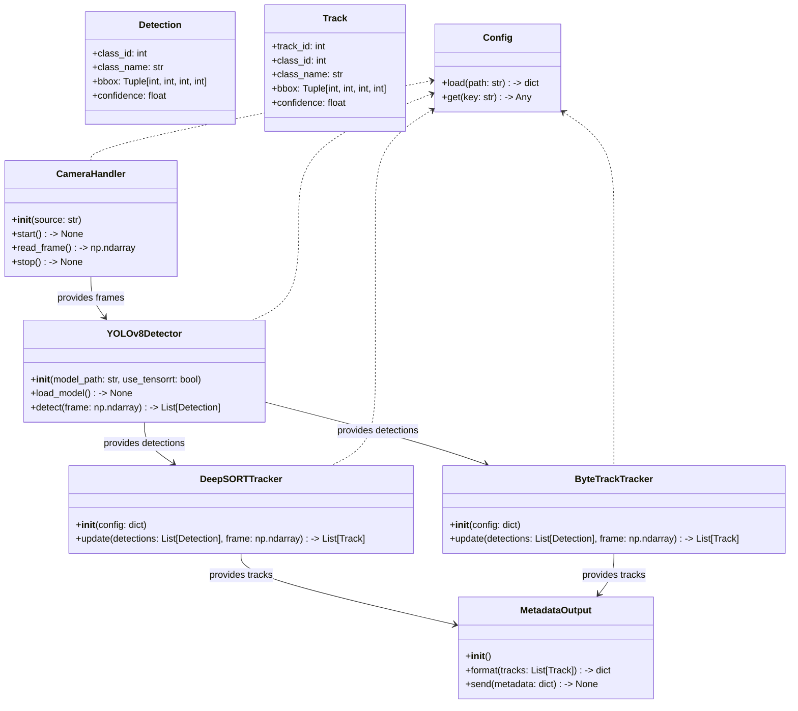
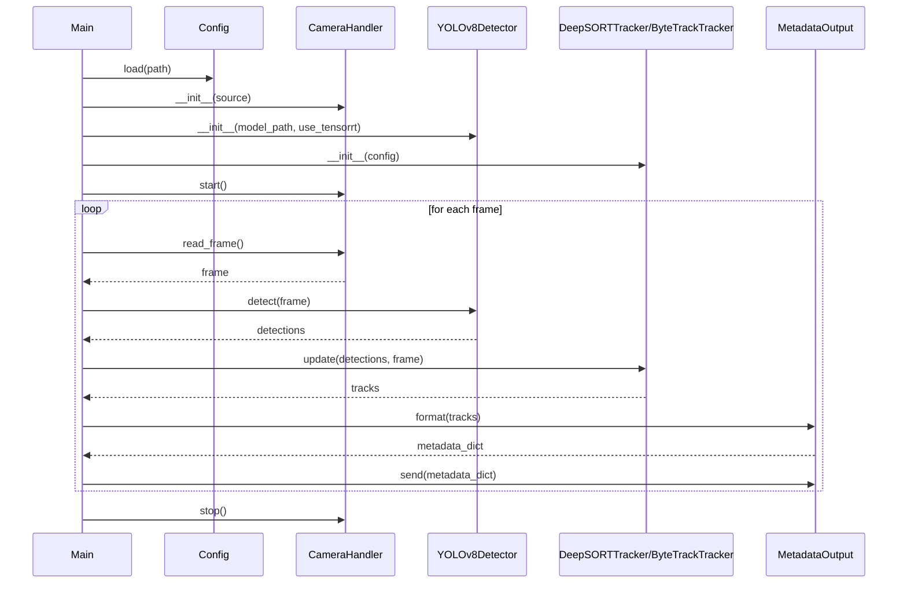

## Implementation approach

We will develop a modular Python system optimized for NVIDIA Jetson Orin NX, leveraging TensorRT for accelerated inference. YOLOv8 will be used for object detection, with support for both DeepSORT and ByteTrack as interchangeable tracking modules. The system will interface with live camera feeds (using OpenCV or GStreamer), output structured real-time metadata, and provide robust error handling. The architecture will allow easy swapping of tracking algorithms and integration with downstream analytics.

Key open-source libraries:
- ultralytics/yolov8 (detection)
- deep_sort_realtime or ByteTrack (tracking)
- OpenCV (camera feed, visualization)
- NVIDIA TensorRT (inference optimization)
- PyCUDA or Numba (optional, for custom GPU ops)

## File list

- main.py
- camera.py
- detector.py
- tracker.py
- metadata.py
- config.py
- utils.py
- requirements.txt
- README.md
- docs/system_design.md
- docs/system_design-sequence-diagram.mermaid
- docs/system_design-sequence-diagram.mermaid-class-diagram

## Data structures and interfaces:

## Program call flow:

## Anything UNCLEAR

- Expected object classes and mission-specific priorities are not specified.
- Required minimum frame rate and latency for operational use are unclear.
- Integration requirements with existing ISR data pipelines need clarification.
- Security and data privacy requirements for metadata transmission are not defined.
