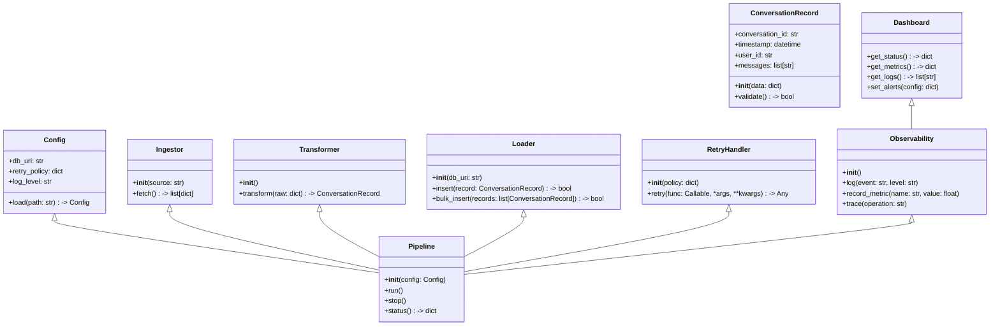
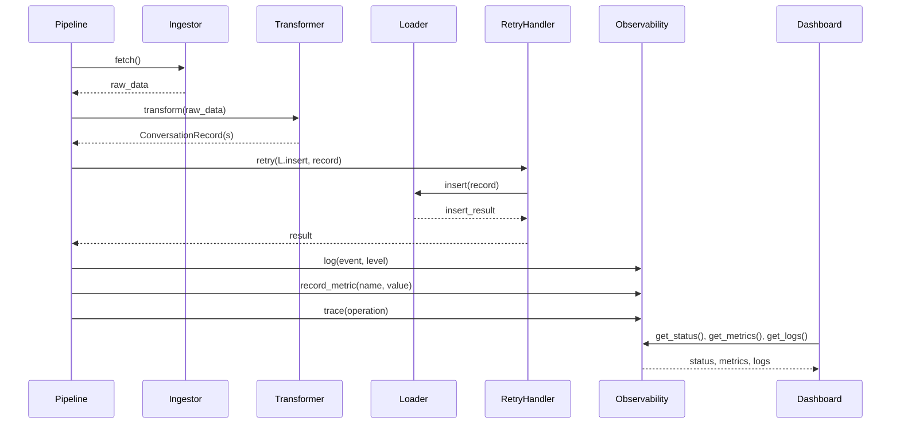

## Implementation approach

We will enhance the existing Python-based ETL pipeline for Claude Code conversations by refactoring and stabilizing the scripts, introducing robust error handling, and ensuring atomic, idempotent inserts into QuestDB. For enterprise-level performance and observability, we will integrate open-source libraries such as:
- **pydantic** for data validation
- **loguru** for structured logging
- **prometheus_client** for metrics
- **opentelemetry** for distributed tracing
- **QuestDB Python client** for database operations
- **FastAPI** for exposing health endpoints and optional UI integration
- **React, MUI, Tailwind CSS** for a dashboard (optional, P1)

The pipeline will be modular, supporting horizontal scaling and cloud/on-prem deployment. Observability will be built-in, with metrics, logs, and traces exposed for monitoring and alerting.

## File list

- etl/__init__.py
- etl/config.py
- etl/models.py
- etl/ingest.py
- etl/transform.py
- etl/load.py
- etl/observability.py
- etl/retry.py
- etl/utils.py
- etl/main.py
- etl/tests/
- requirements.txt
- Dockerfile
- README.md
- dashboard/ (optional, for UI)
    - src/
        - App.jsx
        - components/PipelineStatus.jsx
        - components/MetricsPanel.jsx
        - components/LogViewer.jsx
        - components/AlertConfig.jsx
    - index.html

## Data structures and interfaces:

## Program call flow:

## Anything UNCLEAR

- Expected peak throughput (records/sec) for Claude Code conversations is not specified.
- Compliance/data retention requirements are unclear.
- Multi-tenancy/data partitioning needs clarification.
- Preferred deployment environments (cloud/on-prem/hybrid) are not specified.
- QuestDB schema evolution requirements are unclear.
