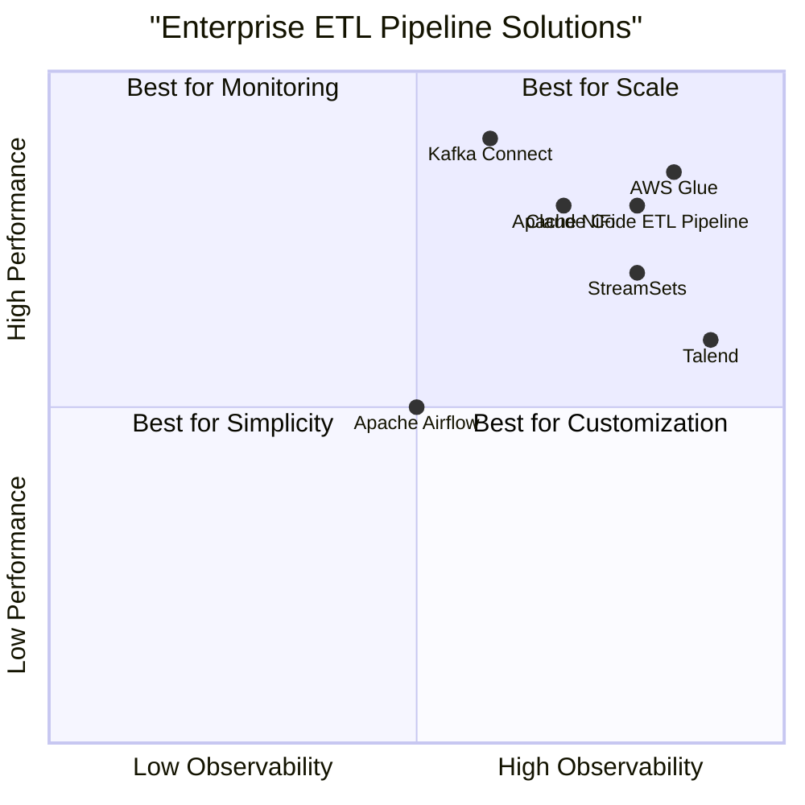

# Product Requirement Document (PRD): Claude Code ETL Pipeline Enhancement

## 1. Language & Project Info
- **Language:** English
- **Programming Language:** Python (existing), Vite, React, MUI, Tailwind CSS (for UI components if needed)
- **Project Name:** claude_code_etl_pipeline
- **Restated Requirements:**
  - Enhance the real-time ETL pipeline for Claude Code conversations.
  - Debug and stabilize existing Python scripts.
  - Ensure reliable data inserts into QuestDB.
  - Harden the pipeline for enterprise-level performance and observability.

## 2. Product Definition
### Product Goals
1. **Robustness:** Achieve high reliability and stability in real-time data processing for Claude Code conversations.
2. **Data Integrity:** Guarantee accurate and consistent data inserts into QuestDB with zero data loss.
3. **Enterprise Readiness:** Implement advanced observability, monitoring, and error handling for scalable, production-grade operations.

### User Stories
- As a data engineer, I want the ETL pipeline to automatically recover from failures so that I can ensure uninterrupted data flow.
- As a platform administrator, I want detailed monitoring and alerting so that I can quickly identify and resolve issues.
- As a developer, I want clear error logs and debugging tools so that I can efficiently troubleshoot problems.
- As a business analyst, I want reliable and timely data in QuestDB so that I can generate accurate reports.
- As an enterprise customer, I want the pipeline to meet compliance and performance standards so that I can trust it for mission-critical workloads.
### Competitive Analysis
Below are 6 competitive products relevant to real-time ETL pipelines and data streaming for enterprise use:

1. **Apache NiFi**
   - Pros: Highly configurable, strong UI, robust error handling, supports real-time data flows.
   - Cons: Can be complex to set up, resource intensive, less optimized for Python-centric workflows.
2. **StreamSets Data Collector**
   - Pros: Intuitive interface, strong monitoring, supports multiple destinations including QuestDB.
   - Cons: Licensing costs, limited customization for advanced Python scripting.
3. **Apache Airflow**
   - Pros: Powerful workflow orchestration, Python-native, strong community support.
   - Cons: Not optimized for true real-time streaming, more suited for batch ETL.
4. **Talend Data Integration**
   - Pros: Enterprise-grade features, strong data quality tools, good observability.
   - Cons: Expensive, heavy-weight, less flexible for custom Python scripts.
5. **Confluent Kafka Connect**
   - Pros: Scalable, real-time streaming, strong ecosystem, integrates with QuestDB.
   - Cons: Requires Kafka expertise, less granular control over Python logic.
6. **AWS Glue**
   - Pros: Serverless, scalable, integrates with many data stores, strong monitoring.
   - Cons: Cloud lock-in, less control over low-level Python code, cost at scale.

### Competitive Quadrant Chart

## 3. Technical Specifications
### Requirements Analysis
- The ETL pipeline must process Claude Code conversation data in real time, handling high throughput and low latency.
- Existing Python scripts must be debugged and refactored for stability, error resilience, and maintainability.
- Data inserts into QuestDB must be atomic, idempotent, and verifiable, with rollback on failure.
- Observability features (metrics, logging, tracing) must be integrated for enterprise monitoring.
- The system must support horizontal scaling and be deployable in cloud/on-prem environments.

### Requirements Pool
- **P0 (Must-have):**
  - Real-time data ingestion and transformation for Claude Code conversations
  - Reliable, atomic inserts into QuestDB
  - Automated error recovery and retry logic
  - Comprehensive logging and monitoring (metrics, traces, alerts)
  - Debugged and refactored Python scripts for stability
- **P1 (Should-have):**
  - UI dashboard for pipeline health and metrics
  - Configurable alerting thresholds
  - Support for schema evolution in QuestDB
- **P2 (Nice-to-have):**
  - Self-healing pipeline orchestration
  - Integration with external SIEM tools
  - Automated compliance reporting

### UI Design Draft
- **Dashboard Layout:**
  - Pipeline status (running, failed, paused)
  - Real-time metrics (throughput, latency, error rate)
  - QuestDB insert success/failure rates
  - Log viewer and trace explorer
  - Alert configuration panel

### Open Questions
- What is the expected peak throughput (records/sec) for Claude Code conversations?
- Are there specific compliance or data retention requirements?
- Should the pipeline support multi-tenancy or data partitioning?
- What are the preferred deployment environments (cloud, on-prem, hybrid)?
- Is QuestDB schema fixed or subject to frequent changes?
