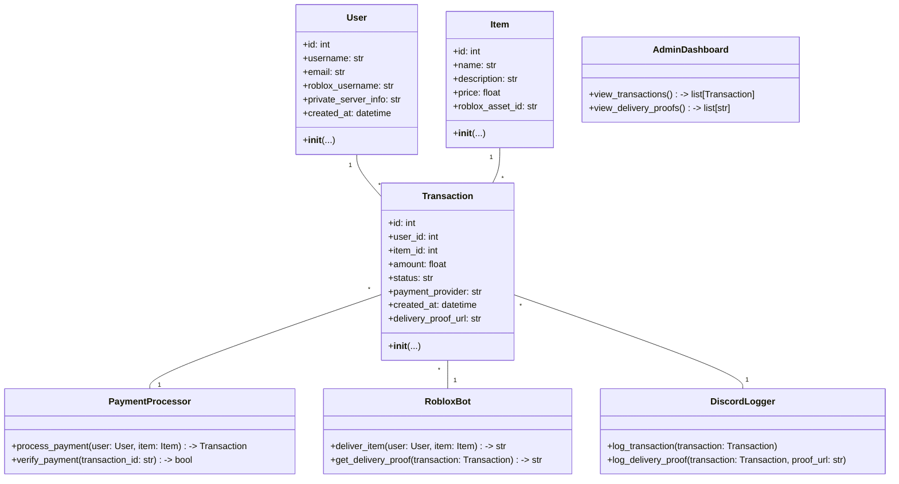
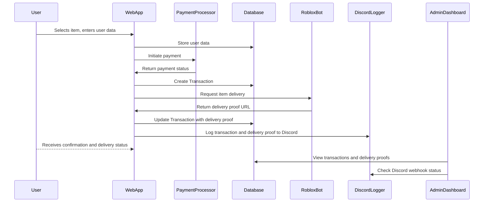

## Implementation approach

We will use **Flask** for the web framework due to its simplicity and extensibility. For payment processing, we will integrate **Stripe** (with optional PayPal support). User data will be collected via secure forms and stored in a PostgreSQL database using SQLAlchemy ORM. The Roblox bot will be integrated via a Python script (using Roblox APIs or RPA if needed) and communicate with the backend via REST API or message queue. All transactions and delivery proofs will be logged to a Discord channel using Discord webhooks. The system will be modular, with clear separation between web, payment, bot, and logging components. Open-source libraries: Flask, SQLAlchemy, requests, stripe, discord-webhook, dotenv, pytest.

## File list

- app.py
- config.py
- requirements.txt
- /templates/
    - index.html
    - purchase.html
    - admin_dashboard.html
    - login.html
    - register.html
- /static/
    - style.css
- /src/
    - models.py
    - payment.py
    - roblox_bot.py
    - discord_logger.py
    - forms.py
    - utils.py
- /migrations/
- /tests/
    - test_payment.py
    - test_bot.py
    - test_logger.py
- .env

## Data structures and interfaces:

## Program call flow:

## Anything UNCLEAR

- Preferred payment provider (Stripe, PayPal, others)?
- Exact user data required for private server access?
- Format and content of delivery proofs for Discord logging?
- Roblox bot rate limits or restrictions?
- Should refunds/dispute resolution be supported?
