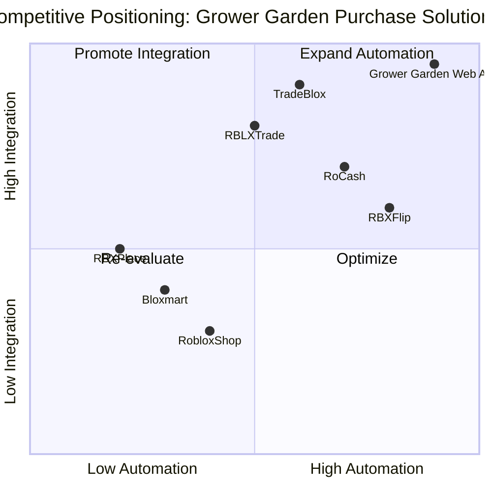

# Product Requirement Document (PRD): Grower Garden Purchase Web Application

## 1. Language & Project Info
- **Language:** English
- **Programming Language:** Python (with web framework, e.g., Flask or Django)
- **Project Name:** grower_garden_web_app
- **Original Requirements:**
  - Implement a Python-based web application to facilitate purchases of Grower Garden items.
  - The application must include:
    - Payment processing
    - User data collection for a private server
    - Automatic item delivery through a Roblox bot
    - Logging all transactions and delivery proofs to a Discord channel using webhooks

## 2. Product Definition
### Product Goals
1. Enable secure and seamless online purchases of Grower Garden items.
2. Automate item delivery to users via a Roblox bot, minimizing manual intervention.
3. Ensure robust transaction logging and delivery proof reporting to Discord for transparency and support.
### User Stories
1. As a customer, I want to purchase Grower Garden items online so that I can receive them quickly and securely in my Roblox account.
2. As an admin, I want to view transaction logs and delivery proofs in Discord so that I can monitor sales and resolve disputes efficiently.
3. As a server owner, I want to collect user data for private server access so that I can manage permissions and ensure a safe environment.
4. As a buyer, I want to receive my purchased items automatically via a Roblox bot so that I don’t have to wait for manual delivery.
5. As a support agent, I want to access transaction and delivery logs so that I can assist users with any issues.

### Competitive Analysis
- **Product 1: RBXFlip**
  - Pros: Fast item delivery, robust payment integration
  - Cons: Limited to specific Roblox items, lacks Discord logging
- **Product 2: Bloxmart**
  - Pros: User-friendly interface, supports multiple payment methods
  - Cons: Manual item delivery, no automated Discord proof
- **Product 3: RoCash**
  - Pros: Automated delivery, Discord integration
  - Cons: Complex setup, limited customization
- **Product 4: RBLXTrade**
  - Pros: Secure transactions, detailed logging
  - Cons: No private server data collection
- **Product 5: RBXPlace**
  - Pros: Simple purchase flow, Discord webhook support
  - Cons: No bot automation, basic logging
- **Product 6: TradeBlox**
  - Pros: Advanced analytics, multi-platform support
  - Cons: Higher cost, steeper learning curve
- **Product 7: RobloxShop**
  - Pros: Large item catalog, easy integration
  - Cons: No delivery proof logging, limited Discord features
### Competitive Quadrant Chart

## 3. Technical Specifications
### Requirements Analysis
The application must provide a secure, user-friendly interface for purchasing Grower Garden items. It should integrate payment processing (e.g., Stripe, PayPal), collect necessary user data for private server access, automate item delivery via a Roblox bot, and log all transactions and delivery proofs to a Discord channel using webhooks. The system must ensure data privacy, transaction integrity, and reliable delivery automation.

### Requirements Pool
- **P0 (Must-have):**
  - Secure payment processing integration
  - User data collection for private server access
  - Automated item delivery via Roblox bot
  - Transaction and delivery proof logging to Discord via webhooks
- **P1 (Should-have):**
  - Admin dashboard for monitoring transactions
  - User notification system for purchase and delivery status
- **P2 (Nice-to-have):**
  - Analytics and reporting features
  - Multi-language support
  - Customizable item catalog
### UI Design Draft
- **Home Page:**
  - Display featured Grower Garden items
  - Login/Register options
  - Quick access to purchase flow
- **Purchase Flow:**
  - Item selection
  - User data entry (Roblox username, private server info)
  - Payment processing (Stripe/PayPal)
  - Confirmation and delivery status
- **Admin Dashboard:**
  - Transaction log viewer
  - Delivery proof access
  - Discord webhook status
- **Notifications:**
  - Purchase confirmation
  - Delivery updates

### Open Questions
1. What payment providers are preferred (Stripe, PayPal, others)?
2. What specific user data is required for private server access?
3. What format should delivery proofs take for Discord logging?
4. Are there any rate limits or restrictions for the Roblox bot?
5. Should the app support refunds or dispute resolution workflows?
