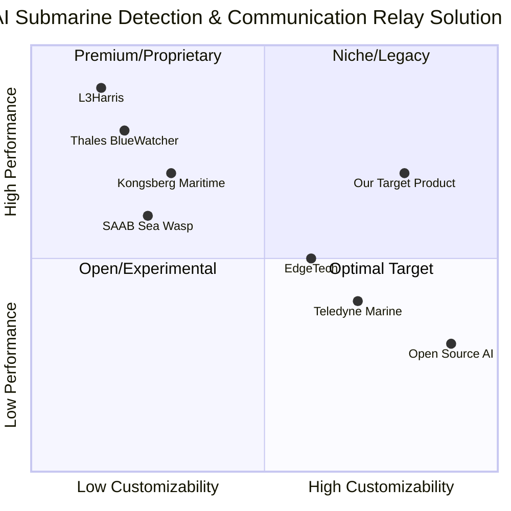

# Product Requirement Document: AI Submarine Detection and Communication Relay System

## 1. Language & Project Info
- **Language:** English
- **Programming Language:** Python
- **Project Name:** ai_submarine_detection_and_comm_relay
- **Restated Requirements:**
  Implement a Python program to create an AI-driven detection engine that processes raw sonar or hydrophone streams for submarine detection. The system must include a communication relay module capable of switching between acoustic and RF links, ensuring compliance with specified accuracy, latency, and logging criteria. The solution must provide thorough documentation and a test environment for benchmarking.

## 2. Product Definition
### Product Goals
1. Accurately detect and classify submarine activity from raw sonar or hydrophone data streams using AI algorithms.
2. Seamlessly switch communication between acoustic and RF links based on environmental and operational conditions, maintaining low latency and high reliability.
3. Ensure comprehensive logging, documentation, and provide a robust test environment for benchmarking system performance.

### User Stories
- As a naval operator, I want the system to detect submarines in real-time from sonar/hydrophone data so that I can respond to potential threats promptly.
- As a communications engineer, I want the relay module to automatically switch between acoustic and RF links so that connectivity is maintained in varying underwater conditions.
- As a system administrator, I want detailed logs and documentation so that I can audit system performance and troubleshoot issues efficiently.
- As a developer, I want a test environment with benchmarking tools so that I can validate the accuracy and latency of the detection engine.
- As a compliance officer, I want the system to meet specified accuracy and latency criteria so that operational standards are upheld.
### Competitive Analysis
Below is an analysis of leading solutions and approaches in AI-driven submarine detection and underwater communication relay systems:

1. **Thales BlueWatcher**
   - Pros: Proven AI-based sonar detection, robust hardware integration, real-time processing.
   - Cons: Proprietary, limited customization, high cost.
2. **Kongsberg Maritime Subsea Monitoring**
   - Pros: Advanced hydrophone arrays, modular communication, strong analytics.
   - Cons: Complex deployment, requires specialized training.
3. **SAAB Sea Wasp**
   - Pros: Integrated detection and communication, field-tested, scalable.
   - Cons: Focused on ROVs, less flexible for custom AI models.
4. **L3Harris Undersea Warfare Systems**
   - Pros: Military-grade reliability, multi-modal communication, extensive support.
   - Cons: Expensive, closed ecosystem.
5. **EdgeTech Sonar Systems**
   - Pros: High-resolution sonar, open data interfaces, customizable.
   - Cons: Lacks built-in AI, requires third-party integration.
6. **Teledyne Marine Acoustic Modems**
   - Pros: Reliable acoustic/RF switching, global deployments, strong support.
   - Cons: Communication-focused, limited detection capabilities.
7. **Open Source Sonar AI Projects**
   - Pros: Flexible, community-driven, rapid prototyping.
   - Cons: Varying quality, limited support, may lack compliance features.

#### Competitive Quadrant Chart

## 3. Technical Specifications

### Requirements Analysis
The system must process raw sonar or hydrophone data streams in real-time, applying AI/ML models for submarine detection and classification. It must support seamless switching between acoustic and RF communication links, based on signal quality and operational context. The solution must log all detection events, communication switches, and system anomalies, and provide detailed documentation and a test environment for benchmarking accuracy and latency.

### Requirements Pool
- **P0 (Must-have):**
  - Real-time processing of raw sonar/hydrophone streams
  - AI-driven detection and classification of submarine activity
  - Communication relay module with automatic acoustic/RF switching
  - Compliance with specified accuracy (e.g., >95%) and latency (<1s) criteria
  - Comprehensive event and system logging
  - Complete user and developer documentation
  - Test environment with benchmarking tools
- **P1 (Should-have):**
  - Configurable detection thresholds and communication parameters
  - Modular architecture for easy integration with other systems
  - Visualization dashboard for detection and communication status
- **P2 (Nice-to-have):**
  - Support for additional sensor types (e.g., magnetometers)
  - Remote update and monitoring capabilities
  - Advanced analytics and reporting

### UI Design Draft
- **Main Dashboard:**
  - Real-time sonar/hydrophone data visualization
  - Detection event log with timestamps and confidence scores
  - Communication status indicator (acoustic/RF)
  - System health and performance metrics
- **Settings Panel:**
  - Configure detection thresholds
  - Set communication preferences
  - Access documentation and logs

### Open Questions
1. What are the exact accuracy and latency targets (e.g., >95% accuracy, <1s latency)?
2. What are the primary deployment environments (e.g., shipboard, buoy, underwater vehicle)?
3. Are there specific compliance or security standards to meet?
4. What are the preferred AI/ML frameworks or libraries?
5. What is the expected volume and format of raw data streams?
