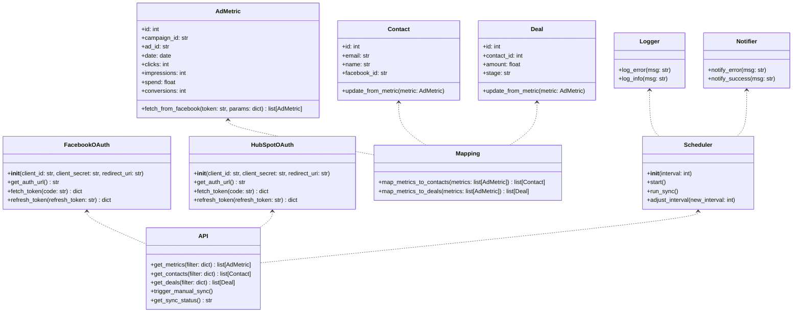
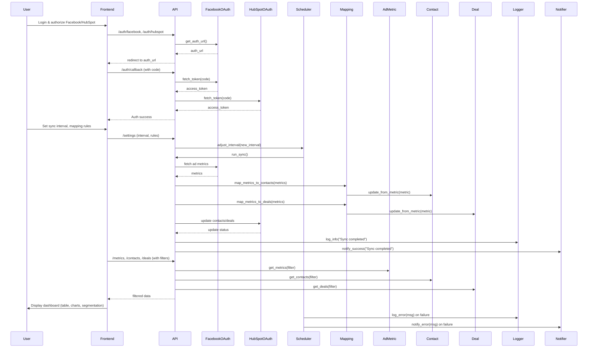

## Implementation approach

We will use a modular Python backend (FastAPI for REST API, requests-oauthlib for OAuth 2.0, APScheduler for sync routines, SQLAlchemy for data storage, and logging for error handling). The backend will securely connect to Facebook Marketing API and HubSpot API, handle OAuth 2.0 authentication, map ad metrics to HubSpot contacts/deals, and expose endpoints for the React dashboard. The frontend will use Vite, React, MUI, and Tailwind CSS for a lightweight, responsive dashboard with filtering, segmentation, and visualization features.

Open-source libraries:
- Backend: FastAPI, requests-oauthlib, APScheduler, SQLAlchemy, python-dotenv, logging
- Frontend: React, MUI, Tailwind CSS, axios

## File list

- backend/
    - main.py
    - auth/
        - facebook_oauth.py
        - hubspot_oauth.py
    - sync/
        - scheduler.py
        - mapping.py
    - models/
        - contact.py
        - deal.py
        - ad_metric.py
    - api/
        - endpoints.py
    - utils/
        - logger.py
        - notifier.py
    - config.py
    - requirements.txt
- frontend/
    - src/
        - App.jsx
        - components/
            - Dashboard.jsx
            - FilterPanel.jsx
            - DataTable.jsx
            - ChartPanel.jsx
            - SegmentationSidebar.jsx
            - SyncStatusBar.jsx
            - ExportButton.jsx
        - api/
            - api.js
        - styles/
            - tailwind.css
    - index.html
    - package.json
    - vite.config.js
- docs/
    - system_design.md
    - system_design-sequence-diagram.mermaid
    - system_design-sequence-diagram.mermaid-class-diagram

## Data structures and interfaces:

## Program call flow:

## Anything UNCLEAR

- Specific Facebook ad metrics required for mapping (e.g., clicks, impressions, spend, conversions?)
- Should sync routine support real-time updates or only scheduled intervals?
- What user roles and permissions are needed for dashboard access?
- Any compliance/data privacy requirements?
- Preferred notification channel for sync errors?
