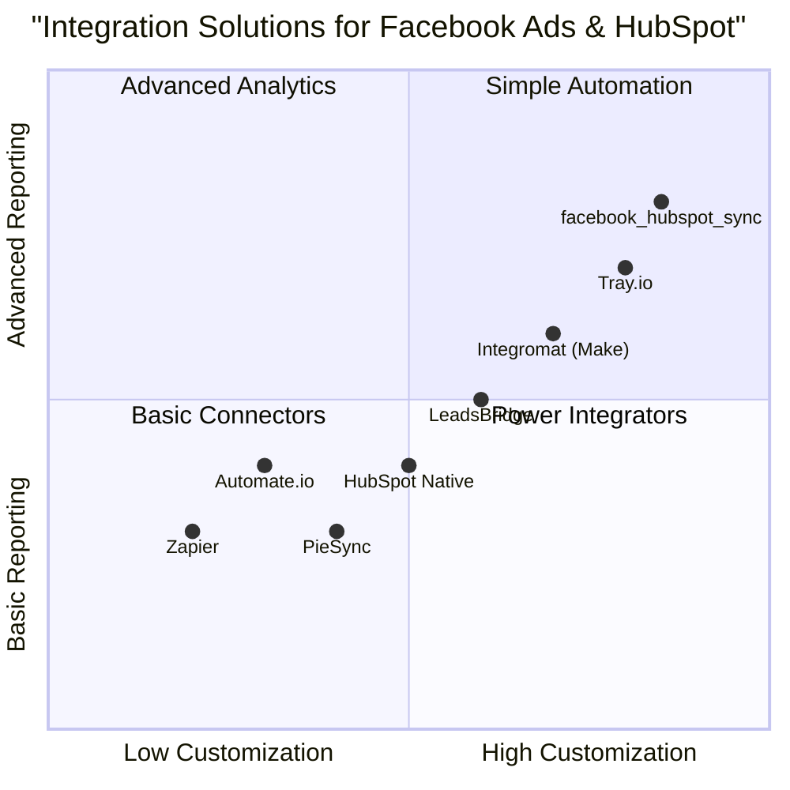

# Product Requirement Document: facebook_hubspot_sync

## 1. Language & Project Info
- **Language:** English
- **Programming Language:** Python
- **Project Name:** facebook_hubspot_sync
- **Restated Requirements:**
  - Develop a Python program that securely connects Facebook’s Marketing API to HubSpot.
  - Authenticate via OAuth 2.0 for both platforms.
  - Pull and map Facebook ad metrics to HubSpot contacts and deals.
  - Run an adjustable, automated sync routine.
  - Provide a lightweight dashboard for filtering and segmenting performance data.

## 2. Product Definition
### Product Goals
1. Enable secure, automated data integration between Facebook Marketing API and HubSpot CRM.
2. Provide robust mapping of ad metrics to HubSpot contacts and deals for actionable insights.
3. Deliver a user-friendly dashboard for filtering, segmenting, and visualizing performance data.

### User Stories
- As a marketing manager, I want to automatically sync Facebook ad metrics to HubSpot so that I can analyze campaign impact on leads and deals.
- As a CRM administrator, I want secure OAuth 2.0 authentication so that sensitive data is protected during integration.
- As a sales executive, I want to filter and segment ad performance data in a dashboard so that I can identify high-value leads.
- As a data analyst, I want to adjust sync frequency and mapping rules so that I can optimize data flow for reporting needs.
- As a business owner, I want to view integrated campaign results in one place so that I can make informed decisions quickly.
### Competitive Analysis
| Product | Pros | Cons |
|---------|------|------|
| Zapier | Easy to set up, supports many integrations, no code required | Limited customization, can be expensive at scale |
| Tray.io | Advanced workflow automation, flexible mapping | Higher learning curve, costly for small teams |
| LeadsBridge | Specialized in ad platform integrations, good support | UI can be complex, limited dashboard features |
| Automate.io | Affordable, simple interface | Fewer advanced features, limited reporting |
| Integromat (Make) | Visual workflow builder, strong data manipulation | Can be overwhelming, less direct support for HubSpot-Facebook mapping |
| PieSync | Real-time sync, strong contact mapping | Limited metrics support, now part of HubSpot Operations Hub |
| HubSpot Native Integrations | Seamless CRM experience, secure | May lack advanced Facebook ad metric mapping, less customizable |

#### Competitive Quadrant Chart

## 3. Technical Specifications
### Requirements Analysis
- Secure OAuth 2.0 authentication for both Facebook and HubSpot APIs
- Scheduled and on-demand sync routines with adjustable frequency
- Mapping logic for Facebook ad metrics to HubSpot contacts and deals
- Error handling, logging, and notification for sync failures
- Lightweight dashboard for data filtering, segmentation, and visualization
- Role-based access control for dashboard features
- Scalable architecture for future integrations

### Requirements Pool
- **P0 (Must-have):**
  - OAuth 2.0 authentication for both APIs
  - Automated sync routine (adjustable interval)
  - Mapping of ad metrics to HubSpot contacts and deals
  - Dashboard for filtering and segmenting performance data
  - Secure data handling and storage
- **P1 (Should-have):**
  - Manual sync trigger
  - Customizable mapping rules
  - Basic data visualization (charts, tables)
  - Error notification (email/slack)
- **P2 (Nice-to-have):**
  - Advanced segmentation (multi-field filters)
  - Export data (CSV/XLS)
  - Multi-user support with roles
  - Integration with other ad platforms

### UI Design Draft
- **Dashboard Layout:**
  - Top navigation: Sync status, manual trigger, settings
  - Main panel: Filter controls (date range, campaign, contact/deal fields)
  - Data table: Ad metrics mapped to contacts/deals
  - Visualization: Performance charts (clicks, conversions, spend)
  - Sidebar: Segmentation options, export button

### Open Questions
- What specific Facebook ad metrics are required for mapping?
- Should the sync routine support real-time updates or only scheduled intervals?
- What user roles and permissions are needed for dashboard access?
- Are there any compliance or data privacy requirements to consider?
- Is there a preferred notification channel for sync errors?
