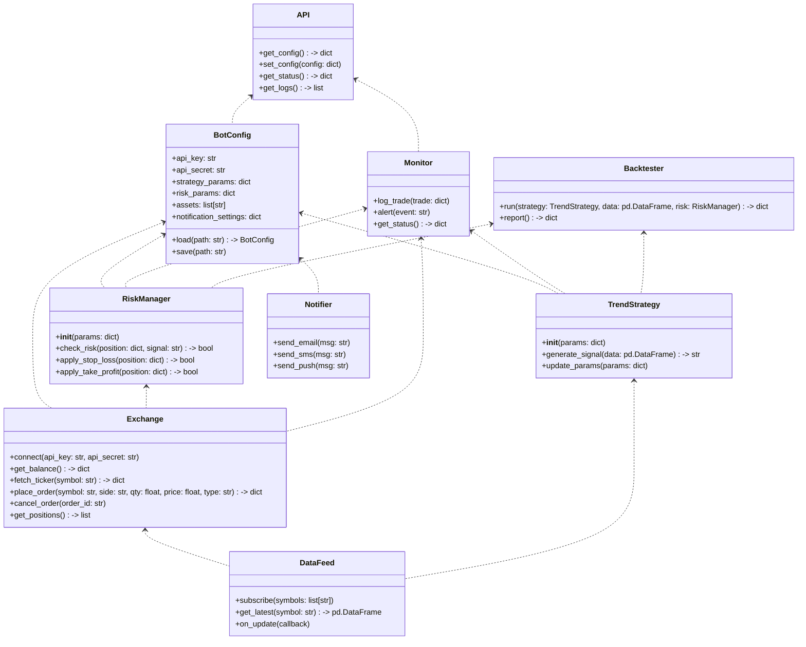
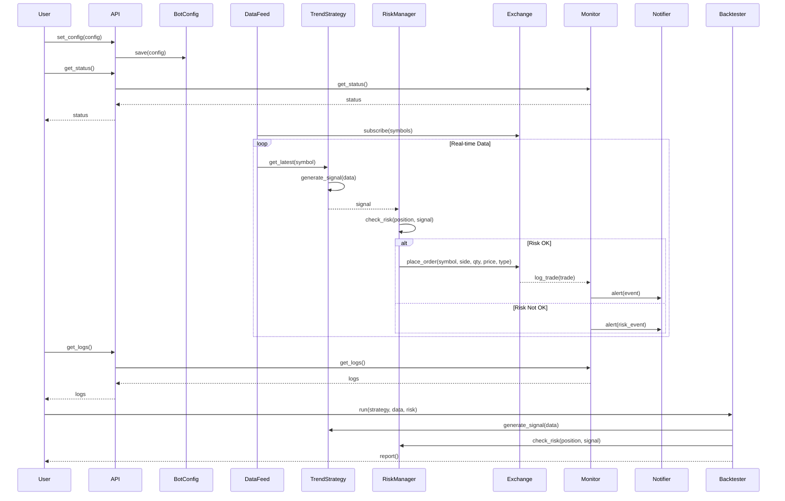

## Implementation approach

We will implement the trading bot in Python, leveraging a modular architecture for extensibility and maintainability. Key open-source libraries include:
- ccxt (for CoinDCX Futures REST API integration)
- websockets or asyncio (for real-time data streaming)
- pandas, numpy (for data processing and indicator calculations)
- pydantic (for configuration and validation)
- cryptography (for secure API key management)
- fastapi (for external API/configuration interface)
- logging (for monitoring and audit)

Difficult points include:
- Real-time order execution with minimal latency
- Secure API key storage
- Flexible strategy customization and risk management
- Backtesting and simulation environment

## File list

- main.py
- config.py
- api.py
- strategy.py
- risk.py
- exchange.py
- data.py
- monitor.py
- notifier.py
- backtest.py
- utils.py
- models.py
- storage.py
- docs/system_design.md

## Data structures and interfaces:

## Program call flow:

## Anything UNCLEAR

- Which trend indicators should be supported by default? (EMA, SMA, MACD, RSI, others?)
- What is the minimum latency requirement for order execution?
- Should risk management be portfolio-level or per-asset?
- Preferred notification channels (email, SMS, push)?
- Is mobile app integration required, or only web/API?
