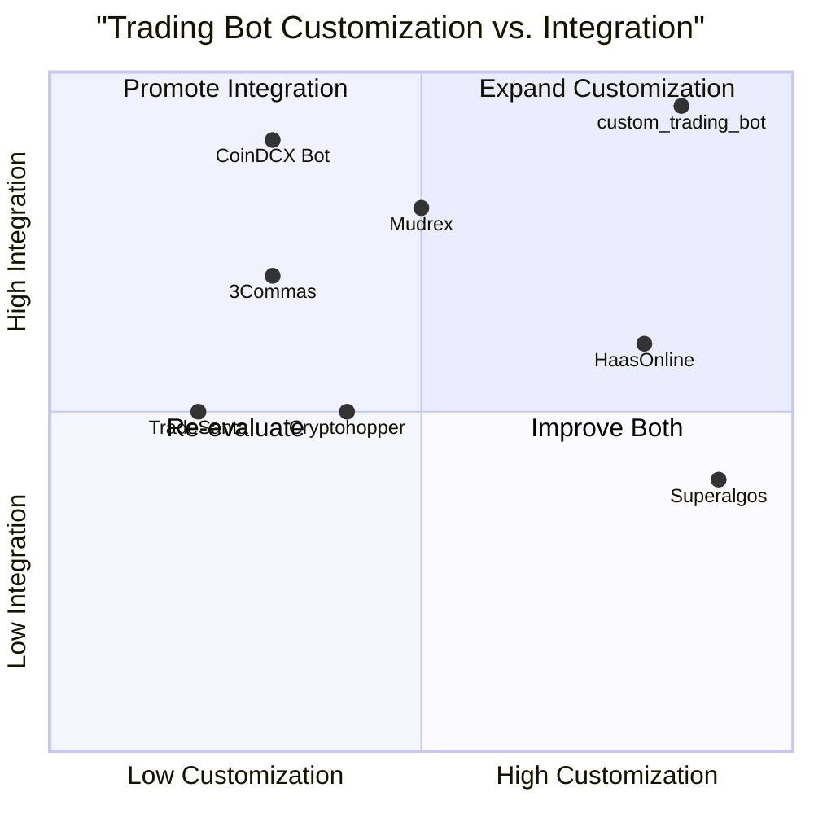

# Product Requirement Document (PRD): custom_trading_bot

## 1. Language & Project Info
- **Language:** English
- **Programming Language:** Python
- **Project Name:** custom_trading_bot
- **Restated Requirements:**
  - Develop a Python program for a customized trading bot that utilizes a trend-following strategy.
  - Integrate the bot with CoinDCX Futures.
  - Incorporate advanced customization options for strategy parameters, risk management, and user preferences.

## 2. Product Definition
### Product Goals
1. Enable users to automate trading on CoinDCX Futures using robust trend-following algorithms.
2. Provide advanced customization for strategy parameters, risk controls, and execution logic.
3. Ensure secure, reliable, and real-time integration with CoinDCX Futures API.

### User Stories
- As a retail trader, I want to set custom trend indicators so that I can tailor the bot to my trading style.
- As a professional trader, I want to adjust risk management settings so that I can control my exposure.
- As a developer, I want API access to bot configuration so that I can integrate it with my own tools.
- As a user, I want real-time monitoring and alerts so that I can stay informed of bot actions.
- As a portfolio manager, I want multi-asset support so that I can diversify my trading strategies.

### Competitive Analysis
| Product                | Pros                                      | Cons                                      |
|------------------------|-------------------------------------------|-------------------------------------------|
| 3Commas                | Advanced automation, multi-exchange       | Limited customization for trend strategies |
| HaasOnline             | Powerful scripting, backtesting           | Expensive, steep learning curve           |
| Cryptohopper           | Cloud-based, marketplace for strategies   | Limited futures support                   |
| Mudrex                 | User-friendly, CoinDCX integration        | Fewer advanced customization options      |
| Superalgos             | Open-source, highly customizable          | Complex setup, less user-friendly         |
| TradeSanta             | Simple UI, supports major exchanges       | Basic strategy customization              |
| CoinDCX Bot            | Native integration, easy setup            | Limited to preset strategies              |

### Competitive Quadrant Chart

## 3. Technical Specifications
### Requirements Analysis
- CoinDCX Futures API integration (REST/WebSocket)
- Trend-following strategy modules (e.g., EMA, SMA, MACD, RSI)
- Advanced customization: strategy parameters, risk management, position sizing, asset selection
- Real-time data processing and order execution
- Secure API key management and encrypted storage
- Modular architecture for extensibility
- Logging, monitoring, and alerting system
- Backtesting and simulation environment

### Requirements Pool
- **P0 (Must-have):**
  - CoinDCX Futures API integration
  - Trend-following strategy implementation
  - Customizable strategy parameters
  - Risk management controls (stop-loss, take-profit, max drawdown)
  - Real-time monitoring dashboard
- **P1 (Should-have):**
  - Multi-asset support
  - Backtesting and simulation tools
  - API for external configuration
  - Notification system (email, SMS, push)
- **P2 (Nice-to-have):**
  - Strategy marketplace
  - Social trading features
  - Advanced analytics and reporting

### UI Design Draft
- **Main Dashboard:**
  - Account summary, open positions, P&L
  - Trend indicator selection and parameter adjustment
  - Risk management settings
  - Real-time trade log and alerts
- **Strategy Editor:**
  - Visual configuration of trend-following logic
  - Backtest results and performance metrics
- **Settings:**
  - API key management
  - Notification preferences

### Open Questions
- What specific trend indicators should be supported by default?
- What is the minimum latency requirement for order execution?
- Should the bot support portfolio-level risk management or per-asset controls?
- What notification channels are preferred by users?
- Is there a need for mobile app integration or web-only access?
