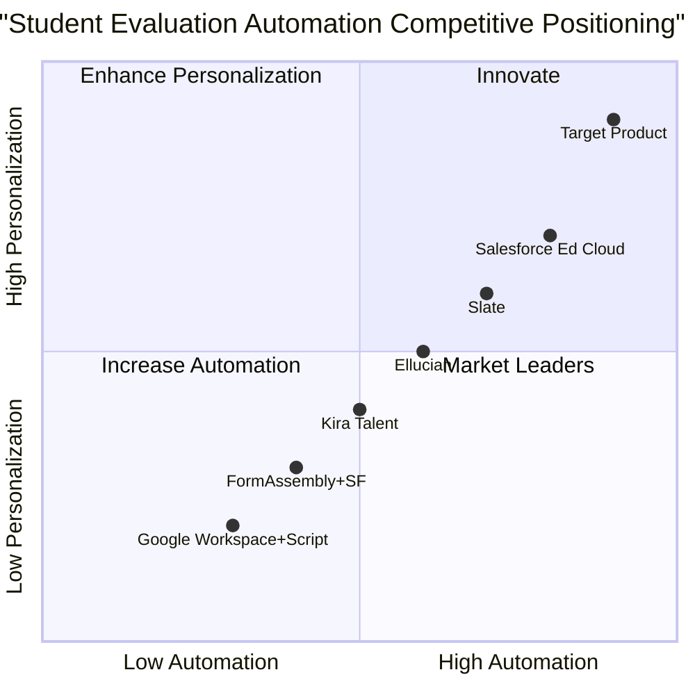

# Product Requirement Document: student_evaluation_automation

## 1. Language & Project Info
- **Language:** English
- **Programming Language:** Python
- **Project Name:** student_evaluation_automation

### Restated Requirements
Develop a Python program to automate the evaluation of incoming students by:
- Integrating data from 3 MachForms into Google Sheets
- Compiling the data into a master record
- Using the OpenAI API to generate personalized academic pathways
- Filling a branded Google Docs template with the pathway
- Exporting the result as a PDF
- Emailing the PDF to the student
- Storing the PDF in Salesforce
- Providing a tracking interface for admins

## 2. Product Definition
### Product Goals
1. Seamlessly automate the student evaluation workflow from data collection to personalized academic pathway delivery.
2. Ensure secure, accurate, and efficient integration with MachForms, Google Sheets, Google Docs, Salesforce, and email systems.
3. Provide a robust tracking and management interface for administrators to monitor student progress and document status.

### User Stories
- As an admissions officer, I want to automatically compile student data from multiple forms so that I can save time and reduce manual errors.
- As a student, I want to receive a personalized academic pathway PDF via email so that I understand my recommended courses and next steps.
- As an admin, I want to track the status of each student’s evaluation and document delivery so that I can ensure timely follow-up.
- As a system integrator, I want the solution to securely store records in Salesforce so that all student documentation is centralized.
- As a program manager, I want the branded Google Docs template to be filled automatically so that all communications maintain a professional appearance.
### Competitive Analysis

| Product Name                | Pros                                                      | Cons                                                      |
|-----------------------------|-----------------------------------------------------------|-----------------------------------------------------------|
| Slate by Technolutions      | Comprehensive admissions CRM, strong integrations         | Expensive, complex setup                                  |
| Ellucian CRM Recruit        | Deep SIS integration, robust reporting                    | Less customizable, slower support                         |
| Salesforce Education Cloud  | Highly customizable, strong automation, scalable          | High cost, requires expert setup                          |
| Kira Talent                 | Video assessment, workflow automation                     | Limited to interview/evaluation, not full workflow        |
| FormAssembly + Salesforce   | Flexible form builder, native Salesforce integration       | Manual pathway generation, less automation                |
| Google Workspace + Apps Script | Low cost, flexible, leverages Google ecosystem         | Requires custom scripting, limited out-of-box features    |
| Target Product              | End-to-end automation, AI-driven personalization, seamless integration | New product, requires initial configuration               |

## 3. Technical Specifications

### Requirements Analysis
- Integration with MachForms: Must securely fetch and parse data from three distinct MachForms.
- Google Sheets Sync: Must aggregate and update student data in a master Google Sheet in real time.
- OpenAI API: Must generate personalized academic pathways based on student data and program requirements.
- Google Docs Automation: Must fill a branded template with pathway details and export as PDF.
- Email Delivery: Must send the PDF to the student’s email address automatically.
- Salesforce Storage: Must upload the PDF and student record to Salesforce, linking to the correct contact.
- Admin Tracking Interface: Must provide a dashboard for admins to monitor evaluation status, document delivery, and Salesforce sync.
- Security: Must comply with FERPA and institutional data privacy standards.

### Requirements Pool
- **P0 (Must-have):**
  - MachForms integration
  - Google Sheets master record
  - OpenAI API pathway generation
  - Google Docs template automation
  - PDF export and email delivery
  - Salesforce record storage
  - Admin tracking dashboard
- **P1 (Should-have):**
  - Error handling and retry logic
  - Audit logs for all actions
  - Customizable email templates
- **P2 (Nice-to-have):**
  - Mobile-friendly admin interface
  - Analytics on student pathway trends
  - Multi-language support

### UI Design Draft
- **Admin Dashboard:**
  - Student list with status indicators (data received, pathway generated, PDF sent, Salesforce stored)
  - Search and filter by name, status, date
  - Detail view for each student: form data, pathway, document links
  - Manual override and re-send options
- **Student Email:**
  - Branded message with attached PDF
  - Link to contact admissions for questions

### Open Questions
- What is the expected volume of incoming students per cycle?
- Are there specific data fields or formats required from MachForms?
- Should admins be able to edit pathways before sending?
- What branding elements are required for the Google Docs template?
- What Salesforce object(s) should the PDF be attached to?
