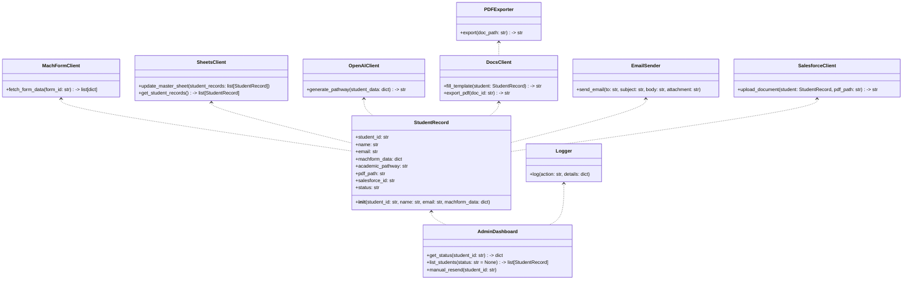
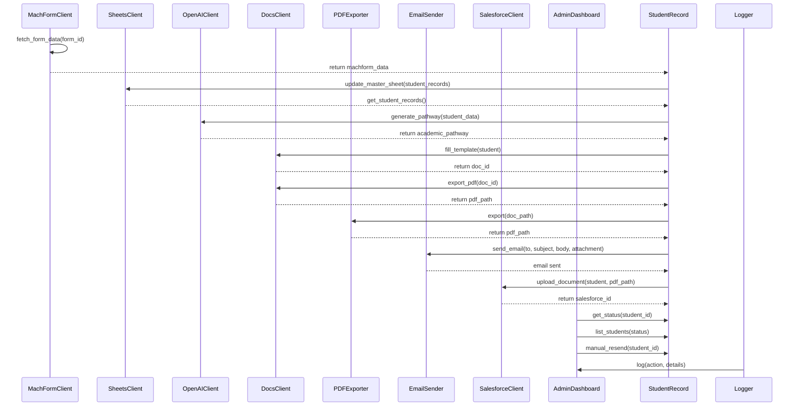

## Implementation approach

We will use Python as the main language, leveraging open-source libraries for integration:
- MachForms: Data fetched via HTTP requests (assuming API or webhooks; otherwise, web scraping).
- Google Sheets: Use `gspread` or `google-api-python-client` for Sheets API.
- OpenAI API: Use `openai` Python SDK.
- Google Docs & PDF: Use `google-api-python-client` for Docs, and `pdfkit` or Google Docs export for PDF.
- Email: Use `smtplib` or `sendgrid` for sending emails.
- Salesforce: Use `simple-salesforce` for API integration.
- Admin Tracking Interface: Use `Flask` or `FastAPI` for a web dashboard, with `Bootstrap` for UI.
- Security: Use OAuth2 for Google and Salesforce, environment variables for secrets, and logging for audit.

## File list

- main.py
- config.py
- machform_client.py
- sheets_client.py
- openai_client.py
- docs_client.py
- pdf_exporter.py
- email_sender.py
- salesforce_client.py
- admin_dashboard.py
- models.py
- utils.py
- requirements.txt
- templates/
    - branded_template.docx
- static/
    - style.css
- docs/
    - system_design.md
    - system_design-sequence-diagram.mermaid
    - system_design-sequence-diagram.mermaid-class-diagram

## Data structures and interfaces:

## Program call flow:

## Anything UNCLEAR

- MachForm API details: Is there a REST API or only webhooks/exports?
- Exact data fields/formats from MachForms?
- Should admins be able to edit pathways before sending?
- Branding requirements for Google Docs template?
- Salesforce object for PDF attachment?
- Expected student volume per cycle?
