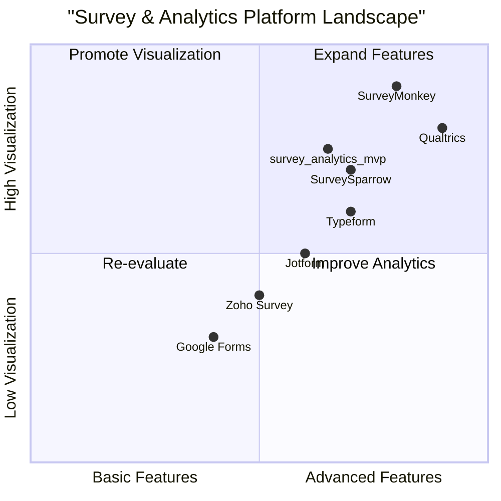

# Product Requirement Document (PRD): survey_analytics_mvp

## 1. Language & Project Info
- **Language:** English
- **Programming Language:** Backend: Python (FastAPI/Flask) or Node.js (Express); Frontend: React or Next.js
- **Project Name:** survey_analytics_mvp
- **Restated Requirements:**
  - Build an MVP web application to capture surveys, analyze data via radar charts and heatmaps, provide APIs for survey management, and generate PDF/CSV reports. Backend must use Python (FastAPI/Flask) or Node.js (Express). Frontend must use React or Next.js.
## 2. Product Definition

### Product Goals
1. Enable users to create, distribute, and manage surveys efficiently.
2. Provide advanced data visualization through radar charts and heatmaps for survey analysis.
3. Support robust reporting with export options (PDF/CSV) and accessible APIs for survey management.

### User Stories
- As a survey creator, I want to design custom surveys so that I can collect targeted feedback.
- As a data analyst, I want to visualize survey results using radar charts and heatmaps so that I can identify trends and patterns.
- As an admin, I want to manage surveys and responses via APIs so that I can integrate with other systems.
- As a user, I want to export survey results to PDF/CSV so that I can share and archive reports.
- As a manager, I want to access real-time analytics so that I can make informed decisions quickly.

### Competitive Analysis

| Product                | Pros                                         | Cons                                      |
|------------------------|----------------------------------------------|-------------------------------------------|
| SurveyMonkey           | Mature platform, rich analytics, integrations| Expensive, limited customization in MVP   |
| Typeform               | User-friendly UI, flexible survey logic      | Limited advanced analytics, pricing tiers |
| Google Forms           | Free, easy to use, integrates with Google    | Basic analytics, limited visualization    |
| Qualtrics              | Enterprise-grade, powerful analytics         | High cost, complex setup                  |
| Jotform                | Drag-and-drop builder, export options        | Limited chart types, less robust APIs     |
| Zoho Survey            | Affordable, API access, reporting features   | UI less modern, analytics less advanced   |
| SurveySparrow          | Conversational surveys, reporting            | Fewer visualization options, pricing      |

### Competitive Quadrant Chart

## 3. Technical Specifications

### Requirements Analysis
- The backend must be implemented in Python (FastAPI/Flask) or Node.js (Express).
- The frontend must use React or Next.js, with MUI or Tailwind CSS for UI components.
- Survey creation, editing, and response collection must be supported.
- Data visualization must include radar charts and heatmaps for survey results.
- APIs must be provided for survey CRUD operations and data retrieval.
- Export functionality for PDF and CSV reports is required.
- Authentication and basic user management should be included.

### Requirements Pool
- **P0 (Must-have):**
  - Survey creation, editing, and response collection
  - Radar chart and heatmap visualizations
  - RESTful APIs for survey management
  - PDF/CSV export of survey results
  - User authentication (basic)
- **P1 (Should-have):**
  - Real-time analytics dashboard
  - Role-based access control
  - Survey templates
- **P2 (Nice-to-have):**
  - Custom branding
  - Multi-language support
  - Advanced filtering and segmentation

### UI Design Draft
- **Main Dashboard:**
  - Survey list, create new survey button, analytics summary
- **Survey Builder:**
  - Form editor, question types, logic branching
- **Analytics Page:**
  - Radar chart, heatmap, export buttons
- **API Documentation:**
  - Interactive API docs (Swagger or similar)

### Open Questions
- Which backend framework is preferred: FastAPI, Flask, or Express?
- Should authentication support OAuth/social login or just email/password?
- What is the expected scale (number of users/surveys/responses)?
- Are there specific compliance or data privacy requirements?
- Should the MVP support multi-tenancy (multiple organizations)?
