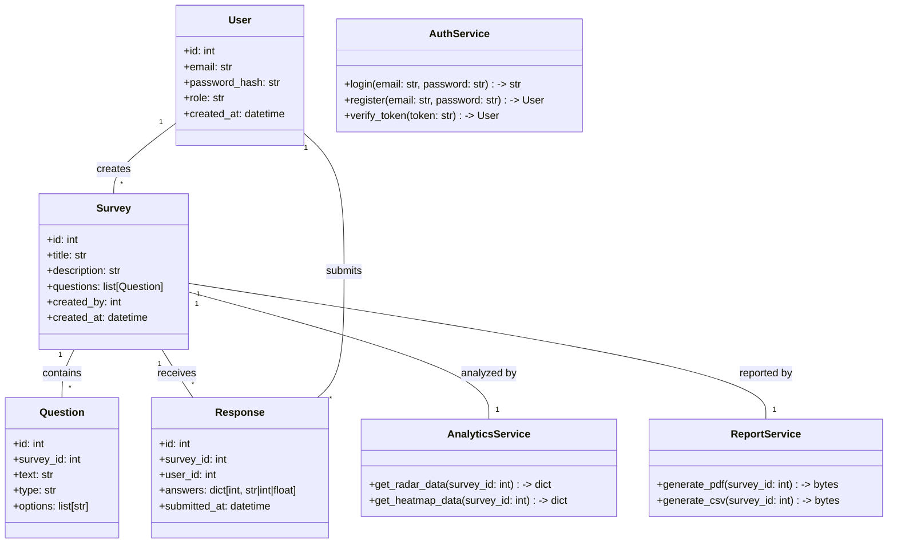
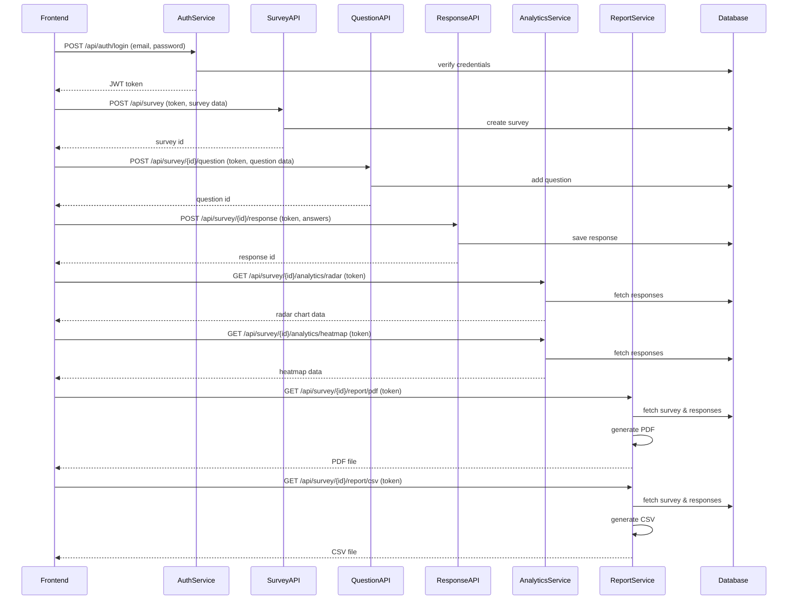

## Implementation approach

We will use FastAPI (Python) for the backend due to its speed, async support, and built-in OpenAPI documentation. React will be used for the frontend, leveraging MUI for UI components and Chart.js (with react-chartjs-2) for radar charts and heatmaps. For PDF/CSV export, we will use open-source libraries (e.g., ReportLab for PDF, pandas for CSV). Authentication will be handled via JWT with email/password. The backend will expose RESTful APIs for survey CRUD, response submission, analytics, and report generation. Integration points include:
- Frontend <-> Backend via REST APIs
- Backend <-> Database (PostgreSQL)
- Backend <-> File system (for PDF/CSV export)

## File list

- public/index.html
- src/App.jsx
- src/components/SurveyBuilder.jsx
- src/components/SurveyList.jsx
- src/components/SurveyAnalytics.jsx
- src/components/ChartRadar.jsx
- src/components/ChartHeatmap.jsx
- src/components/ExportButtons.jsx
- src/api/index.js
- src/pages/Login.jsx
- src/pages/Dashboard.jsx
- backend/main.py
- backend/models.py
- backend/schemas.py
- backend/api/survey.py
- backend/api/response.py
- backend/api/analytics.py
- backend/api/report.py
- backend/api/auth.py
- backend/utils/pdf_export.py
- backend/utils/csv_export.py
- backend/database.py
- backend/config.py

## Data structures and interfaces:

## Program call flow:

## Anything UNCLEAR

- Preferred backend framework: FastAPI, Flask, or Express? (Default: FastAPI)
- Should authentication support OAuth/social login or just email/password? (Default: email/password)
- Expected scale (users/surveys/responses)?
- Compliance/data privacy requirements?
- Multi-tenancy support needed?
