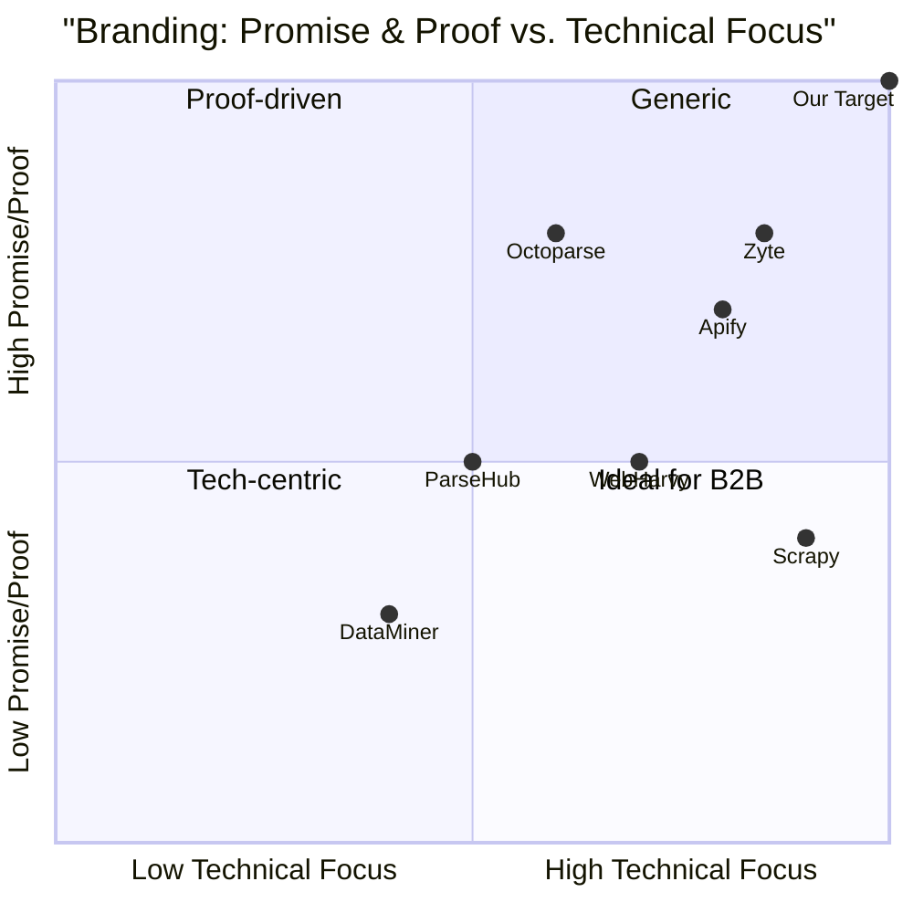

# Product Requirement Document (PRD): Branding Assets for Python Web Scraping Services

## 1. Language & Project Info
- **Language:** English
- **Programming Language:** N/A (Design-focused)
- **Project Name:** python_web_scraping_branding
- **Original Requirement:**
  Create a professional square logo and a Facebook cover image for a page dedicated to selling web scraping services with Python. The PRD must emphasize a clear promise and proof element in the design. Include any relevant branding, color, and style guidelines suitable for a tech service targeting business clients.

## 2. Product Definition

### 2.1 Product Goals
1. **Establish Professional Brand Identity:** Convey trust, expertise, and technical proficiency to business clients seeking web scraping solutions.
2. **Communicate Clear Value Proposition:** Visually highlight the promise (e.g., "Accurate Data, Delivered Fast") and proof (e.g., client logos, testimonials, or metrics) in both logo and cover image.
3. **Drive Engagement and Conversion:** Ensure assets are visually compelling and optimized for Facebook, encouraging page follows and service inquiries.

### 2.2 User Stories
- As a business owner, I want to instantly recognize the service and its credibility from the logo and cover image so that I feel confident reaching out.
- As a decision-maker, I want to see clear proof of results or reliability so that I can trust the service with my data needs.
- As a Facebook user, I want the cover image to stand out in my feed so that I am compelled to learn more about the service.
- As a marketer, I want the branding to align with modern tech standards so that it appeals to B2B clients.

### 2.3 Competitive Analysis
| Product/Page                        | Pros                                              | Cons                                              |
|-------------------------------------|---------------------------------------------------|---------------------------------------------------|
| Scrapy (Official)                   | Recognizable, clean, Python-centric               | Lacks proof elements, generic promise             |
| Octoparse                           | Modern, clear value proposition                   | Overly busy visuals, less Python focus            |
| ParseHub                            | Friendly, approachable, clear CTA                 | Weak proof, less technical appeal                 |
| Apify                               | Strong tech branding, uses proof/testimonials     | Less focus on Python, sometimes cluttered         |
| DataMiner                           | Simple, direct, browser-centric                   | Minimal promise/proof, not Python-branded         |
| WebHarvy                            | Professional, business-oriented                   | Dated visuals, lacks strong proof                 |
| Zyte                                | Modern, Python-focused, uses client logos         | Sometimes lacks clear CTA                         |

### 2.4 Competitive Quadrant Chart

## 3. Technical Specifications

### 3.1 Requirements Analysis
- **Logo:**
  - Square format (minimum 1024x1024px, scalable to 512x512px and 256x256px)
  - Must include a Python visual element (e.g., Python logo, code brackets, data icons)
  - Professional, clean, and modern style
  - Should work on both light and dark backgrounds
  - Must include a subtle promise (e.g., "Data Delivered")
- **Facebook Cover Image:**
  - Size: 1640x924px (safe zone: 1230x624px)
  - Must feature a clear value proposition (promise) and a proof element (e.g., testimonial, client logo, or metric)
  - Consistent with logo branding
  - Visually engaging, with a clear CTA (e.g., "Get a Free Demo")
  - Optimized for both desktop and mobile display

### 3.2 Requirements Pool
- **P0 (Must-have):**
  - Square logo with Python and data/scraping visual cues
  - Facebook cover image with clear promise and proof
  - Consistent color palette and typography
- **P1 (Should-have):**
  - Logo adaptable for favicon and profile picture
  - Cover image includes CTA button/area
  - Visuals optimized for accessibility (contrast, readability)
- **P2 (Nice-to-have):**
  - Animated version of logo for digital use
  - Alternate cover image for special campaigns

### 3.3 UI Design Draft
- **Logo:**
  - Centered Python icon with stylized data stream or web grid
  - Tagline below or integrated (e.g., "Accurate Data, Delivered Fast")
  - Colors: Blue (#3776AB), White, Dark Gray (#222222), Accent Green (#27AE60)
- **Cover Image:**
  - Left: Service name and tagline
  - Center: Visual proof (e.g., 5-star rating, client logos, testimonial quote)
  - Right: Python/data iconography, CTA button
  - Background: Gradient blue/gray, subtle tech pattern

### 3.4 Branding, Color, and Style Guidelines
- **Color Palette:**
  - Primary: Python Blue (#3776AB), White (#FFFFFF)
  - Secondary: Dark Gray (#222222), Accent Green (#27AE60)
  - Optional: Light Gray (#F5F5F5) for backgrounds
- **Typography:**
  - Headings: Montserrat Bold or similar
  - Body: Open Sans Regular or similar
  - All text must be clear, legible, and professional
- **Iconography:**
  - Use Python logo or stylized snake, data streams, web grids
  - Avoid cartoonish or overly playful elements
- **Style:**
  - Modern, minimal, tech-focused
  - High contrast for readability
  - Consistent spacing and alignment
- **Imagery:**
  - Use abstract data/web motifs
  - Proof elements: client logos (with permission), testimonial quotes, ratings

### 3.5 Open Questions
- Which specific proof elements (e.g., client logos, testimonials, metrics) are available for use?
- Is there a preferred tagline or value proposition statement?
- Are there any restrictions on using the official Python logo?
- Should the cover image include contact information or just a CTA?
