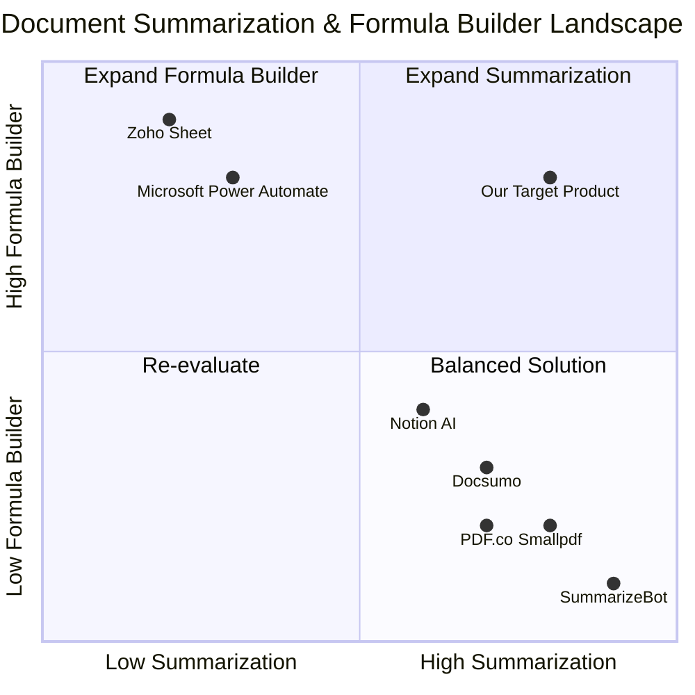

# Product Requirement Document (PRD): browser_based_document_summarizer_formula_builder

## 1. Language & Project Info
- **Language:** English
- **Programming Language & Frameworks:** Python (Django), Frontend: Vite, React, MUI, Tailwind CSS
- **Project Name:** browser_based_document_summarizer_formula_builder

### Restated Requirements
A browser-based Python/Django application that allows users to:
- Upload multiple documents (PDF, Word, plain text)
- Generate concise summaries for each document
- Use a formula builder for custom financial calculations
- Save and reuse formulas
## 2. Product Definition

### Product Goals
1. Enable seamless upload and management of multiple document types (PDF, Word, plain text) via a browser interface.
2. Provide accurate, concise, and actionable summaries for each uploaded document.
3. Empower users to create, save, and reuse custom financial formulas for calculations on extracted or user-provided data.

### User Stories
- As a user, I want to upload several documents at once so that I can process them efficiently.
- As a user, I want to receive concise summaries for each document so that I can quickly understand their content.
- As a user, I want to build custom financial formulas so that I can perform calculations relevant to my needs.
- As a user, I want to save and reuse my formulas so that I do not have to recreate them each time.
- As a user, I want to view and manage my uploaded documents and saved formulas in a user-friendly dashboard.

### Competitive Analysis
(See next step for detailed competitor research and quadrant chart.)
#### Competitive Analysis

| Product                | Pros                                                      | Cons                                                      |
|------------------------|-----------------------------------------------------------|-----------------------------------------------------------|
| Smallpdf               | Easy document upload, supports multiple formats           | No formula builder, limited summarization features        |
| Docsumo                | Automated document processing, summary extraction         | Formula builder not available, pricing tiered             |
| SummarizeBot           | Multi-format summarization, API integration               | No financial calculation features, UI less intuitive      |
| Microsoft Power Automate| Custom workflows, formula/calculation support             | Complex setup, not focused on document summarization      |
| Zoho Sheet             | Formula builder, document import                          | No document summarization, spreadsheet-centric            |
| Notion AI              | AI-powered summaries, document management                 | Formula builder limited, not specialized for finance      |
| PDF.co                  | PDF processing, summary extraction, API                   | Formula builder not included, limited to PDFs             |

#### Competitive Quadrant Chart

## 3. Technical Specifications

### Requirements Analysis
- Must support uploading multiple documents simultaneously (PDF, Word, plain text).
- Must automatically generate concise summaries for each uploaded document using NLP techniques.
- Must provide a formula builder interface for custom financial calculations, supporting basic and advanced operations.
- Must allow users to save, edit, and reuse formulas.
- Should provide a dashboard for managing documents and formulas.
- Should ensure data privacy and secure file handling.
- May support integration with cloud storage (Google Drive, Dropbox).

### Requirements Pool
- **P0 (Must-have):**
  - Multi-document upload (PDF, Word, plain text)
  - Document summarization (NLP-based)
  - Formula builder for financial calculations
  - Save and reuse formulas
  - User authentication and secure file storage
- **P1 (Should-have):**
  - Dashboard for document and formula management
  - Formula sharing between users
  - Export summaries and calculation results
- **P2 (Nice-to-have):**
  - Integration with cloud storage
  - Advanced formula templates
  - Mobile-friendly interface

### UI Design Draft
- **Main Dashboard:**
  - Document upload area (drag & drop, file selector)
  - List of uploaded documents with summary preview
  - Formula builder panel (input fields, operators, save/load options)
  - Saved formulas list (edit, delete, apply)
  - User profile/settings

### Open Questions
- What is the maximum file size for uploads?
- Should formulas support external data sources (e.g., real-time financial data)?
- What level of summary detail is required (short, medium, long)?
- Are there specific compliance or security requirements?
