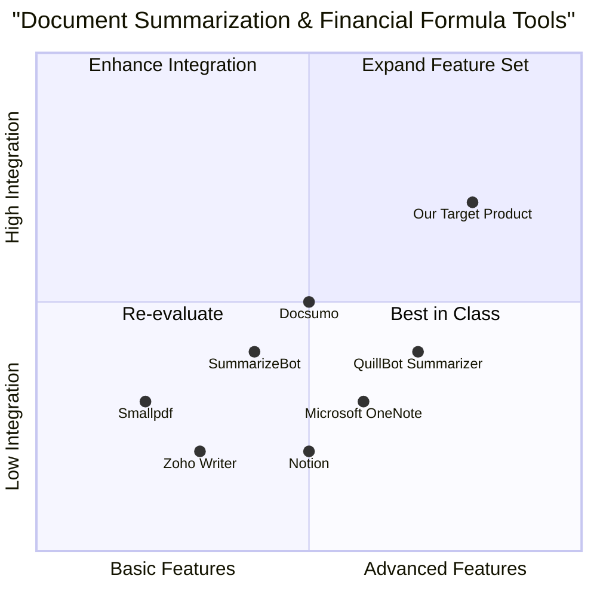

# Product Requirement Document: document_summarizer_formula_builder

## 1. Language & Project Info
- **Language:** English
- **Programming Language:** Python (Django for backend), Vite, React, MUI, Tailwind CSS for frontend
- **Project Name:** document_summarizer_formula_builder

### Restated Requirements
A browser-based Python/Django application that enables users to:
- Upload multiple documents (PDF, Word, plain text)
- Automatically generate concise summaries for each document
- Build custom financial calculation formulas using a formula builder
- Save and reuse custom formulas for future calculations

## 2. Product Definition
### Product Goals
1. Enable seamless multi-format document upload and management.
2. Provide accurate, concise, and automated document summarization.
3. Empower users with a flexible formula builder for custom financial calculations, including saving and reusing formulas.

### User Stories
- As a financial analyst, I want to upload several reports and get quick summaries so that I can review key points efficiently.
- As an accountant, I want to create and save custom formulas for recurring financial calculations so that I can reuse them without rebuilding each time.
- As a business manager, I want to upload contracts and receive concise summaries so that I can make informed decisions faster.
- As a user, I want to manage my uploaded documents and formulas in a secure, organized dashboard so that I can easily access and reuse them.
- As a team member, I want to share saved formulas with colleagues so that we maintain consistency in financial calculations.
### Competitive Analysis

| Product Name                | Pros                                                      | Cons                                                      |
|-----------------------------|-----------------------------------------------------------|-----------------------------------------------------------|
| Smallpdf                    | Easy PDF handling, cloud-based, simple UI                 | Limited to PDFs, no formula builder, limited summarization |
| Docsumo                     | Multi-format support, AI-powered summaries                | No custom formula builder, enterprise-focused pricing      |
| SummarizeBot                | Supports various formats, API access                      | Summaries can lack depth, no financial formula features    |
| Zoho Writer                 | Document management, some automation                      | No document summarization, no formula builder              |
| Microsoft OneNote           | Multi-format notes, formula support                       | No auto-summarization, formula builder not financial-focused|
| Notion                      | Document management, formula support                      | No auto-summarization, formulas are basic                  |
| QuillBot Summarizer         | Strong summarization, browser-based                       | No document management, no formula builder                 |

#### Competitive Quadrant Chart

## 3. Technical Specifications

### Requirements Analysis
- Must support uploading multiple documents in PDF, Word (.docx), and plain text formats.
- Must automatically generate concise, accurate summaries for each uploaded document using NLP techniques.
- Must provide a formula builder interface for custom financial calculations, supporting basic arithmetic, financial functions, and variable assignment.
- Must allow users to save, edit, and reuse custom formulas.
- Should provide a secure dashboard for managing documents and formulas.
- Should support sharing formulas with other users or teams.
- May include user authentication and role-based access control.
- May provide export options for summaries and calculation results.

### Requirements Pool
- **P0 (Must-have):**
  - Multi-format document upload (PDF, Word, plain text)
  - Automated document summarization
  - Formula builder for custom financial calculations
  - Save and reuse formulas
  - Secure user dashboard
- **P1 (Should-have):**
  - Formula sharing
  - User authentication
  - Export summaries/results
- **P2 (Nice-to-have):**
  - Role-based access control
  - Advanced financial functions
  - Integration with cloud storage

### UI Design Draft
- **Main Dashboard:**
  - Document upload area (drag-and-drop + file selector)
  - List of uploaded documents with summary preview
  - Formula builder panel (create, edit, save formulas)
  - Saved formulas list (reuse, share, delete)
  - Calculation results display
- **Navigation:**
  - Sidebar: Documents, Formulas, Settings, Help
- **Modals/Dialogs:**
  - Upload progress, summary details, formula editor, sharing options

### Open Questions
- What is the maximum file size for uploads?
- Should summaries be customizable (length, detail level)?
- What financial functions/formulas are most critical for initial release?
- Is team collaboration (shared dashboards) required at launch?
- What export formats are needed (PDF, Excel, etc.)?
