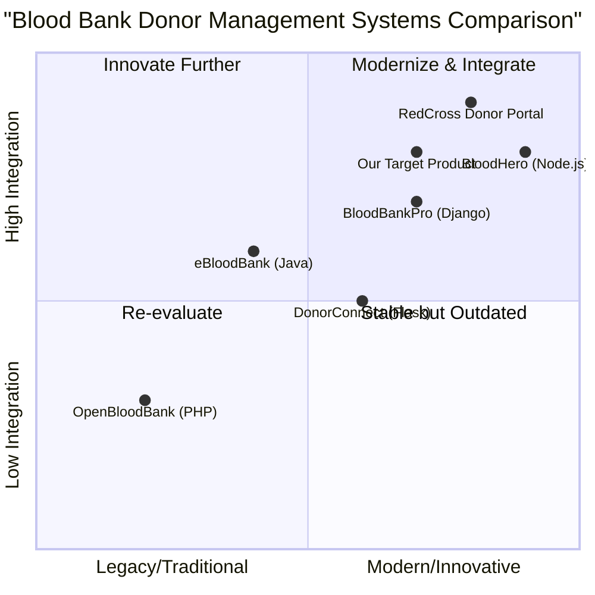

# Product Requirement Document (PRD): Blood Bank Donor Management System Migration to Python

## 1. Language & Project Info

- **Language:** English
- **Programming Language:** Python (Framework options: Django, Flask, or FastAPI)
- **Project Name:** blood_bank_donor_management_python
- **Original Requirement:** Convert an existing PHP Blood Bank Donor Management System into a Python web application using Django, Flask, or FastAPI. The new application must preserve the original UI and functionality and connect to Firebase Realtime Database.

## 2. Product Definition

### 2.1 Product Goals
1. Migrate the existing PHP Blood Bank Donor Management System to a Python web application, ensuring all core features and workflows are preserved.
2. Maintain the original user interface and user experience to minimize retraining and ensure continuity for existing users.
3. Integrate the application with Firebase Realtime Database for real-time data synchronization and scalability.

### 2.2 User Stories
- As a blood bank administrator, I want to manage donor records efficiently so that I can keep the database up to date.
- As a donor, I want to register and update my information online so that I can be contacted for donations when needed.
- As a staff member, I want to search and filter donor lists by blood type and location so that I can quickly find suitable donors.
- As a system admin, I want to monitor system activity and data integrity so that I can ensure compliance and security.
- As a user, I want the interface and workflows to remain familiar so that I can transition smoothly to the new system.

### 2.3 Competitive Analysis

| Product Name                | Pros                                                      | Cons                                                      |
|----------------------------|-----------------------------------------------------------|-----------------------------------------------------------|
| OpenBloodBank (PHP)        | Open source, widely used, feature-rich                    | Outdated UI, limited scalability, PHP-based               |
| BloodBankPro (Django)      | Modern Python stack, good documentation, modular           | Paid license, limited customization                       |
| DonorConnect (Flask)       | Lightweight, easy to deploy, RESTful API                   | Fewer built-in features, basic UI                         |
| RedCross Donor Portal      | Trusted brand, robust security, mobile support             | Not open source, high cost, complex integration           |
| eBloodBank (Java)          | Enterprise-grade, scalable, multi-language support         | Heavyweight, complex setup, Java-based                    |
| BloodHero (Node.js)        | Real-time updates, modern UI, active community             | Node.js learning curve, less mature for healthcare        |
| Our Target Product         | Familiar UI, Python-based, Firebase integration, open code | Migration complexity, dependency on Firebase              |

## 3. Technical Specifications

### 3.1 Requirements Analysis
- The application must replicate all core features of the original PHP system, including donor registration, search/filter, admin management, and reporting.
- The UI must closely match the original design, with responsive layouts and familiar workflows.
- The backend must be implemented in Python using Django, Flask, or FastAPI, with a modular architecture for maintainability.
- Integration with Firebase Realtime Database is required for real-time data updates and scalability.
- Security and data privacy must be ensured, including user authentication and role-based access control.

### 3.2 Requirements Pool
- **P0 (Must-have):**
  - Full migration of donor management features
  - UI/UX preservation
  - Firebase Realtime Database integration
  - User authentication and access control
- **P1 (Should-have):**
  - Responsive design for mobile and desktop
  - Audit logs and activity tracking
  - Data export/import functionality
- **P2 (Nice-to-have):**
  - Multi-language support
  - Advanced analytics dashboard
  - Integration with SMS/email notification services

### 3.3 UI Design Draft
- **Main Dashboard:** Overview of donor statistics, quick actions, and recent activity
- **Donor Management:** List, search, filter, add/edit donor records
- **Admin Panel:** User management, system settings, audit logs
- **Reporting:** Generate and export reports on donations, donor activity, and inventory

### 3.4 Open Questions
- Is the original PHP source code and UI design available for reference?
- Which Python framework is preferred: Django, Flask, or FastAPI?
- Are there any additional features or integrations required beyond the original system?
- What are the specific compliance requirements (e.g., HIPAA, GDPR)?
